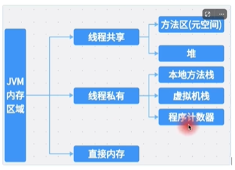
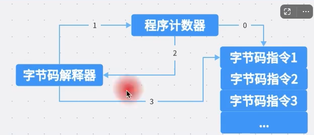
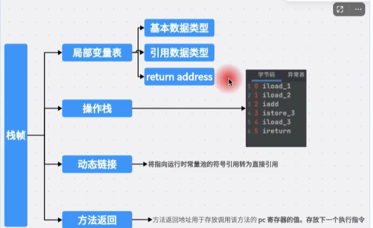
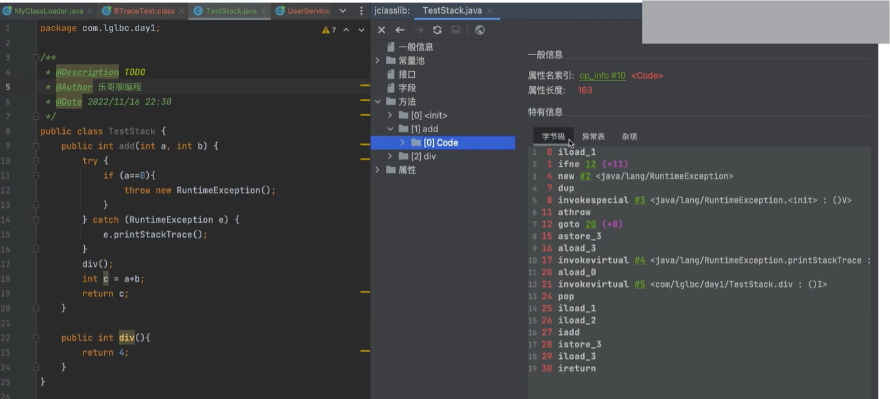
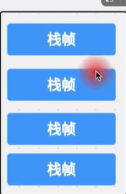
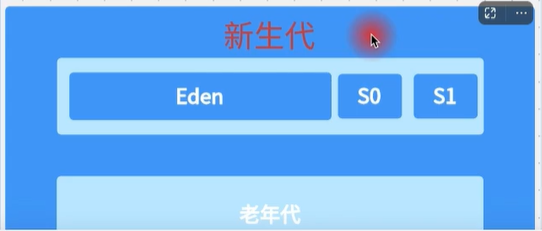
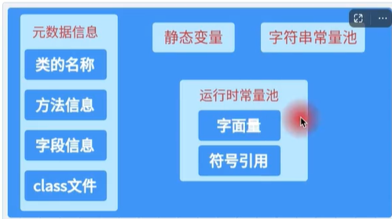
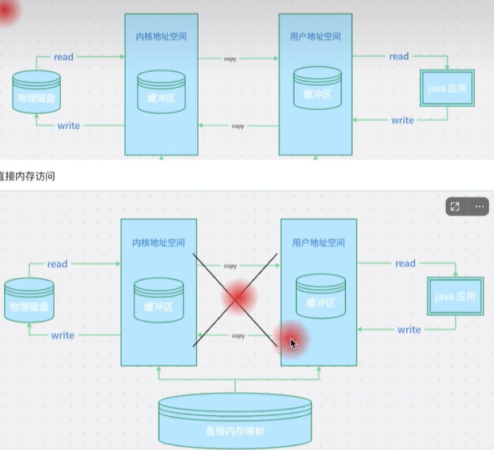

# JVM内存分布

## JVM 内存分配



x86 平台上 JVM 内存分为五个区域：

- 程序计数器：记录当前线程执行的字节码指令地址。
- 虚拟机栈：每个线程都有自己的虚拟机栈，用于存储方法调用、方法返回值、局部变量、操作数、临时变量等信息。
- 本地方法栈：与虚拟机栈类似，为 Native 方法服务。
- 堆：用于存放对象实例，是 JVM 所管理的内存中最大的一块。
- 方法区：用于存放已被虚拟机加载的类信息、常量、静态变量、即时编译器编译后的代码等数据。

### 程序计数器

程序计数器是一块很小的内存空间，它是当前线程执行的字节码指令地址的指示器。

当线程启动时，这个计数器的值为 0，每执行一次字节码指令，计数器加 1。

如果线程正在执行的是 native 方法，这个计数器值保持不变。

```md
代表当前线程所执行的字节码所在的行号，配合字节码解释器获取下一条需要执行的字节码指令.
代码中的分支、循环、跳转、异常处理、线程恢复等操作都需要依赖程序计数器来完成.

程序计数器是线程私有的，线程消失它就消失，每个线程维护自己的程序计数器，互不影响.

如果当前线程正在下执行本地方法，此时程序计数器为空值.

```



### 虚拟机栈

虚拟机栈也是线程私有的，生命周期与线程相同。

每个方法在执行的同时，都会创建一个栈帧用于存储局部变量表、操作数栈、动态链接、方法出口等信息。

每个方法从调用直至执行完成，就对应着一个栈帧在虚拟机栈中入栈和出栈的过程。

栈帧的大小在编译期确定，保存在方法表中。





### 本地方法栈

本地方法栈与虚拟机栈类似，为 Native 方法服务。

### 堆

堆是 JVM 所管理的内存中最大的一块。

堆是所有线程共享的一块内存区域，在虚拟机启动时创建。

堆的大小可以通过 -Xmx 和 -Xms 选项来设置。



大部分对象在堆上分配，少部分在栈上分配（通过逃逸分析）.

### 方法区

方法区也是 JVM 所管理的内存中一块很小的内存区域。

方法区用于存储已被虚拟机加载的类信息、常量、静态变量、即时编译器编译后的代码等数据。
也包括运行时常量池.

jdk8以前主要通过永久代实现方法区，jdk8以后，方法区被分成了堆和元空间。

为什么jdk8以后，方法区不存放在永久代而是分成堆和元空间？

因为永久代的大小受限于系统内存，而元空间的大小不受限，因此可以根据系统内存的大小，动态调整元空间的大小，使得永久代的内存可以动态分配。
因为这个是这些信息都是静态变量和字符串常量池，一般不会发生变化，因此可以放在元空间中，不会溢出，



方法区的大小可以通过 -XX:MaxPermSize 和 -XX:InitialPermSize 选项来设置。

为什么jdk8之前存在永久代，而jdk8开始使用元空间代替，这个受jvm管理吗？需要进行垃圾回收吗？还有会存在溢出或者泄露吗？

```md
JDK 8 之前存在永久代的原因

统一管理类元数据：永久代将类的元数据、静态变量、常量池等信息统一存放在一起，便于 JVM 对这些数据进行集中管理。这样一来，垃圾回收器可以针对不同区域（堆和永久代）采用不同的回收策略。

JDK 8 开始使用元空间代替永久代的原因

- 存溢出问题：

永久代有固定的大小限制，由 -XX:MaxPermSize 参数指定。在动态生成大量类的场景下，如使用 CGLIB 代理、反射等，很容易导致永久代空间耗尽，出现 java.lang.OutOfMemoryError: PermGen space 错误。而元空间使用的是本地内存，默认情况下仅受系统可用内存的限制，能有效避免此类问题

- 类加载和卸载问题：垃圾回收复杂性

永久代的垃圾回收比较复杂，因为要考虑类的卸载和常量池的回收等情况。元空间的垃圾回收机制相对简单高效，当类加载器不再被使用时，其加载的类的元数据所占用的元空间可以及时被回收

- 与其他 JVM 实现保持一致：

其他一些 JVM 实现（如 JRockit）并没有永久代的概念，使用元空间可以让 HotSpot 与其他 JVM 实现更加一致。

元空间是否受 JVM 管理以及是否需要垃圾回收

- 受 JVM 管理：元空间是受 JVM 管理的。元空间使用本地内存（Native Memory），JVM 会根据需要动态分配和释放内存。JVM 会根据类的加载和卸载情况，动态地调整元空间的大小。

- 需要垃圾回收：元空间也需要进行垃圾回收。当类的加载器不再被引用，并且其所加载的类也不再被使用时，JVM 会对这些类的元数据进行垃圾回收，以释放元空间的内存。

元空间是否会存在溢出或者泄露

- 溢出：尽管元空间默认使用系统的可用内存，但如果系统的物理内存不足，或者程序中动态生成了大量的类，导致元空间不断增长，最终会耗尽系统的可用内存，从而抛出 java.lang.OutOfMemoryError: Metaspace 错误。可以通过 -XX:MetaspaceSize 和 -XX:MaxMetaspaceSize 参数来限制元空间的大小。
- 泄露：如果代码中存在类加载器泄漏的情况，例如类加载器被错误地持有引用，导致其所加载的类无法被卸载，那么元空间中的类元数据就会不断增加，最终导致内存泄漏。

总结来说，JDK 8 使用元空间代替永久代，解决了永久代在内存管理方面的一些问题，但在使用过程中仍然需要注意元空间的内存使用情况，避免出现溢出或泄露问题。

```

字符串常量池和运行时常量池的区别

```md
定义和作用
- 字符串常量池：这是一种特殊的缓存机制，专门用于存储字符串常量。其作用是避免重复创建相同内容的字符串对象，以此节省内存并提升性能。当程序中出现字符串字面量时，JVM 会先在字符串常量池中查找是否已有相同内容的字符串，如果有则直接返回该字符串的引用；若没有，就会在字符串常量池中创建一个新的字符串对象。
- 运行时常量池：它是方法区的一部分，每个类或者接口在编译后生成的 Class 文件里都有一个常量池表，当类被加载到 JVM 后，这个常量池表会被加载到内存中，形成运行时常量池。运行时常量池用于存储各种常量，除了字符串常量，还包括类和接口的全限定名、字段和方法的名称与描述符、基本数据类型的常量值等。

位置

- 字符串常量池：在 JDK 7 之前，字符串常量池位于方法区；从 JDK 7 开始，字符串常量池被移到了堆中。这一改变是因为方法区的内存空间有限，将字符串常量池移到堆中可以更好地利用堆的内存管理机制，减少内存溢出的风险。
- 运行时常量池：在 JDK 8 之前，运行时常量池存在于方法区（永久代）；JDK 8 及以后，方法区被元空间取代，运行时常量池依然是元空间的一部分。

存储内容
- 字符串常量池：仅存储字符串常量，包括字符串字面量（如 "hello"）和通过 String.intern() 方法手动添加到常量池的字符串对象。
- 运行时常量池：存储的内容更为丰富，涵盖了类和接口的全限定名、字段和方法的名称与描述符、基本数据类型的常量值、符号引用等。例如，在一个类中定义了一个整型常量 public static final int NUM = 10，这个常量值 10 就会存储在运行时常量池中。

创建时间
- 字符串常量池：字符串常量池中的字符串对象在编译期和运行期都可能被创建。像字符串字面量在编译时就会被加入到字符串常量池中；而通过 String.intern() 方法在运行时也能将字符串对象添加到常量池中。
- 运行时常量池：运行时常量池是在类加载的过程中创建的。当类被加载到 JVM 后，其对应的 Class 文件中的常量池表会被加载到内存中，形成运行时常量池。
```

### 直接内存

直接内存（Direct Memory）是指，在 Java 堆外的内存，通过 Unsafe 类的 allocateMemory() 和 freeMemory() 方法来分配和释放。

直接内存并不属于虚拟机管理的内存，因此不受 Java 虚拟机控制，也不受 GC 管理，因此也不会出现内存溢出、内存泄漏等问题。



用户态，内核态
Java应用读数据，需要将磁盘read操作从内核态切换到用户态，然后将数据拷贝到JVM堆中，再从JVM堆中read数据，最后再从用户态切换到内核态。

直接内存，不需要从内核态切换到用户态，直接将数据从磁盘拷贝到JVM堆中，然后直接从JVM堆中read数据，不需要再从用户态切换到内核态。

```md
高效IO操作: 不需要进行用户态和内核态的切换，直接从磁盘拷贝到JVM堆中，可以提高IO操作的效率。
不需要操作系统的内核态数据拷贝到jvm堆中。

使用场景， 大数据处理，高性能的网络编程socket。

虚拟地址映射： 虽然直接内存位于 JVM 堆外，但在 JVM 的地址空间中，会有一段虚拟地址范围被映射到直接内存区域。这样，Java 程序可以通过这个虚拟地址来访问直接内存中的数据。


```

### 面试题

1. 直接内存会导致OOM吗？

不会，直接内存分配的内存不会被 JVM 管理，因此不会导致 OOM。

2. 针对同一个类，使用不同类加载器，加载到jvm，是否是同一个对象

针对同一个类（即类名相同、二进制字节码相同），使用不同的类加载器加载到 JVM 中时，生成的 Class 对象以及实例对象均不属于同一个类型

Class 对象的唯一性由 类加载器 + 类名 共同决定


## 参考

> https://www.bilibili.com/video/BV1rg411v7rw?spm_id_from=333.788.videopod.sections&vd_source=5a41e8ae8c0a4c2c6809a5ccf977c1a9
> 