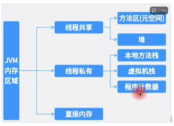

# JVM内存分配

## JVM 内存分配

x86 平台上 JVM 内存分为五个区域：

- 程序计数器：记录当前线程执行的字节码指令地址。
- 虚拟机栈：每个线程都有自己的虚拟机栈，用于存储方法调用、方法返回值、局部变量、操作数、临时变量等信息。
- 本地方法栈：与虚拟机栈类似，为 Native 方法服务。
- 堆：用于存放对象实例，是 JVM 所管理的内存中最大的一块。
- 方法区：用于存放已被虚拟机加载的类信息、常量、静态变量、即时编译器编译后的代码等数据。

### 程序计数器

程序计数器是一块很小的内存空间，它是当前线程执行的字节码指令地址的指示器。

当线程启动时，这个计数器的值为 0，每执行一次字节码指令，计数器加 1。

如果线程正在执行的是 native 方法，这个计数器值保持不变。

### 虚拟机栈

虚拟机栈也是线程私有的，生命周期与线程相同。

每个方法在执行的同时，都会创建一个栈帧用于存储局部变量表、操作数栈、动态链接、方法出口等信息。

每个方法从调用直至执行完成，就对应着一个栈帧在虚拟机栈中入栈和出栈的过程。

栈帧的大小在编译期确定，保存在方法表中。

### 本地方法栈

本地方法栈与虚拟机栈类似，为 Native 方法服务。

### 堆

堆是 JVM 所管理的内存中最大的一块。

堆是所有线程共享的一块内存区域，在虚拟机启动时创建。

堆的大小可以通过 -Xmx 和 -Xms 选项来设置。

### 方法区

方法区也是 JVM 所管理的内存中一块很小的内存区域。

方法区用于存储已被虚拟机加载的类信息、常量、静态变量、即时编译器编译后的代码等数据。

方法区的大小可以通过 -XX:MaxPermSize 和 -XX:InitialPermSize 选项来设置。

### 内存分配

JVM 内存分配主要通过两种方式：

- 指针碰撞：堆内存是由一系列的内存块组成的，每个内存块都有一定的大小，虚拟机在运行时，通过指针来定位内存块。
  一块内存，一半是已经分配的，一半是没分配的，当分配内存时，中间指针移动到未分配的内存块，分配完成后，指针移动到下一个内存块。
- 空闲列表：堆内存中维护一个空闲列表，虚拟机在运行时，通过空闲列表来分配内存。

### 指针碰撞

指针碰撞是指在堆内存中，所有内存块的大小相同，虚拟机通过指针来定位内存块。

当需要在堆上分配一个对象时，虚拟机首先检查是否有足够的内存空间，如果有，就将指针指向该内存空间，如果没有，就向操作系统申请新的内存空间。

### 空闲列表

空闲列表是指在堆内存中，维护一个空闲列表，虚拟机通过空闲列表来分配内存。

当需要在堆上分配一个对象时，虚拟机首先检查是否有足够的内存空间，如果有，就从空闲列表中找到一块足够大的内存空间，如果没有，就向操作系统申请新的内存空间。

### 内存分配策略

JVM 内存分配策略有以下几种：

- 固定大小分配：在堆内存中，为每个线程分配固定大小的内存，线程结束后，内存被释放。
- 按需分配：在堆内存中，为每个线程分配内存，线程结束后，内存被释放。
- 线程本地分配：在线程的虚拟机栈中，为每个线程分配内存，线程结束后，内存被释放。
- 直接内存分配：在堆外内存中，直接分配内存，不需要通过 JVM 的内存管理。

### 面试题

直接内存会导致OOM吗？

不会，直接内存分配的内存不会被 JVM 管理，因此不会导致 OOM。

## 参考

> https://www.bilibili.com/video/BV1rg411v7rw?spm_id_from=333.788.videopod.sections&vd_source=5a41e8ae8c0a4c2c6809a5ccf977c1a9
> 