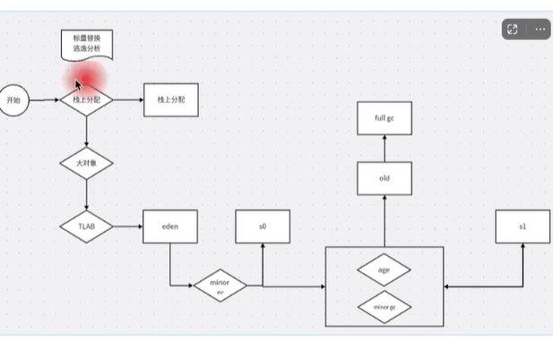

# JVM内存分配

## 内存分配过程



```md
开始

标量替换：将栈上的数据类型转换为标量类型，以便在栈上分配内存。

逃逸分析：分析代码，判断对象是否逃逸到方法外部，如果逃逸，则将对象分配在堆上。return

栈上分配：将对象直接分配在栈上，以便快速访问。

大对象： 大对象直接分配在老年代中，避免频繁GC。

TLAB分配：如果对象大小超过TLAB的大小，则将对象直接分配在老年代中。

对象创建：创建一个对象，并将其存储在堆上。

minorGC: eden区满了，触发minorGC。

s0: survivor0区满了，将eden区和s1区存活的对象复制到s0区，并清空eden区。

s1: survivor1区满了，将eden区和s0区存活的对象复制到s1区，并清空eden区。

age,minor gc,full gc: 老年代满了，触发minorGC，如果老年代仍然满了，则触发fullGC。

```

## 逃逸分析

如何确定对象是否在栈上进行分配，当然得通过逃逸分析。
逃逸分析，就是看下一个方法是否会返回对象，如果返回，则需要将对象分配在堆上。

```java
public Student getStudent(){
    return new Student();
}
// 对象分配到堆中
public void save(){
    Student stu = new Student();
    // ...
}
// 对象分配到栈中
1. 对于基本类型，直接在栈上分配内存。
2. 对于对象引用，如果对象在方法中被创建，则分配在栈上。
3. 对于对象引用，如果对象在方法中被传递，则分配在堆上。
```

## 标量替换

标量替换，就是将栈上的数据类型转换为标量类型，以便在栈上分配内存.
将对象拆解成不可再分的对象，一些基础类型的变量。
聚合量，对象属性中还有对象

## 内存分配

JVM 内存分配主要通过两种方式：

- 指针碰撞：堆内存是由一系列的内存块组成的，每个内存块都有一定的大小，虚拟机在运行时，通过指针来定位内存块。
  一块内存，一半是已经分配的，一半是没分配的，当分配内存时，中间指针移动到未分配的内存块，分配完成后，指针移动到下一个内存块。
- 空闲列表：堆内存中维护一个空闲列表，虚拟机在运行时，通过空闲列表来分配内存。

## 指针碰撞

指针碰撞是指在堆内存中，所有内存块的大小相同，虚拟机通过指针来定位内存块。

当需要在堆上分配一个对象时，虚拟机首先检查是否有足够的内存空间，如果有，就将指针指向该内存空间，如果没有，就向操作系统申请新的内存空间。

## 空闲列表

空闲列表是指在堆内存中，维护一个空闲列表，虚拟机通过空闲列表来分配内存。

当需要在堆上分配一个对象时，虚拟机首先检查是否有足够的内存空间，如果有，就从空闲列表中找到一块足够大的内存空间，如果没有，就向操作系统申请新的内存空间。

## 内存分配策略

JVM 内存分配策略有以下几种：

- 固定大小分配：在堆内存中，为每个线程分配固定大小的内存，线程结束后，内存被释放。
- 按需分配：在堆内存中，为每个线程分配内存，线程结束后，内存被释放。
- 线程本地分配：在线程的虚拟机栈中，为每个线程分配内存，线程结束后，内存被释放。
- 直接内存分配：在堆外内存中，直接分配内存，不需要通过 JVM 的内存管理。

## 如何解决内存分配并发问题

- CAS, compare and swap, 比较并交换，是一种原子操作，可以保证多个线程同时修改同一个变量时，只有一个线程能成功。
- TLAB, thread local allocation buffer, 线程本地分配缓冲区，是一种技术，可以为每个线程分配一块内存，避免线程间的竞争。
- 对象池，对象池是一种技术，可以为每个线程分配一组对象，避免频繁创建对象。
- 堆外内存，堆外内存是一种技术，可以直接分配内存，不需要通过 JVM 的内存管理。


## 面试题

为什么需要使用标量替换？

栈上分配对象是方法结束时对象就会被回收了减少了堆的内存压力并且减少了垃圾回收的开销。
使用标量替换的目的是为了提高程序的性能，通过将对象拆分成独立的标量，使得变量能够被寄存器更好的访问，减少了内存访问的开销
