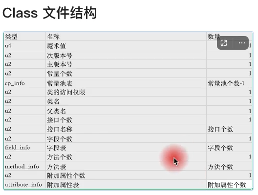
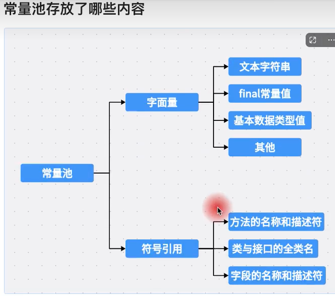
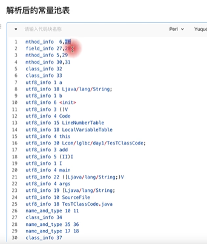

# 解析Class文件




```java
public class TestTClassCode{
    public String a;
    public String b;
    public static int add(int a, int b){
        return a + b;
    }

    public static void main(String[] args){
        int c = add(1, 2);
        System.out.println(c);
    }
}
```


