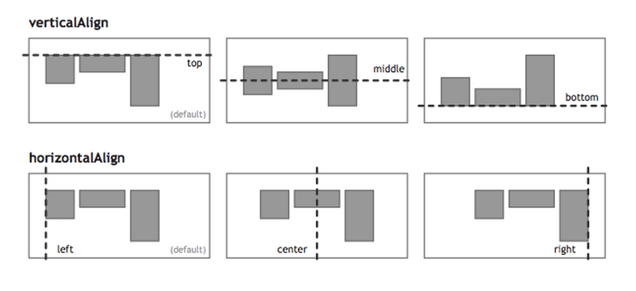

# Flex layout

> link: Flex 布局教程 --> https://www.ruanyifeng.com/blog/2015/07/flex-examples.html
> Flex 语法 --> https://www.ruanyifeng.com/blog/2015/07/flex-grammar.html

## align



## Flex grammar

- display: flex; /_ or inline-flex _/
- flex-direction: row | row-reverse | column | column-reverse; /_ default row _/
- flex-wrap: nowrap | wrap | wrap-reverse; /_ default nowrap _/
- flex-flow: <flex-direction> || <flex-wrap>; /_ default row nowrap _/
- justify-content: flex-start | flex-end | center | space-between | space-around; /_ default flex-start _/
- align-items: flex-start | flex-end | center | baseline | stretch; /_ default stretch _/
- align-content: flex-start | flex-end | center | space-between | space-around | stretch; /_ default stretch _/

- justify-content, main axis, 主轴上的对齐方式
- align-items, cross axis, 交叉轴上的对齐方式

- order: <integer>; /_ default 0, 属性定义项目的排列顺序。数值越小，排列越靠前，默认为 0 _/
- flex-grow: <number>; /_ default 0, 性定义项目的放大比例，默认为 0，即如果存在剩余空间，也不放大 _/
- flex-shrink: <number>; /_ default 1 , 属性定义了项目的缩小比例，默认为 1，即如果空间不足，该项目将缩小_/
- flex-basis: <length> | auto; /_ default auto, 属性定义了在分配多余空间之前，项目的初始大小。 _/
- flex: none | <'flex-grow'> <'flex-shrink'>? || <'flex-basis'>; /_ default 0 1 auto, 简写属性，设置 flex-grow, flex-shrink 和 flex-basis 的值 _/
- align-self: auto | flex-start | flex-end | center | baseline | stretch; /_ default auto, 属性允许单个项目有与其他项目不一样的对齐方式，可覆盖 align-items 属性。 _/

- main axis, 主轴, 由 flex-direction 决定, 主轴上的对齐方式由 justify-content 决定
- cross axis, 交叉轴, 由 flex-direction 决定, 交叉轴上的对齐方式由 align-items 决定
- 当 flex-direction 为 row 或 row-reverse 时, 主轴为水平方向, 交叉轴为竖直方向
- 当 flex-direction 为 column 或 column-reverse 时, 主轴为竖直方向, 交叉轴为水平方向

## Flex container

### flex 单项目

```html
<div class="box">
  <span class="item"></span>
</div>

<style>
  .box {
    display: flex;
    justify-content: center; //主轴居中
    justify-content: space-between; //主轴两端对齐
    justify-content: flex-end; //主轴右对齐
    justify-content: space-around; //主轴两侧对齐
    justify-content: flex-start; //主轴左对齐

    align-items: center; //交叉轴居中
    align-items: flex-end; //交叉轴下对齐
    align-items: flex-start; //交叉轴上对齐
    align-items: baseline; //交叉轴基线对齐
    align-items: stretch; //交叉轴拉伸
  }
  .box {
    display: flex;
    justify-content: center; //主轴居中
    align-items: center; //交叉轴居中
  }
</style>
```

## Flex 两项目

```html
<div class="box">
  <span class="item"></span>
  <span class="item"></span>
</div>

<style>
  .box {
    display: flex;
    justify-content: space-between; //主轴两端对齐
  }
  .box {
    display: flex;
    flex-direction: column; // 列方向
    justify-content: space-between; //主轴两端对齐,单列的话,就忽略
    align-items: center; // 交叉轴居中
    align-items: flex-end; // 交叉轴下对齐
  }
  .item:nth-child(2) {
    align-self: flex-end; // 单个项目下对齐
  }
</style>
```
