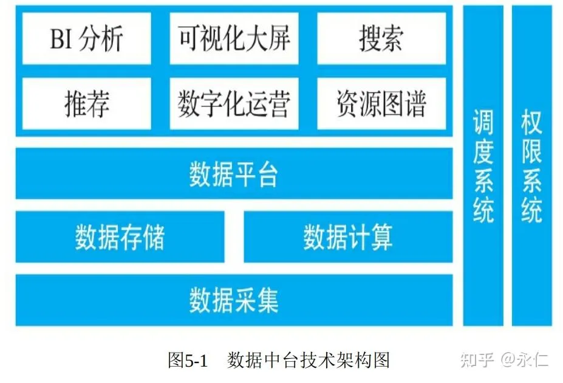
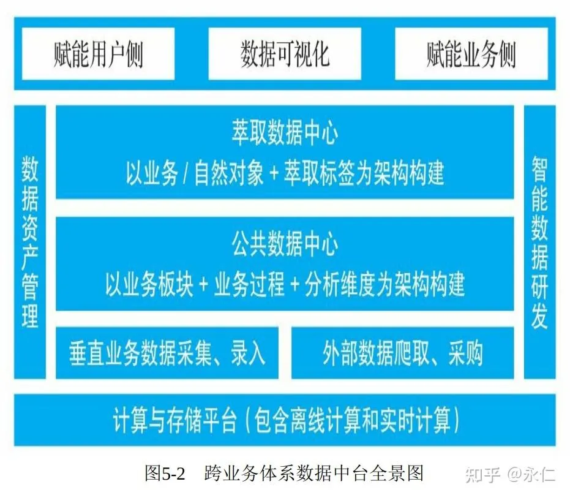
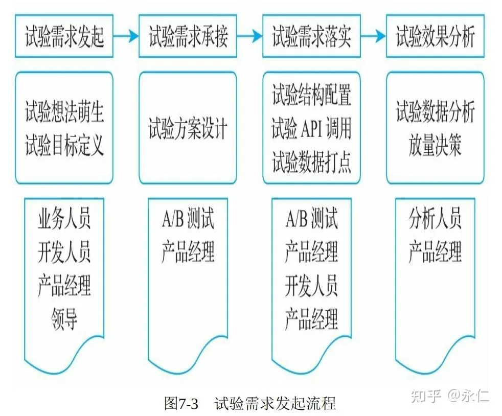
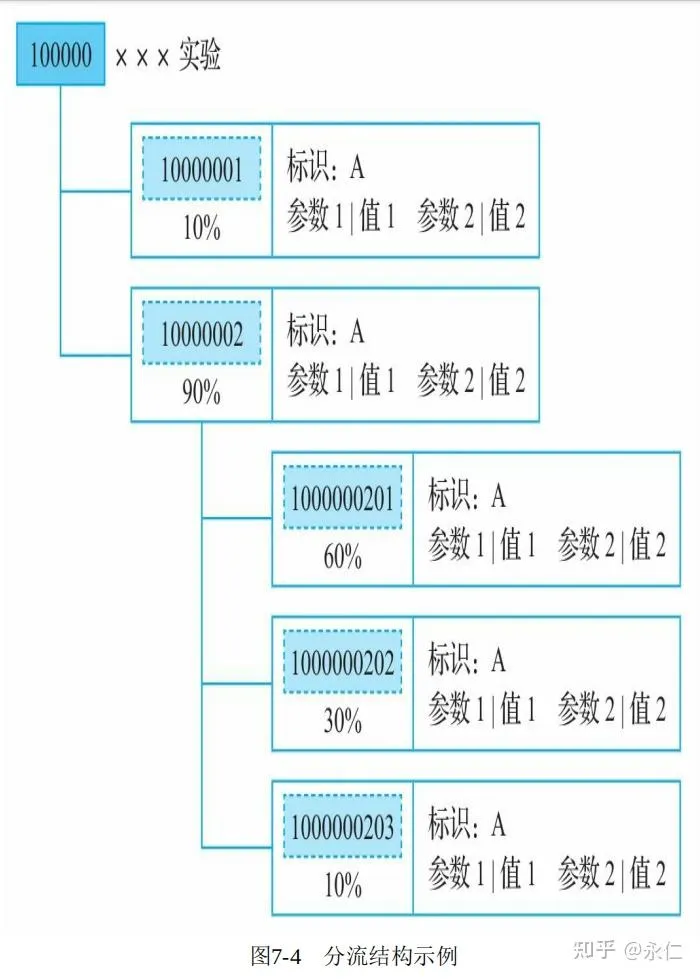
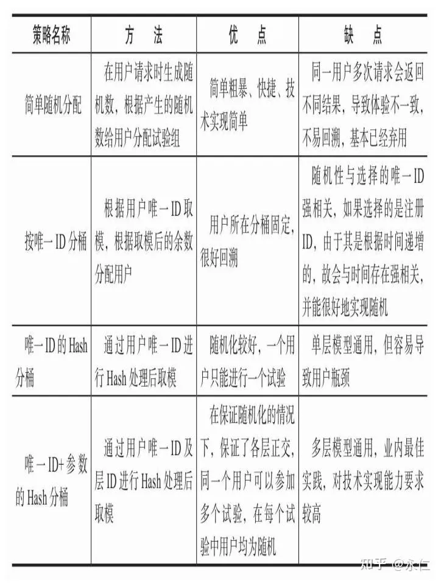

# 数据产品经理实战笔记

> 全文来自: https://zhuanlan.zhihu.com/p/687241783

> 该文档《数据产品经理：实战进阶》详细介绍了数据产品经理的工作范围和技能要求，
> 旨在帮助读者了解数据产品、数据分析、产品路线图、数据埋点、数据中台、数据管理、数据服务、用户画像等相关知识体系。
> 第一章介绍了数据产品经理的概念、能力模型和分类，并提供了相关案例分析。
> 第二章深入探讨数据分析方法论和应用案例。
> 第三章涵盖产品路线图的制定、需求收集和优先级确定等方面。
> 第四章介绍了数据埋点的概念和技术，
> 第五章讲解数据中台的重要性和构建方法。其他章节则涉及数据指标体系、A/B测试系统搭建、数据管理、数据服务以及用户画像等内容。
> 综合来看，该文档旨在为数据产品经理提供全面的工作指南和实战经验，帮助他们更好地处理数据产品相关问题并提升职业能力。

## 第1章 全面认识数据产品经理

### 1. 数据产品的定义是什么，它的类型有哪些，详细说明？

数据产品的定义可以理解为利用数据来辅助用户做出更优决策或行动的一种产品形式。  
根据提供数据的对象和使用方式，数据产品可以分为用户数据产品、商用数据产品和企业数据产品。 
用户数据产品主要面向普通用户提供数据查询服务，如Google Trends。   
商用数据产品由企业开发，为其他企业或商家提供数据服务，如GrowingIO和阿里巴巴的生意参谋。 
而企业数据产品由企业自身建立和使用，旨在降低员工使用数据的门槛，辅助决策和提高业务效率。 
企业数据产品可分为应用型和平台型，其中应用型专注于解决具体业务或部门问题，平台型为应用型提供支持。  
在数据产品的设计中，常见的组成部分包括采集清洗、计算管理、分析展示和挖掘应用。  
数据产品的类型和定义的详细说明有助于产品经理更好地理解和运用数据产品在实际工作中的意义和作用。   

### 2. 如何搭建企业数据平台？

要搭建企业数据平台，可以按照以下步骤进行：

1. 确定需求：首先要明确企业数据平台的具体需求，包括数据管理、数据分析、数据服务等方面。
选择方案：根据需求的不同层次，可以选择适合的方案来满足，如自定义分析、基于埋点的自动分析功能、自定义报表分析界面等。
2. 建设数据中台：数据中台是企业数据管理与服务的重要组成部分，需要做到统一数据源、统一集市、统一指标等。
3. 改组织架构：在建设数据中台的过程中，需要对组织架构进行调整，整合数据开发人员，确保数据中台的顺利运作。
4. 强调效果反馈：建设企业数据平台也要关注数据的效果反馈，建立跨体系的合作，确保数据的有效分析与利用。
5. 通过以上步骤，可以有效地搭建起完善的企业数据平台，提升数据管理与运营的效率和效果。

### 3. 数据产品经理的能力模型

数据产品经理的能力模型通常由三个方面构成：产品经理能力、数据专业能力和软能力。

在这三个方面中，产品经理能力包括对需求的判断、合理性和解决方案的提供。

数据专业能力主要涉及数据产品设计能力、数据分析能力以及对大数据技术架构和数据挖掘算法等基础知识的了解。

而软能力则包括商业认知能力、沟通协调能力和项目管理能力。

在不同职级下，对这些能力的要求和侧重点也各有不同，从初级到高级，能力要求逐渐提高，对问题的解决能力和影响力也随之增加。

总的来说，数据产品经理需要具备产品经理的基本技能、数据领域的专业知识以及一系列软技能，才能在工作中发挥出色。

#### 3.1 产品经理能力包括：

- 熟悉并了解商业模式和业务运营原理，以更好地为用户和公司提供服务。
- 具备沟通协调能力和项目管理能力，需要与团队内外的同事合作，协调时间、排期和平衡利益。
- 不断提升专业水平，学习数据产品设计、数据分析方法等，解决公司常见问题。
- 具备解决复杂问题的能力，能独立完成任务，发现并解决问题。

#### 3.2 数据专业能力包括：

- 数据产品设计能力，着力于提供优秀的解决方案，发挥数据价值，规范数据资产管理。
- 数据分析能力，细分、对比、溯源，通过分析体现价值，熟知数据分析方法。
- 数据挖掘算法和大数据技术架构的基础知识，了解原理以判断需求实施的可能性或复杂度。

#### 3.3 软能力包括：

- 商业认知能力，了解各种业务逻辑和决策动机，常识包括商业模式、利润计算、财务分析等。
- 项目管理能力，了解项目标准要求、政策、流程，能够独立完成复杂任务并与跨部门协作。
- 领导力，跨部门项目领导能力，推动更大范围和更复杂项目的落地。
- 沟通协调能力，需要与团队内外的同事合作，协调时间、排期和平衡利益。

### 4. 数据产品经理的分类有哪些?

数据产品经理的分类主要包括三种：平台型、策略型和应用型。

根据不同类型的数据产品经理分类并分点归纳总结如下：

1. 功能型数据产品经理：
    - 工作内容：主要关注功能类需求的把握和产品进度的管理，旨在提升用户体验，让用户更开心、更长时间地留在产品上。
    - 能力要求：具备逻辑思维能力和解决问题的能力，可以独立与运营同事对接产品需求，了解产品研发过程和埋点相关的技术细节。

2. 策略型数据产品经理：
    - 工作内容：聚焦于建立数据指标体系，生产合适好用的数据工具或应用产品，对业务痛点的熟悉程度更高，偏向B端。
    - 能力要求：需要对业务发展和团队建设的规模有深刻认知，具备跨团队沟通能力、项目管理能力和创新意识。
3. 商业型数据产品经理：
    - 工作内容：专注于电商领域常见的数据指标体系，熟悉公司数据流的采集、清洗、管理、展示、分析、挖掘处理过程，以及公司数据分析应用场景。
    - 能力要求：需要具备较强的求知欲、创新意识和电商运营、增长等业务相关经验。
4. B端数据产品经理：
    - 工作内容：主要对接运营同事，在开展线上营销活动时通过点选条件进行用户筛选，快速选择推送用户并记录运营效果。
    - 能力要求：要有相关工作经验，了解完整的产品需求收集、分析、定义、设计、落地和迭代过程，有良好的逻辑思维和解决问题能力。

总的来说，不同类型的数据产品经理在工作内容和能力要求上有所不同，但都需要具备一定的逻辑思维能力、沟通能力和对业务和数据的深入理解。

#### 4.1 平台型数据产品经理：

- 在企业内部，平台型数据产品经理专注于抽象各需求部门的共同点，落地成对应的数据产品，提高整个公司的运转效率。  
- 主要负责数据资产管理、标签库设计与统一、埋点平台管理等产品。    
- 在商用数据产品上，他们专注于发现各行业或行业内主流客户的通用需求，以实现较大的商业产出。    

#### 4.2 策略型数据产品经理：

- 负责针对某个业务场景，提供提高业务效率的数据策略，如搜索、推荐、排序、风控等常见场景。
- 有时还负责用户/商品画像标签等通用模块的策略。
- 需要熟悉统计学原理，具备较强的数据分析能力。

#### 4.3 应用型数据产品经理：

- 定位于针对某个业务场景，提供对应数据产品或工具来提高业务效率，如多维分析、漏斗分析、画像分析等功能。
- 善于跨部门合作，实现业务结果。
- 需要具备产品设计、开发工作流程等方面的执行力。

### 5. 数据产品经理的应聘与招聘

数据产品经理的应聘与招聘可以分为以下几点：

#### 5.1 如何应聘：

- 梳理简历并准备公司调研：简历梳理是为了清晰地描述每段工作经历的转换逻辑，挑选重点数据项目进行详细描述以展示产品的价值和数据分析结果对业务推动的作用。同时要关注产生的业务价值。公司调研则是了解公司实际运行情况，尤其要关注公司对数据的重视程度。
- 准备面试：面试是整个招聘流程中最关键的环节之一。在面试中，需要客观展现自己，表述清晰、逻辑严谨，善用段落或总分逻辑表达观点。同时，面试也是双向筛选的过程，应该考虑面试官是否符合自己的要求。
- 最后，面试后应该注意反馈和改进，无论成功与否都应该进行总结反馈。

#### 5.2 如何招聘：

- 对应聘者的考察：对于应聘高级数据产品经理的候选人，重点考察其对数据领域的深入程度、团队管理能力和职业规划情况。这类人才通常要带领或建立一个团队，搭建或维护一整套数据平台，并推进公司的数据资产建设。
- 提出人才需求：人才缺口常伴随业务的高速发展、数据产品价值受重视和现有人力不足等情况。团队或个人在这种情况下需要主动向上提出人才需求，经过讨论确认后才能进入招聘流程。需要综合考虑公司价值和实际工作量，提高对数据产品价值的展示。

### 6. 分点归纳总结商用数据产品研究案例

商用数据产品研究案例可以从Domo这个案例中进行总结：

1. 数据产品Domo的功能模块包括Connect（数据连接）、Store（数据存储）、Prepare（数据计算）、Visualize（数据可视化）、Collaborate（数据协作）、Predict & Extend（数据预测与拓展）。
2. Domo的商业模式是按照使用用户收费，年费最低==2.5==万美元，每用户约==2000==美元，年复合增长率超过==100%==。
3. Domo的产品目标是降低企业使用数据资产的门槛，提供多数据源接入、数据存储、准备、可视化等功能，使数据能够落实为业务动作，从而发挥数据的真正价值。
4. Domo致力于成为新一代商业平台的可能，发布面向移动端的应用商店，打造全球第一个“商务云”的概念，与合作商共同创造更贴近客户使用场景的分析应用。

综上所述，Domo作为商用数据产品的研究案例，通过其功能模块、商业模式、产品目标和战略规划等方面展现了其在数据管理与运营领域的特点和实践经验。

### 7. 数据产品经理面试案例

从自我介绍、项目和数据产品能力、关于数据产品经理职位的思考以及开放性问题，这4个维度分点归纳总结数据产品经理面试案例

数据产品经理的面试案例可以从以下四个维度来总结：

1. 自我介绍 

在自我介绍环节，候选人需要紧扣核心，介绍学历背景、工作经验、主要职责和工作成果，
并突出展示与面试职位的关联性。
自我介绍需简洁明了，控制在3-5分钟，并强调自身优势以及为公司带来的价值。应避免长篇大论，保持精炼。

2. 项目和数据产品能力 

在展示项目和数据产品能力时，候选人需要深入说明自己参与项目的技术细节、业务逻辑、设计思路以及上下游工作关系。
候选人应展现对业务逻辑的清晰理解，熟悉产品研发过程中的技术细节和关键能力。
在面对专业能力的考察时，候选人要以真实的项目经历来展示自己的基本功和专业匹配度。

3. 数据产品经理职位的思考 

面试官会围绕数据产品经理职位的思考，考察候选人对职位工作内容、边界、方法和未来发展方向的认知。
候选人需展现对数据管理和运营体系的全面理解，同时强调对行业数据指标和数据分析应用的熟悉度。
跨团队沟通能力、项目管理能力等软实力也是重要考核点。

4. 开放性问题 

在回答开放性问题时，候选人要展现解决问题的能力和逻辑思维，灵活应对多种情况，透露思考和沟通能力。
候选人应将问题置于自己熟悉的环境中更好地回答问题，避免支支吾吾或天马行空的表现。
同时，要尊重事实，避免弄虚作假。

通过这四个维度的全面归纳总结，候选人可以在面试中更好地展示自己的能力和优势，提升面试表现的质量和成功率。

## 第2章 数据分析方法论

### 1. 数据分析的基本流程，请分点详细说明

数据分析的基本流程如下：

1. 发现问题：首先需要发现问题，可能是已知的问题，也可能是潜在的问题。这一步需要产品经理用数据探索出方向和策略。
2. 定位问题：在发现问题后，需要定位问题到具体哪个环节或部分出现了问题。这时可以运用全链路分析、组成因子分解、影响因子分析、枚举法等方法。
3. 分析问题：在定位问题后，需要综合运用多种分析方法来深入分析问题，并得出结论。可以使用细分、趋势、对比等分析方法。
4. 提出有价值的数据结论：最后需要根据问题分析的结果，提出解决方案或有价值的结论。这一步需要针对问题给出解决方案，以提高效率、降低成本或达成其他业务目标。

以上是数据分析的基本流程，涵盖了发现问题、定位问题、分析问题和提出结论这四个关键步骤。
在实际工作中，产品经理需要灵活运用各种数据分析方法来完善这一流程，以实现数据驱动的业务决策和优化。

### 2. 什么是有价值的数据结论，请分点详细说明
有价值的数据结论是指能够帮助增加收益或减少损失的结论，具体来说包括以下几点：

1. 增加收益：有价值的数据结论应该能够帮助增加公司的收入，例如提升销售额、增强用户体验、提高用户参与感和增加转化率。
2. 减少损失：另一方面，有价值的数据结论也应该有助于减少公司的损失，比如减少用户投诉失败的概率、减少人工空闲时间、减少作弊行为等。
3. 数据支撑：一个有价值的数据结论需要有充分的数据支撑，即通过数据分析得出结论，并能够解释和证明这些结论。要为自己的结论提供充足的数据支撑。
4. “增减思路”分析：在得到有价值的数据结论时，需要采用“增减思路”，即找到可以增加收益和减少损失的方法。例如，为高级用户提供专属内容、提供折扣、维护社群等方式来增加用户收入。
5. 着重业务目标：在提出结论时，需要确保结论与业务目标一致，能够帮助实现公司的业务目标，例如增加收入或减少成本。

综上所述，有价值的数据结论应当以“增加收益”和“减少损失”为导向，以数据支撑为基础，采用“增减思路”分析，确保与业务目标一致，并通过有效的数据分析方法得出结论。

### 3. 怎么得到有价值的数据结论，请分点详细说明
要得到有价值的数据结论，可以从以下几个点进行详细说明：  

1. 了解业务目标：首先需要清楚所处的业务环境和目标是什么，只有明确了业务目标，才能更有针对性地进行数据分析。
2. 进行“增减思路”分析：在任意业务分析时，需要明确业务能够增加的收益和能够减少的损失。
对于产品部来说，增加收益一般包括增加收入、增强体验、增加用户参与感、增加转化率；
减少损失则包括减少用户操作步骤、减少用户投诉失败概率、减少用户收到损坏物品概率、减少公司的人工空闲时间、减少作弊，降低损失。
3. 从数据支撑得出结论：任何结论都应该有数据支撑，确保数据的准确性和可靠性，避免凭空臆测或主观判断。
4. 举例展示：通过案例展示具体的数据结论得出方法。
比如，在用户数据分析中，根据用户在不同时间段的行为习惯得出结论，如何在特定时间段推送广告或设计功能，从而增加用户的留存率和点击率。
5. 以终为始思维：反向分析过程或原因，寻找关键因素或对策，从而达成结果或解决问题。这种思维方式能够帮助更快地得出有价值的数据结论。

总的来说，要得到有价值的数据结论，需要明确业务目标，进行增减思路分析，依据数据支撑得出结论，通过举例展示和以终为始思维来指导分析过程。这样就能更准确、有效地得到有意义的数据结论，为业务发展提供支持和指导。

### 4. 数据分析基础方法包括：全链路分析、组成因子分解、影响因子拆解以及枚举法，共4种，请分点详细说明方法的定义，并列出每个方法的步骤
数据分析基础方法包括全链路分析、组成因子分解、影响因子拆解以及枚举法，共4种方法。

1. 全链路分析:
- 定义: 全链路分析是指对整个业务流程或数据流的每个节点进行分析和研究，以了解每个环节的问题和优化点。
- 步骤:
  - 1）梳理链路关键节点，确定每个节点的指标；
  - 2）对每个节点进行深入洞察，查看问题点和增长点；
  - 3）根据每个节点的影响因素，找出根本原因，提出有针对性的解决方案。

2. 组成因子分解:
- 定义: 组成因子分解是将整体指标数据按照某种分类标准分解成不同的因子的过程，以便理解每个因子对整体结果的影响。
- 步骤:
  - 1）将整体目标等于所有的组成因子之和；
  - 2）明确思路，将组成结果的因素清晰地列出来；
  - 3）针对不同的因子，制定对应的策略。

3. 影响因子拆解:
- 定义: 影响因子拆解是将结果影响的所有因子列出来，逐个分析每个因子对结果的影响，以寻找影响结果的根本因素。
- 步骤:
  - 1）列出对结果有影响的所有因子；
  - 2）逐个分析每个因子对结果的影响；
  - 3）通过测试和分析，找到如何通过这些影响因子促进增长的方法。
4. 枚举法:
- 定义: 枚举法是把所有的数据一一列举出来，然后进行后续的分析。
- 步骤:
  - 1）数据列举：取出搜索query列表和分析用到的数据指标；
  - 2）逐个解读：逐个解读其数据和特征，一步步地努力通过这些数据还原出用户的真实使用场景和想法；
  - 3）汇总问题：给出解决建议与排定优先级。要想快速抓住重点，还需要借助两种思维：排序思维和抽样思维。
以上是数据分析基础方法的定义和每种方法的步骤。

## 第3章 产品路线图

制订产品路线图是从产品战略目标出发，通过需求管理和优先级排序，找到产品阶段性目标并制订规划的一系列过程，这个过程可分为4个主要步骤：

==制定产品战略目标、收集并整理需求、确定优先级和规划路线图==。

### 1. 产品的战略规划

自上而下可分为4个层级，依次是产品愿景、产品目标、产品路线图、产品迭代计划与任务，请分点详细说明。

产品的战略规划可以分为四个层级，包括产品愿景、产品目标、产品路线图、产品迭代计划与任务：

1. 产品愿景：

产品愿景不仅仅是一个简单的描述，而应该体现带给用户的价值。
比如抖音由最初的定位为“音乐短视频App”改变为“记录美好生活”，这一改变决定了产品的定位、运营重点、用户群特征等。
产品愿景由CEO和高管层制定，产品经理需要深入理解，并思考如何制定有效的产品战略目标以实现愿景。

2. 产品目标：

产品目标包括用户/客户满意度、业务目标、市场目标以及技术改进等。
产品经理需要对产品及竞品有用户视角，并时刻保持好奇心。
同时，要理解技术改进对产品功能架构的影响，如微服务、基础架构优化等。

3. 产品路线图：

产品路线图是在时间轴上展示产品需求的总体视图，能够宏观展示产品的发展方向和目标。
路线图建议包含版本目标、核心需求、时间周期和里程碑等内容。
通过产品路线图的规划，使得各干系人能对产品的阶段性发展有一个大概的方向，减少未来迭代过程中的阻力。 
路线图的制订要遵循一个思维方式：
假设→定义→测量。

4. 产品迭代计划与任务：

产品迭代计划由敏捷团队规划，并涉及任务的具体执行。
产品迭代计划需要及时调整，根据项目进展随时更新。
最终的产品迭代计划与任务执行是落地产品战略目标和产品愿景的重要手段之一。

### 2. 收集需求的方式

从用户/客户反馈、竞品分析、销售人员和客户服务人员、行业分析、头脑风暴、数据反馈，分点详细说明

收集需求的方式可以从以下几个方面展开：

#### 1. 用户/客户反馈：

用户/客户反馈是非常重要的需求来源之一。可以通过意见反馈、种子用户或忠诚用户的访谈来收集用户需求。
另外，通过前端埋点和用户行为数据分析，可以在页面上增加一些辅助功能，如在线咨询，以便及时收集用户遇到的问题和难题。

#### 2. 竞品分析：

通过分析竞品的市场占比、产品优劣势、竞争壁垒等来获取需求信息。
需要确定分析的目标，是为了看竞品的某个模块、功能，还是用户操作流程等，以目标为导向进行分析。

#### 3. 销售人员和客户服务人员：

与一线业务销售人员和客户服务人员定期沟通，建立需求登记机制，提供标准化的需求登记表，确保准确描述需求。
每周共同确认需求表中的需求，并及时反馈，以确保需求沟通的良性循环。

#### 4. 行业分析：

通过阶段性阅读行业分析报告，了解市场规模、主要竞争对手、商业模式等信息，为产品架构和规划提供基础。
在对行业进行深入挖掘时，一般需要进行以下几个方面的信息收集：

- 行业背景（市场规模、主要竞争对手、市场发展趋势、机会和风险等）
- 商业模式（商业画布、盈利模式、细分领域机会等）
- 竞品分析（市场占比、产品优劣势、竞争壁垒、上下游合作伙伴等）
- 用户研究（目标用户、需求、痛点、群体特征、解决方案等）

#### 5. 头脑风暴：

产品经理可以组织头脑风暴会议，让各相关人员一同探讨需求，不同思维碰撞可以提升需求分析效率。
主持人需要控制会议节奏和话题，确保讨论有效进行。

#### 6. 数据反馈：

数据反馈也是重要的需求来源，尤其是随着数据中台的建设和发展，未来会成为主要的需求来源之一。
通过数据挖掘行为数据、用户信息数据和交易数据，可以进一步挖掘用户需求以及将数据应用于产品落地。

### 3. 如何确定需求的优先级

请用价值与复杂度模型、加权评分、KANO模型、SWOT分析以及四象限分析法，分点进行详细说明

确定需求的优先级是数据产品经理在产品路线图规划和需求管理中必不可少的工作环节。 

有以下几项工作需要注意： 

- 对需求进行合理的分类； 
- 把这件事作为一项团队的共同活动（不仅仅是产品经理的事）； 
- 限制优先事项的数量（不能所有事情都紧急，数量上限取决于研发资源）； 
- 选择适用的方法论或工具； 
- 需求目标要明确； 
- 粗略的估算成本（不一定要按人天估算，也可以是大中小）。

下面我将使用价值与复杂度模型、加权评分、KANO模型、SWOT分析以及四象限分析法来详细说明如何确定需求的优先级：

- 价值与复杂度模型：这种方法主要基于商业价值和复杂度评估需求的优先级。商业价值衡量需求对收入、客户价值和战略价值的贡献，而复杂度评估需求所需的投入成本。通过比较商业价值和复杂度，确定商业价值高、复杂度低的需求为优先级最高的，因为这些需求能够直接体现商业价值。

- 加权评分：这是一种相对客观的评估方法，通过收益和成本两方面的关键衡量指标来为不同需求进行加权评分。收益包括收入、客户价值和战略价值等，而成本则包括研发成本、运营成本、复杂度和风险等。通过加权评分，团队可以更客观地评估各个需求的优先级。

- KANO模型：KANO模型是通过分析需求对用户满意度的影响，以及产品性能和用户满意度之间的关系来分类需求。KANO模型将需求分为基本型、期望型、兴奋型、无差异型和反向型需求，根据用户对需求的满意度进行排序，有助于确定哪些需求应该具有更高的优先级。

- SWOT分析：SWOT分析是对产品的优势、劣势、机会和威胁进行综合评估。通过SWOT分析，可以更好地了解产品在行业内的竞争优势和不足，以及外部环境中存在的机会和威胁。这有助于确定哪些需求是更具战略意义的，应该优先考虑。

- 四象限分析法：四象限分析法常用于迭代优化的产品线需求管理，将需求划分为急需改进区、保持区、保留区和停止区。第一象限的需求需要立即处理，而第四象限的需求则尽量避免做。通过四象限分析，可以清晰地确定哪些需求是紧急且重要的，应该具有最高的优先级。

综上所述，数据产品经理在确定需求的优先级时可以结合价值与复杂度模型、加权评分、KANO模型、SWOT分析以及四象限分析法，根据不同方法的评估结果来制定合理的需求优先级排序，以确保团队能够有效管理和控制需求。

### 4. 产品路线图

包含版本目标、核心需求、时间周期和里程碑，请分点详细说明

产品路线图是产品线负责人推动项目发展的重要工具，其主要包含以下要素：

- 版本目标：产品路线图中需要设定每个版本的核心目标，可以是一到两个可衡量的结果目标，并且需要与战略及业务目标挂钩。
- 核心需求：在产品路线图中，需要找到对每个版本的目标影响最大的几个核心需求，并简要列出来。这些核心需求需要突出重点，不要将一些小功能当作核心需求。
- 时间周期：产品路线图应该带有时间线，明确不同版本的发布时间，以及各个阶段性目标的时间节点。在图表中可以直观地展示在什么时间段通过什么版本功能来实现具体目标。
- 里程碑：为了衡量项目的进展和达成目标，产品路线图中需要设定关键目标，并为其设定时间节点，作为里程碑。这有助于团队跟踪进度，确保在规定时间内完成各项任务。
- 产品路线图的建立能够让团队更清晰地了解产品的长远方向和计划，为团队提供具体的目标和时间节点指引，有助于协调团队成员的工作，提高团队的协作效率。

==产品迭代PDCA循环==：

### 5. 数据埋点

从数据埋点的定义、意义与类型方面，详细描述什么是数据埋点

数据埋点是一种数据采集技术，特指针对用户行为或时间进行捕获、处理和上报的相关技术及其实施过程。埋点的意义在于解决数据源可靠性的问题，确保数据产生的价值。埋点类型包括Web埋点、App埋点和接口埋点。

Web埋点主要通过在页面中注入JavaScript代码，对收集的数据进行上报。App埋点是针对移动应用程序的数据采集技术，用于监控用户在App中的各种行为。接口埋点则通过日志系统存储数据，并通过ETL保存到数据仓库，用于实时接口监控与异常情况发现。

总而言之，数据埋点是通过技术手段对用户行为或事件进行捕获、处理和上报的相关技术，旨在确保数据源的可靠性和产生数据的价值，以支持业务运营和决策。

## 第4章 数据埋点体系

### 1. 从目标收集、字典管理与埋点管理平台3方面，详细说明如何做好埋点

#### 目标收集:

- 目标收集的关键要义在于全面，即需要的数据都应进行埋点，但并不是越全越好。
从两个角度思考目标收集：用户信息（包含浏览器信息）和目标及事件。（谁对什么做了什么）
- 对于用户信息，包括用户身份和硬件环境信息，确保收集未登录的唯一码、登录后的唯一码、操作系统、硬件设备码等信息。
- 用事件作为埋点的点，事件需要上传事件本身和触发事件的用户信息，确保埋点信息全面。
埋点编码由技术部门完成，基于制定的规则对新增页面、模块、元素及事件进行编码，并更新
埋点文档。

#### 字典管理:

埋点后的重要步骤是字典管理，确保每个埋点都有一个独特标识，方便管理与后续数据分析。
在命名埋点时要遵循全路径原则，将页面→模块→最子级模块→元素→事件纳入命名范围，确保命名的准确性。

#### 埋点管理平台:

埋点管理平台包括字典管理、可视化管理、状态监控和测试等模块。

- 可视化管理模块支持设计埋点，减少设计上的遗漏，同时作为埋点测试的基础。
- 埋点状态监控模块主要对埋点的存活状态、未知埋点发现及数据异常进行提醒，确保埋点的准确性和完整性。

综上所述，为做好埋点，需要全面收集目标数据，进行准确的命名和管理，以及建立完善的埋点管理平台，确保埋点的准确性、连贯性和全面性，从而实现数据的有效管理与分析。

### 2. 如何进行埋点技术的选择

在选择埋点技术时，需要考虑公司的具体情况和阶段，可以根据以下建议进行选择：

公司刚启动，技术人员少，人员流动大，公司初步扩张中，尚未进入精细化运营阶段时，可以选择无埋点技术。

项目在天使阶段之后的融资阶段，业务复杂度高，App应用的技术多样时，不适合使用无埋点技术，而应考虑有埋点技术或私有化部署的无埋点技术。

公司流量巨大，业务复杂度高的阶段，需要有埋点和无埋点技术联合使用，可以通过对无埋点技术进行修改来满足需求，同时需要建设自己的埋点管理平台。

根据公司发展阶段和业务需求的不同，选择合适的埋点技术将有助于最大化数据采集效果，并为后续的数据分析和决策提供良好的支持。

## 第5章 数据中台

### 1. 数据中台是什么，分点详细说明

数据中台是一种企业战略，旨在通过数据的统一、标准化和共享，最大化企业资源的价值。
数据中台并非仅仅是一种技术变革或产品落地，而是在公司范围内以业务为目标，最大化数据的价值。
该战略的核心是通过建立一个统一的、标准的、共享的数据平台，以提高业务效率和价值。
数据中台需要深度融合技术与业务，在整个企业范围内实现数据的共建和共享，以实现数据的最大化利用。

在构建数据中台时，需着重考虑以下要点：

- 数据中台的由来：数据中台并非单纯由技术变革驱动，而是一种企业战略，能够解决企业范围内的组织协同问题和资源价值最大化需求。
- 中台的彷徨：许多文章将数据中台与数据平台、数据仓库混淆在一起，实际上数据中台是更大范围的战略目标，而非单一技术解决方案。
- 中台的产品形态：数据中台可以表现为==统一指标平台、统一标签平台、可视化报表平台、智慧营销平台==等形式，体现了数据中台在业务方面的多样化产品设计。
- 中台在技术与业务之间的综合体：数据中台旨在整合技术与业务要求，通过建立共享数据平台来服务全域业务，促进公司内部数据资源的流通和最大化利用。
- 数据中台的建设需要多方共同努力，包括确定战略、改组织、深业务、做统一、享服务等步骤，以确保中台能够真正服务于企业的发展战略并实现资源优化利用。

怎么落地：

### 2. 统一指标平台

统一指标平台是公司内部提供数据展示和分析服务的统一平台。   
这个平台包括指标的BI展示、查询功能、口径说明等前台展示部分，同时也包括认证、权限管理、SQL维护等系统模块，以及数据底层开发。    
它的主要作用是让用户可以通过界面展示快速查看指标数据，同时也可以提供接口级服务，支持业务侧快速搭建所需的BI系统。   
在构建统一指标平台时，除了确定指标名称、口径说明和相关SQL代码外，还需要进行体系设计，包括领域和维度。   
领域用于快速检索，指标用于理解，口径用于确定，而维度用于指标的区间确认。    

因此，统一指标平台是一个整合了**数据展示、数据查询、权限管理**等功能的平台，旨在让企业内部用户能够方便地获取并理解各类指标数据。

### 3. 统一标签平台

统一标签平台是为公司提供数据包服务的统一平台，主要用于业务侧进行标签的选取或组合，以获取数据包。
网络标签是一种互联网内容组织方式，是关键字用于描述和分类内容，便于检索和分享。
在数据系统中，一个完整的标签应包括**标签名称、计算标准、计算代码、依赖的数据库表、结构定义以及对应关系说明**。

统一标签平台的意义在于最大可能地进行数据打通，为公司的降本增效、营销增长和价值发现等提供基础数据支撑。

通过建立统一的标签系统，可以让运营更精准地进行营销活动，为研发侧构建更高级的模型提供支撑。

#### 指标和标签有什么区别：

指标的目的在于度量，而标签的目的在于分类，二者区别明显。
同时，指标一般输出的是一个结果数据或数据列表，又或者是排行榜信息，而标签更多的是一个数据的集合；
指标输出的是直接的结果，而标签返回的主要是数据包。

### 4. 可视化报表平台在业务发展不同阶段的形态

可视化报表平台在业务发展的不同阶段会有不同的形态。

- 初创阶段：企业最开始阶段，主要需要的是KPI的进度看板，在这个阶段不适合使用复杂的报表平台。
- 成长阶段：随着企业不断发展，各业务线开始并行，同时数据沉淀已初步完成，此时需要报表能够快速响应各业务线的发展需求，同时需要支持运营和营销效果方面的数据分析。
- 成熟阶段：在这个阶段，企业各个业务已经各自发展很长时间，对数据的需求非常强烈。
但是由于业务的快速发展，导致数据业务化发展困难，各部门之间的数据获取和营销活动变得困难。
此时，中台的可视化报表平台就成为解决方案。可视化报表平台应具备平台化、业务化和快速响应的特征，通过统一平台查看报表，满足各业务线的数据诉求，快速进行报表搭建和数据分析，支撑业务数据化并支持业务独立数据分析。

#### 5. 智慧营销平台

智慧营销平台是一个可以支持企业各个业务线进行全域营销活动的平台，实现基于数据的业务增长，统一调配资源并最大化资源利用。该平台主要包括以下部分：

- 权限模块：用于限定登录用户的功能和数据范围。
- 用户模块：用于营销的用户，数据可来源于标签平台或数据模型。
- 商品模块：用户的目标商品，数据主要来源于数据模型的预测。
- A/B测试模块：用户分组，有时也包含效果模块。
- 营销资源模块：包括促销和优惠券。
- 过滤模块：对用户促销进行频率限制和风控过滤。
- 触达模块：包括主动与被动触达，如短信、邮件、微信等。
- 效果模块：用于评估营销效果，进行环比和同比分析。

通过智慧营销平台，企业可以更有效地进行营销活动，提供个性化的用户体验，实现业务增长和资源优化利用。

#### 6.数据中台的产品思维

数据中台的产品思维是指在构建数据中台产品时需要具备的思维方式和理念。具体来说，数据中台的产品思维包括以下几个方面：

- 统一：打破烟囱式的开发，建立统一的产品。这意味着需要整合各个部门和业务线的利益，统一产品的开发方向和目标。
- 标准：中台是建立标准的地方，需要各条业务线在同一个标准下发展。这意味着建立统一的数据标准，确保数据的一致性和可靠性。
- 分层：遵循分层原则，避免出现穿透所有组织层的开发方式。这可以提高系统的稳定性和可维护性。
- 共享：将开发目标定位于整个公司的数据价值最大化，以服务为目标。开发不再为单一部门或个人的利益驱动，而是为整个组织的利益着想。
- 价值驱动：产品的设计和开发要以给公司带来的实际价值作为评价标准。确保产品的功能和特性能够有效地解决实际业务问题，实现业务目标。

综上所述，数据中台的产品思维需要统一、标准、分层、共享和价值驱动，以确保产品能够在整个组织中发挥最大的作用，解决业务需求，并最大化数据价值的挖掘和利用。

### 7. 如何构建数据中台

构建数据中台需要从以下几个方面进行详细说明：

- 制定明确的战略：

首先，建设数据中台需要明确的战略规划。这包括确定建设数据中台的初衷和目标，明确中台的战略定位和业务需求，以及制定长期的发展规划和执行计划。

- 深度改组组织：

在构建数据中台过程中，需要对组织结构进行深度改组，确保各部门协同合作，共同推动数据中台建设。通过重新组织和分工，实现数据产品经理和数据分析师的协同工作，提高数据回流效率。

数据中台的组织架构是业务分层和能力独立的结合结构，直接向CTO或者CEO汇报的独立技术线。

一般数据中台由三层组成，分别是 负责基础架构的部门，负责指标、口径和标签的部门以及负责数据驱动业务的系统开发部门 。

独立的能力一般指的是NLP能力、图像识别能力等

- 深度业务了解：

对业务流程、痛点和数据需求进行深入了解，从数据研发部门、应用端和业务侧多方面角度收集信息。通过全面了解业务需求，可以更好地建设数据中台，满足业务的数据诉求。

- 数据资源统一管理：

建立唯一的数据源管理平台，统一管理所有数据源，并确保数据的唯一标识。统一数据中心和数据集市，避免数据被割裂和难以获取，提高数据的可视化管理和业务级验证能力。

- 持续优化和战略调整：

建设数据中台是一个持续优化的过程，需要不断进行战略调整和组织架构的优化。避免受到业绩压力影响建设进度，同时保持技术部门和业务部门合作，避免频繁的组织变化带来的不良影响。

## 第6章 数据指标体系

### 1.数据指标体系的概念与价值

#### (1)数据指标体系的概念

数据指标体系是数据管理与运营体系中的重要组成部分，它是通过对数据进行分析得到的汇总结果，是业务单元经过精分和量化后的度量值。
数据指标体系的本质是将各种统计量系统地组织起来，按照业务模型和标准对指标进行分类和分层。
在建设数据指标体系时，需要明确指标的口径、维度、汇总方式和量度等信息，并能够快速获取到相关指标的信息。

数据指标体系的建设是数据中台建设的重要环节之一，它是业务数据标准化的基础，统一管理各种指标，方便进行统一修改、共享和维护。
一个完备的数据指标体系能够减少重复统计、避免定义模糊和逻辑混乱，提高数据质量，也可以避免数据冗余和资源浪费等问题。

在构建数据指标体系时，可以采用树状结构来组织指标，先确定几个核心指标作为树根，然后不断拆解并加入维度，最终形成一棵指标树，保持指标间的逻辑关系，并将它们组成有机整体。
科学的数据指标体系能够引导公司在正确的道路上前进，使业务焕发新生，而不合理的数据指标体系可能会使业务方无所适从。

综上所述，数据指标体系是对数据进行描述性统计和量化的重要工具，通过系统化的设计和建设，可以有效管理各种指标并为企业的数据驱动发展提供支持。

#### （2）分数据指标体系的价值

数据指标体系的价值主要体现在以下几个方面：

- 全面支持决策：数据指标体系可以让管理层更准确地进行战略决策，通过数据层面客观认知公司的发展情况，而不是凭空臆测。这种科学的决策基于数据的呈现，能够及时调整战略和规划决策，为公司未来的发展提供借鉴。

- 指导业务运营：数据指标体系中包含许多细分指标，反映用户对运营情况的反馈。这些指标可以帮助运营团队了解用户喜好，决定下一步的运营策略和活动，从而更好地推动业务发展。

- 统一统计口径：通过数据中台建设和数据指标体系化，可以实现指标的统一管理和统一的统计口径。这可以避免定义模糊和逻辑混乱，提高数据质量，减少数据冗余和重复分析产生的资源浪费。

- 驱动用户增长：体系化的指标结合了用户的场景，且多个不同的指标和维度可以串联起来进行全局分析，解决了非体系化指标无法串联的痛点。

### 2. 指标的类型

数据指标的类型可以分为基础指标、复合指标和派生指标。具体来说：

- 基础指标：也称为==原子指标==，是指那些==不能再拆解的指标==，通常表达业务实体原子量化属性的概念集合，例如订单数、日活跃用户数等。
- 复合指标：建立在基础指标之上，==通过一定的运算规则形成的计算指标集合==，例如ARPU值、人均阅读章节数等。
- 派生指标：指基础指标或复合指标==与维度成员、统计属性、管理属性等相结合==产生的指标，是对原子指标业务统计范围的圈定，其中包括时间周期修饰词和其他修饰词。

除了从技术角度对指标进行分类外，根据日常业务及需求需要，数据指标也可以分为埋点数据、业务数据、财务数据和复合数据这几大类。每种类型的数据指标都有其独特的特点和用途，可以根据具体情况进行选择和应用。

### 3. 数据指标的分类，详细说明

数据指标的分类通常可以根据不同的需求和业务进行划分。根据文档提供的信息，数据指标可以分为以下几类：

- 埋点数据：埋点数据是通过在前端和客户端开发的埋点收集用户行为数据的一种指标类型，主要用于用户行为分析和用户路径跟踪。

- 业务数据：业务数据包括事务型指标、存量型指标和复合型指标。
事务型指标是对业务活动进行衡量的指标，例如新增注册会员数、当日充值会员金额；
存量型指标是对实体对象某些状态的统计，例如注册会员总数、充值金额总额；
复合型指标是在事务型指标和存量型指标的基础上进行复合的指标，包括比率型、比例型、变化量型、变化率型、统计型和排名型。

- 财务数据：财务数据主要涉及金额的数据，通常会上报至服务端进行存储，包括一定时期内的成交总额（GMV）、每用户平均回报（ARPU）等。

- 复合数据：复合数据是在事务型指标和存量型指标的基础上复合而成的指标类型，包括各种比率型、变化量型、统计型等复合指标。

通过以上分类，可以更好地理解不同类型的数据指标在数据产品管理和运营中的作用和应用场景。

### 4. 数据指标体系设计原则

数据指标体系的设计原则包括：

- 用户第一原则：在构建数据指标体系时，要以用户为中心，围绕着“为用户创造价值”这一核心理念进行设计。
选择与用户强相关、与价值输出密切相关的指标，将用户需求放在首位，并通过需求收集会等方式获取用户的关键性指标需求。

- 系统性原则：建立数据指标体系时，要树立全局观念，考虑整体与部分的辩证统一关系。
关注指标间的逻辑关系，将所有指标组成一个有机整体，可以采取树状结构或用户行为树的方式来组织指标。

- 典型性原则：选择典型及代表性的指标，能真实反映业务情况。
针对不同需求选择典型性指标，建立在具体分析的基础上，例如在内容行业中评估推荐栏目书单激起用户兴趣时，应更关注推荐位图书的点击量。

- 动态性原则：数据指标体系要能够适应业务发展的变化，随着产品业务的发展和需求的变化不断完善。随着产品功能的发展，关注的指标也可能会发生变化，需要不断更新与发展数据指标体系。

通过遵循这些设计原则，可以构建一个符合实际需求、有机整合的数据指标体系，有助于对业务进行全面的监控和分析，推动产品的持续优化和发展。

### 5. 数据指标体系建设的步骤

从确立公司业务的核心指标、确定用户行为的关键指标、进行业务需求的多维拆解、依优先级进行系统性整合，4方面详细说明

数据指标体系建设的步骤旨在帮助数据产品经理从新手到专家，在数据管理与运营体系方面实现全面指导。在建设数据指标体系时，主要包括以下四个方面的步骤：

- 确立公司业务的核心指标：

在确定数据指标体系之前，首先需要明确公司的核心业务是什么，公司的整体目标是什么，以及如何通过产品帮助用户解决问题。
这需要进行需求梳理和基于需求进行优先级排序。
需求梳理有助于明确要分析的场景、要查看的数据和要衡量的指标。
确定北极星指标可帮助找到最能体现用户创造的价值和为公司带来收益的指标。

- 确定用户行为的关键指标：

在确定核心指标后，需要进一步确定用户行为的关键指标。
关注主要业务流程和通用用户行为，可以更客观地了解业务的发展情况。不同行业的核心指标会有所不同，需要根据业务类型进行细分拆解。

- 进行业务需求的多维拆解：

除了确定核心指标和用户行为指标外，还需要对业务需求进行多维拆解。
这包括对关键运营活动和运营点进行量化，进行多维度分析，以满足对用户和运营内容更细致的评估。
通过业务大盘拆解和业务单元精分，可以更好地满足不同团队的关注点和需求。

- 依优先级进行系统性整合：“分—分—分—总”

前三个过程都是将指标体系不断进行拆分，是一个发散的阶段，最后一步是收敛，进行整合重构。
最后，根据不同阶段所需观察的不同指标，结合海盗指标法勾勒出业务数据的关键漏斗，整合整体概况数据、用户行为数据、商品详情及销量数据等，使业务大盘有粗粒度的监控。
根据业务指标定义确定数据统计逻辑，并将结果可视化到大数据平台中，供产品和运营进行日常监控使用，进而进行数据挖掘和个性化推荐等工作。

通过这四个方面的详细步骤，数据产品经理可以全面指导数据管理与运营体系的建设，从而在实战中不断进阶，从新手到专家。

### 6. 数据指标体系建设的注意事项

数据指标体系建设的注意事项可以从以下几个方面详细说明：

1. 关键指标设计原则：

关键指标并非设计得越多越好，而是应该根据业务发展需要设计3-6个关键指标。

2. 规划上线后的持续优化：

数据指标体系规划上线并不意味着任务完成，而是需要持续完善、更新迭代，并根据产品发版改进进行调整、细化。

3. 具体问题具体分析：

在指标体系建设过程中，不同用户会有不同的数据需求，需要根据服务对象的不同明确用户是谁，关注用户更在乎什么样的指标，确保指标的可执行性和针对性。

4. 建立清晰的逻辑定义：

在选择指标时，保证指标间的独立性避免重叠，并确保逻辑定义明晰，避免导致误会，同时需要沟通各相关部门明确业务需求，进行多维度拆解需求。

5. 系统性整合优化：

在指标建设过程中，需要进行系统性整合，去除重复分析的指标，保留典型性指标，并将它们有机地整合起来，形成一个指标树以便今后查找数据时更快速地找到需求的数据。

### 7. 电子商务行业日常通用的核心指标

电子商务行业日常通用的核心指标如下：

- 日活跃用户数（DAU）：当日使用App的用户数，通过UID排重。
- 访问次数/浏览量（PV)：当日用户访问App/页面的总次数，不排重。
- 注册用户数：当日新增的注册用户数，通过UID排重。
- 购买转化率：当日用户从登录到最终支付订单的转化率。
- 订单量：周期内用户支付订单数量。
- 订单总额（GMV)：周期内用户支付订单金额的总和。
- 客单价：支付订单的平均金额，周期内支付订单的总额/订单量。
- 复购率：周期内用户重复购买的比例。
- 全站跳出率：当日用户访问App直接跳走的比例。
- 平均访问量：当日用户每次浏览页面数量的平均值。
- 当前在线人数：==15==分钟内在线的用户数，通过UID排重。

以上是11种电子商务行业日常通用的核心指标。

## 第7章 A/B测试

### 1. A/B测试是什么

从起源、特点、场景3个方面分点详细说明

A/B测试是一种科学试验方法，通过随机分组给予不同变量刺激，采集数据并使用统计学的方法来评估不同变量对试验效果的影响是否显著。
从A/B测试的起源、特点和应用场景三个方面来详细说明：

- 起源：

A/B测试源于生物医学中的双盲试验，即将试验对象随机分成不同组别，并在试验对象不知情的情况下分别给予不同的刺激，最终通过统计检验来验证不同变量对结果的影响。
在互联网领域，谷歌工程师首次应用A/B测试于搜索结果展示测试，为通过试验优化产品设计的时代开启。

- 特点：

A/B测试具有先验性，是一种预测型结论，直接影响业务产品并能干预和调整；
具有科学性，通过严格的随机算法避免数据偏差，确保试验结果的代表性；
具有严谨性，通过统计学的假设检验验证试验结果；
具有成效性，通过低成本在小范围内进行测试，快速将有效方案应用于全量用户以实现收益最大化。

- 应用场景：

A/B测试广泛应用于界面试验、功能试验、算法试验和人群试验等不同场景。

界面试验用于优化UI展示，功能试验包括系统灰度发布、新功能上线等，算法试验则验证算法优化对业务指标的影响，
而人群试验则进一步细分研究特定人群对方案的反应，分析不同人群的认可程度。

综上所述，A/B测试是一种基于统计学方法的严谨科学试验，起源于生物医学领域，通过先验性、科学性和成效性在不同场景下应用，

以评估不同变量对试验效果的影响，并通过持续优化实现产品的增长与提升。

### 2. A/B测试流程

划分为试验需求洞察、试验需求发起、试验方案设计、试验需求落实、试验效果分析5个阶段，分点详细描述

A/B测试流程可以划分为五个阶段，详细描述如下：

1. 试验需求洞察：

- 需求来源洞察：试验需求可能源于行业趋势、公司战略、业务规则调整、用户体验追求、用户心理学或产品情感等方面。
- 需求目标洞察：明确需求场景及目标，确保A/B测试能科学客观地回答争议场景的问题。
- 试验需求发起：
- 业务人员、开发人员、产品经理、领导等可能提出A/B测试诉求，需求整理后向A/B测试的产品经理提出试验需求。

2. 试验方案设计：

- A/B测试分流方案：明确分流算法、分层与分组、流量占比、试验周期、分流人群等细节。
- A/B测试产品方案：包括产品原型设计、效果指标定义、数据采集埋点方案设计。

3. 试验需求落实：

- 进行需求评审，调整方案并确保评审通过后进入开发。
- 开发A/B测试产品方案和分流方案，配置试验参数和分流结构。

4. 试验效果分析：

- 分析试验结果，生成试验报告，比较两个版本的用户行为是否存在显著差异。
- 根据试验经验持续优化产品，实现产品优化的闭环并持续提升用户体验。

### 3. A/B测试系统的核心功能

从试验管理、分流模块、业务接入、数据采集和结果分析5个模块，分点详细说明

A/B测试系统的核心功能主要包括试验管理、分流模块、业务接入、数据采集和结果分析五个模块。试验管理、分流模块、业务接入、数据采集和结果分析这五个模块。

- 试验管理：试验管理模块是一个A/B试验配置后台，用户可以通过页面与用户交互配置试验关键参数，并管理试验。
这个模块能够让用户快速创建A/B测试试验，增加新的A/B测试分组，调整各组的比例，实现线上试验随即变更。

- 分流模块：分流模块是A/B测试中最核心的模块，根据试验配置信息将用户分配给不同的试验组别。

一个好的分流模块应该能够实现流量分配的均匀随机，根据用户、地域、时间、版本、系统、渠道等多种维度进行分组，并保证分组的一致性和均匀性。

- 业务接入：业务接入模块可在产品迭代优化的各个阶段整合A/B测试能力，方便对优化点进行各种A/B测试。
一般通过提供A/B测试SDK或RESTful接口供业务方使用，使得接入模块高效易用，适用于产品上所有类型的A/B测试优化。

- 数据采集：数据采集模块通过记录用户在A/B测试模块中的行为，将这些数据收集到数据中心，为确定新的优化点是否有效提供原始数据。数据采集可通过行为数据打点和记录用户试验名称、组别等信息实现，从而更好地分析试验结果。

- 结果分析：结果分析模块对A/B测试的结果进行数据清洗、数据分析，并通过报表或可视化形式展示。
在结果分析中，需要支持各类效果评估指标，可以根据不同产品和A/B测试案例选择合适的指标，以量化、直接或间接地联系产品体验、用户增长和商业变现。

### 4. A/B测试系统设计要点

从科学的流量分配、足够的用户数据、严谨的结果分析、持续的迭代更新4方面，详细说明

A/B测试系统设计要点包括以下四个方面：科学的流量分配、足够的用户数据、严谨的结果分析、持续的迭代更新。

- 科学的流量分配：在设计A/B测试系统时，关键要确保系统具有科学的流量分配机制。这意味着使用随机算法进行分组，确保每个用户组在属性上与整体用户群体保持一致。通过分桶方式的随机算法，可以进行多次A/B测试验证系统的随机性，从而确保实验结果准确可靠。

- 足够的用户数据：为了得出令人信服的结论，A/B测试需要足够的用户数据支持。在A/B测试中，用户数据量越大，结果越准确。因此，在不影响其他试验的前提下，尽可能为每个试验分组提供更多的用户数据是非常重要的。同时，A/B测试需要经过一定的周期来获取稳定的结果，因此需要让测试运行足够长的时间段，避免数据的偏差。

- 严谨的结果分析：在进行A/B测试后，需要对试验结果进行严谨的分析。将用户行为数据与业务数据相结合，通过效力、置信区间等指标来评估试验效果。最终目的是得出可信的结论，并为产品优化提供参考。

- 持续的迭代更新：A/B测试是一个持续的、不断循环迭代的过程。系统需要支持定义和增加新的评价指标，对多种场景应用进行测试，并提高试验效率。根据测试结果进行产品改进，不断优化用户体验，并形成闭环的产品优化过程。

综上所述，科学的流量分配、足够的用户数据、严谨的结果分析、持续的迭代更新是设计A/B测试系统时需要重点考虑的四个要点。通过合理设计和实施这些要点，可以有效提升A/B测试的效果和可信度，进而帮助产品团队做出更科学的决策和优化策略。

## 第8章 数据管理

### 1. 数据的类型和主要特点

数据的类型和主要特点包括以下几点：

#### 数据的类型：

- 主数据：用来描述企业核心业务实体的数据，如客户、产品等。
- 业务数据：描述主数据之间在某一时间点产生的数量关系，如交易订单表。
- 元数据：描述数据及其环境的结构化信息，如数据字典等。

#### 主要特点和差异：

- 主数据的特点是缓慢变化，比如产品主数据描述的是公司的产品类型，更新变化较慢。
- 业务数据的变化频率快，数据量巨大，比如淘宝的交易订单可能每秒产生上千万条数据。
- 元数据主要用来帮助定位和理解业务数据，包括数据结构、存储位置等信息。

总结一下，这些数据集的主要用途如下：

- 元数据是用来定位和理解业务数据的字典；
- 业务数据存储着核心的交易内容；
- 主数据是用于提取辅助描述信息的数据结构。

### 2. 主数据问题的类型

主数据问题的类型包括：

1. 主责部门不清晰：不同部门间对于主数据的管理责任界定模糊，缺乏明确的责任分工和沟通机制。
2. 数据定义不明确：数据属性定义、标准规范、编码规范等存在差异，导致数据大小写、命名等方面不统一，需要梳理业务规则，消除歧义。
3. 维护流程不统一：企业发展较快，缺乏公司级数据顶层设计，各系统各自为政，难以沟通，职责不清晰，流程不统一，导致无法形成公司级主数据。
4. 数据共享不及时：主数据变动需要实时共享到下游系统，但如果不能及时感知变化并告知需求系统，会带来业务风险和异常问题。
5. 数据状态不可控：主数据在不同系统之间存在不同状态，如果状态错误会导致严重业务异常，需要管理主数据的状态及版本并合理反馈给业务系统。 
6. 数据属性不完备：部门对于主数据属性字段的认知不同，可能漏掉一些属性，导致后续需求问题，需要梳理数据属性是否完备。

### 3. 主数据管理四要素

1) 主数据的管理四要素原则： 
- 梳理好主数据的范围边界及定义标准； 
- 确认业务规则，对齐业务口径； 
- 明确人员、部门的权限及职责范围； 
- 要有一套企业级的主数据平台，便于主数据的统一管理和维护。

2) 从实体模型、业务定义及流程、人员职责与权限、主数据平台及填报系统的工具易用性，

从这4个方面分点详细说明主数据平台的建设要点

(实体模型、维度模型)

主数据平台的建设要点可以从以下四个方面详细说明：

- 实体模型： 

实体模型定义了一种业务实体，主要包含了多个字段，每个字段对应该实体的某一种业务属性。

具体来说，实体模型可以分为以下三类属性字段：

1) 唯一类属性：这些属性在全局范围内具有唯一性，通常用来描述某种物体或实体的唯一编码。例如，商品编码就是一个唯一类属性，用于标识不同商品的唯一性。

2) 公有类属性：这些属性由多个业务线或部门共同使用或生产。举例来说，公有类属性可以包括与多个部门相关的信息，例如共享的联系人信息。

3) 私有类属性：这些属性由各系统独立研发所需要的特殊字段。比如，某个系统可能会有针对自身研发的特殊字段，与其他系统关联性较小。

对于这三类属性字段，需要针对不同级别的管控流程及产品功能点进行处理。
比如，唯一类属性如商品编码可能需要编码规范和查重功能，公有类属性可能需要定义业务主责和审批填报流程，而私有类属性可能需要限制订阅和分发权限。

因此，通过定义不同类别的属性字段，可以帮助实现对业务实体的有效管理和区分，从而构建完整的实体模型。

- 业务定义及流程：

明确业务定义和流程是消除部门间主数据歧义的关键。
需要进行大量跨部门沟通和深厚的业务知识功底，从全局抽象出不同的业务，制定规范和属性字段，打通数据申报审批链路。
形成企业级的主数据填报规范和数据变更审批流程。

- 人员职责与权限：

从某一业务域的主数据负责人、资深业务专家、业务线对接人、主数据结构维护人员、主数据录入人员，分点详细说明人员职责与权限：

------
1) 某一业务域的主数据负责人：

- 职责：对该领域的主数据整体流程和质量负责，确认主数据属性的标准及口径，负责主数据的增删改审批，协调各部门合作。

- 职权：负责该领域的主数据管理，掌握着对数据质量的把控，需要与各相关部门紧密合作，确保主数据的准确性。

2) 资深业务专家：

- 职责：梳理和规范主数据业务实体，制定业务流程和审批流程，解决业务问题并提供解决方案。

- 职权：作为业务指导手册的编制者和执行者，推动部门间的业务沟通，需要具备多家公司实战业务经验，对领域的业务流程了如指掌。

3) 业务线对接人：

- 职责：推进主数据的实施和落地，执行主数据负责人的意图，协调不同业务部门之间的合作和沟通。

- 职权：实际掌控业务系统或运营流程的管理，具备对业务专家需求的理解，以确保业务专家了解企业主数据现状和管理流程。

4) 主数据结构维护人员：

- 职责：负责主数据技术的实体建模，根据业务规范和流程转化为技术模型，维护主数据结构的完整性和准确性。

- 职权：按照业务输出的规范和流程，管理主数据技术落地，对主数据实体结构进行修改和维护，保证数据的准确性和一致性。

5) 主数据录入人员：

- 职责：负责主数据的数据输入和维护，确保数据的及时录入和准确性，配合业务流程进行数据填报。

- 职权：根据业务逻辑和要求，手工录入数据并保证数据的质量，需要具备良好的数据录入能力和业务知识储备。
------

- 主数据平台及填报系统的工具易用性：

建设主数据平台需要便于统一管理和维护，在操作和使用方面要具备易用性。
需要考虑主数据平台的企业级整合性，以及填报系统的操作便捷性，确保用户能方便地进行数据录入和操作。

综上所述，建设主数据平台需要结合实体模型、业务定义及流程、人员职责与权限、主数据平台及填报系统的工具易用性这四个方面，确保平台的完善性和可操作性，以实现主数据管理的有效运营。

### 4. 主数据管理的设计蓝图

主数据管理的设计蓝图包括几个主要部分，具体如下：

- 主数据的编码规范：主要用于统一主数据的核心编码和校验查重逻辑。
- 数据清洗规则：包括业务系统之间的数据映射转换规则和大规模业务主数据接入的业务逻辑前置条件。
- 业务流程管理规范：涵盖主数据订阅、分发、增删改冻等操作流程和审批流程。
- 主数据填报规范：包括主数据所需填报字段、字段级别的属性约束规则和校验逻辑等。

总体来说，主数据管理的设计蓝图是整个主数据系统的设计基础，涵盖了编码、清洗、流程和填报等方面的规范和要求。

### 5. 主数据产品整体的功能矩阵

从底层到顶层，分别是主数据的源数据、数据治理模块、数据分发模块，分点详细说明

主数据产品整体的功能矩阵包括主数据的源数据、数据治理模块和数据分发模块。
在这个功能矩阵中，从底层到顶层，主要包括以下功能点详细拆分：

1. 主数据的源数据：

这部分主要涉及数据的来源，包括业务源系统或外部数据输入。
需要支持并兼容各种数据格式，并建立统一的字段命名规范，以便兼容不同系统传入的字段。同时，需要支持字段命名和映射功能，以及一些SQL级别的数据处理能力，帮助数据清洗并进入主数据管理系统。

2. 数据治理模块：

这一模块涉及数据的管理方面，包括数据质量报告、数据版本管理、模型版本管理、数据初始化模块、图形化配置工作流、用户角色和权限控制等功能点。
此外，还包括监控及日志服务，用于记录所有数据变动，以便在问题出现时定位问题根源，并进行技术回滚。

3. 数据分发模块：

主要涉及主数据的输出和分发服务，确保主数据能够安全、稳定、高效、准确地送达各个业务系统。
此模块需要支持字段级别的权限控制功能，使各个业务系统可以订阅他们所需的字段，并从主数据系统接收增量或全量数据，满足多源业务数据的主数据共享需求。

通过以上功能点的详细拆分，可以有效建立完整的主数据管理体系，实现主数据的有效管理和运营。

### 6. 元数据的概念、类型、应用价值，分点详细说明

元数据

是描述数据的数据，可以帮助理解和定位业务数据的字典。

对于元数据的分类，不同学者和组织有不同的划分方法。

DAMA将元数据划分为 
业务元数据、
技术和操作元数据、
流程元数据 和
数据管理制度元数据。

元数据管理的应用价值，从实体的信息或知识的存储问题、实体的信息或知识的传递和管理问题、信息化建设的效率和标准化问题以及数据战略价值问题，4方面分点详细说明

1) 实体的信息或知识的存储问题：

企业在不同阶段都会积累大量关于实体的信息和知识。以往这些信息保存在文档、表格等介质上，导致信息散乱、难以追溯。通过元数据管理，可以有组织地管理和存储这些信息，提高数据资产的积累效率，降低学习成本，并增加数据资产的重复利用率。

2) 实体的信息或知识的传递和管理问题：

缺乏有效的元数据管理会导致信息传递成本过高。在线下和文档传递的方式会增加人员流动时的信息传递成本，同时也会增加数据丢失和泄露的风险。通过元数据管理，可以降低信息传递成本，优化实体信息的传递和管理。

3) 信息化建设的效率和标准化问题：

元数据管理能够协助数据使用者快速找到正确信息，降低学习成本，弥合设计人员与研发人员间的认知分歧，提高数据共享性，减少数据冗余，避免异构元数据定义，提高实体定义的重复利用率，减少重复劳动。整体而言，元数据管理有利于提升企业生产效率，有效识别错误，降低风险，节约成本。

4) 数据战略价值问题：

元数据管理有助于解决数据在不同系统间定义不一致的问题，提升数据共享性和交换效率。在数据中台概念下，元数据管理是推动企业数据战略实施的重要组织形式，使数据能够有序对外提供价值，是数据实现共享和交换的前置条件。

### 7. 元数据标准化的编码框架

元数据标准化的编码框架包括以下几个层级的内容：

- 元数据内容：

这一层是最接近底层描述的语义层，用于对现实实体进行描述，包括术语、主题词表、本体、分类、数据元素、代码集等。

- 元数据描述语言：

是用来形式化表示元数据的主流语言，如SGML、HTML、UML和XML等，用于进行元数据交换和描述的标准语言。

- 元数据描述框架：

是用来对元数据进行建模的抽象表示层，包括元对象基础设施（MOF）、资源描述框架（RDF）等。

这三个层次逐层抽象，最底层描述的是概念层级的数据内容，通过上述三个层级的抽象，我们可以在特定语境下用通用的框架最大限度地保留实体需要体现的特征。

### 8. 元数据管理策略

元数据管理策略是指在企业或组织层面规划和执行元数据管理的一套战略方案，其主要目的是确保数据管理的有效性、可靠性和可持续性。
具体而言，元数据管理策略可分为以下几个方面进行详细说明：

- 元数据战略的确定：首先需要从企业或组织全局角度确定元数据管理的战略，以解答元数据管理产生的原因、存在的价值以及发展方向。高层管理者需要给予认可和支持，明确战略目标，并确保在元数据管理开展之前就提出。

- 元数据标准的确定：在确定元数据标准时，需要考虑良好的互操作性和拓展性，理解每一类元数据的语义、内容、价值以及使用场景。采用敏捷开发思路，先交付最有价值的部分，确保元数据能为企业或组织带来实际价值。

- 元数据功能的支持：在设计元数据管理功能时，需要兼顾数据操作的稳定性和易用性。设计应周密严谨，结合业务流程设计、状态时序逻辑设计，并加入多重保障如过程监控、结果记录和质量校验等环节，以确保执行的正确性。

- 元数据管理机制的健全：确保元数据管理的参与方职责明确，评估方式明确。建立数据监管制度，提高元数据管理的运转效率。有条件的企业可以提供专职的元数据专家来保障项目和后续管理的知识和经验。

综上所述，元数据管理策略的详细说明应包括战略确定、标准确定、功能支持和机制健全等方面，以确保企业或组织的数据管理更加科学、规范和高效。

### 9. 元数据的管理

遵循需求收集与理解、元数据标准建设、元数据生命周期管理、元数据交换与共享和元数据运用与分析这5个步骤

元数据的管理遵循需求收集与理解、元数据标准建设、元数据生命周期管理、元数据交换与共享和元数据运用与分析这5个步骤是元数据管理的关键环节。具体内容如下：

- 需求收集与理解：

在这一步骤中，需要对元数据的需求进行详细定义，对业务元数据和技术元数据进行多方面的调研和设计。元数据需求是通过与企业或组织中数据管理和使用的参与者进行沟通，综合多方信息进行分析提炼而出。

- 元数据标准建设：这一步骤的产物包括可落地的元数据标准和对参照过的元数据标准的归总收集和管理。元数据标准建设是进行元数据管理的前置步骤，需要采用或参考已被业界认可、面向行业特定需求的标准。

- 元数据生命周期管理：元数据生命周期管理是指根据元数据的信息对数据的生命周期进行管理，包括元数据的创建、添加、删除、修改等操作，也就是实现元数据从无到有的过程。利用元数据管理产品进行任务调度、定期扫描和更新，以及采用质量校验和稽核手段验证数据的合法性和合规性。

- 元数据交换与共享：这一步骤的目的是使元数据能够被使用方访问到，并对外起到参考作用。需要确定交换的元数据范围、对象和方式，以支持元数据的共享和使用。

- 元数据运用与分析：在这一环节中，数据开发者需要汇聚用户所有数据信息，帮助完成数据信息的收集和管理，以解决数据可用性和提升数据资源利用率的难题。相关功能包括数据地图、数据血缘分析和数据影响分析等。

### 10. 元数据管理功能分为：采集层、汇聚层和应用层的功能

元数据管理功能主要分为采集层、汇聚层和应用层三个方面：

- 采集层功能：

在数据采集层，需要针对不同的数据源建立相应的适配器，例如JDBC采集适配器、MySQL采集适配器和HBase采集适配器等。这些适配器可以实现端到端的自动化数据采集，并且可以根据需求逐步扩展适配器种类，拓展自动化采集范围。

- 汇聚层功能：

在数据汇聚层，主要是对元数据进行存储，包括业务元数据、技术元数据以及元模型相关数据的物理化存储。业务元数据涵盖了与实体相关的业务语义、规则和数据维度，技术元数据则包括数据仓库的元数据、视图、数据库结构等。

- 应用层功能：

元数据应用层功能包含元数据生命周期管理、元数据应用分析和元数据质量稽核等方面。在元数据生命周期管理中，需要实现元数据的增删改查，确保元数据的完整性和一致性。
元数据应用分析主要包括对元数据来源、血缘、影响和属性进行分析，以实现对元数据的监控和管理。
而元数据质量稽核则是为了提升元数据的质量，保证数据的准确性和可靠性。

### 11. 数据应用层基本和通用的功能，从元数据生命周期管理、血缘分析、影响分析、数据稽核4方面，分点详细说明

数据应用层具有如下基本和通用的功能：

1. 元数据生命周期管理：

根据元数据的信息进行数据的生命周期管理，使用户能够方便地查询、比较和追溯。
  - 业务元数据的部分主要是对元数据日常的增删查改、版本管理和全局检索等。
  - 技术元数据的部分主要描述了用于开发和管理数据仓库的数据，包括数据仓库结构的描述（各个主题的定义，数据的表、库、视图等的存储结构）、ODS（Operation Data Storage，操作数据存储）层的企业数据模型。

2. 血缘分析：

血缘分析是对数据从某一结果出发，回溯至目标源以及其经历的传递和联系的分析。
它主要记录数据的来龙去脉，让数据的应用方了解数据的处理过程、变化情况和各个处理过程的产物，提升数据信息的可信度和保障数据的合规性。

3. 影响分析：

影响分析是基于血缘关系信息进行的，通过对选定的数据进行追溯，寻找依赖这个数据的表或处理过程，以评估其相关的影响范围。
在数据发生变化或修改时，影响分析可以快速找回问题的根源，提升信息的共享性和工作效率。

4. 数据稽核：

数据稽核是元数据管理中对数据质量的关键功能，利用元数据内容作为质量稽核的依据，进行数据的检查和异常数据处理。
通过配置指标规则和算法，进行数据检查和比对，最终改进异常数据，确保数据的质量和准确性。

通过以上四个方面的功能，数据应用层能够实现元数据管理的全面性和有效性，帮助数据管理者或数据分析师进行数据管理和运营，提升数据的可信度和可维护性。

## 第9章 数据服务

### 1. 什么是数据服务，分点详细说明

数据服务是指通过数据API将数据部门的海量数据开放出去的过程，是数据API的生产工厂与管理空间。 
数据服务的核心是生产数据API与下游应用调用API，其中包括监控、管理、权限校验、限流等数据管理模块，完成了数据赋能的闭环。 
数据服务的核心定位是作为公司内的数据管理与出口平台，承担着数据内容和数据计算与数据消费之间的传输通道的功能。
数据服务作为数据中台的核心组成部分之一，与统一指标体系形成共同作战体系。 
在数据链路上，数据服务处于数据开发与数据消费的中间层，提高数据管理效率和数据消费效率，最大化数据赋能的价值。 
数据服务通过基于标准指标和基于Hive表的两种数据服务模式，可以有效地将数据能力开放给应用，提供统一管理和出口平台，从而提升数据安全和管理效率。

### 2. 为什么要做数据服务，分点详细说明

数据服务的重要性体现在以下几个方面：

- 数据赋能：在过去，数据开放的方式往往是直接将未经处理的数据提供给需要的人员，这种方式效率低下且存在安全等问题，缺乏数据管理与监控。
- 数据管理与监控：数据服务通过API将数据开放出来，成为数据API的生产工厂与管理空间，通过监控、管理、权限校验、限流等模块完成数据赋能的闭环，承担着数据输出与管理的功能，提高数据管理效率与数据消费效率。
- 提高数据消费效率：数据服务将指标提前构建成API，放入API市场，用户申请权限后就能直接调用，避免了烟囱式的重复开发，提高了指标的使用效率。
- 统一API网关：数据服务的一个目标是基于API市场构建统一API网关，作为公司数据API的统一管理与出口平台，提升数据安全性，在管理方面会有极大的提升。

### 3. API服务

API服务是数据服务的核心，主要是通过API来提供数据的访问能力和操作接口。API服务的具体内容包括：

1. API开发平台：API开发平台是用于创建和定义数据API的工具，用户可以选择需要的指标和维度，并设置相应的参数和属性。在API开发完成后，用户会生成一个API供其他系统或应用调用。  

2. API测试平台：API测试平台用于测试API的正常运行和连接性，用户可以在测试平台上输入不同的参数来验证API的功能和返回结果。

3. API市场：API市场是展示API的集中平台，用户可以在API市场中查看和申请需要的API权限，实现API的共享和复用。

4. 应用管理：应用管理是针对应用的注册、API调用事件监控与管理、API资产管理和用户管理等操作的平台。应用管理主要是为了管理用户创建的API以及控制API的调用权限。

总的来说，API服务的目的是为了提供数据的访问和操作接口，通过API的开发、测试、发布和管理，实现数据在不同系统和应用之间的共享和利用。

### 4. 什么是数据血缘

数据血缘是对数据从某一结果出发，回溯至目标源以及其经历的传递和联系的分析。简单来说，数据血缘就是对数据的来龙去脉进行分析。具体来说，数据血缘包括了以下几个方面：

1. 血缘分析的含义：

血缘分析是对不同类型的实体，以历史事实的方式记录每项数据的来源、处理过程、应用对接情况等。这记录了数据在治理过程中的全链血缘关系。
通过血缘分析，数据的应用方或分析师能够根据自身的需求，了解不同实体和不同数据的处理过程、变化情况以及各个处理过程的产物。

2. 数据血缘的功能：

数据血缘能够快速追溯与解析一个API的所有组成部分，细化到字段级别。同时，它能够快速查到任何一个节点的实际上下游，这样可以方便在API出现问题的时候快速定位问题。

3. 数据血缘的应用：

通过数据血缘，可以记录并解析一个API的构成==指标、维度以及指标与维度背后的实际物理表、字段==。
当API发现数据问题后，可以快速查到具体哪张表出现了问题，或者在上游Hive表产生延迟时，可以通过血缘关系向API的负责人报警。

总的来说，数据血缘是一种重要的数据管理技术，通过记录数据的来源和传递过程，帮助用户了解数据的历史、变化情况和关联关系，进而提升数据的可信度和治理效率。

### 5. 指标池服务

指标池服务是数据服务中的一种解决方案，主要针对BI系统希望通过标准指标快速创建报表的需求。
指标池服务的作用是提供一个方便快捷的途径，让用户能够通过拖曳指标和维度的方式快速创建报表组件和图表。

==与API服务不同，指标池服务是为那些想要创建报表但不熟悉大数据体系、Hive表和字段的用户设计的==。
它通过将一批、一业务线或全部的指标数据通过一个接口传输给BI系统，使得用户可以直接选择指标和相关的维度，然后快速生成报表。

指标池服务的关键在于指标内容的丰富性和公共维度内容的完善度。作为数据服务本身，指标池服务需要承担API数据管道和数据内容计算的能力，而指标池的建设则依赖于上游指标定义系统。

总体而言，指标池服务是基于标准指标的数据服务解决方案之一，为BI系统提供了更便捷的方式来创建报表，并且减少了用户对大数据系统和表结构的了解需求。

### 6. 基于标准指标的数据服务、基于Hive表的数据服务，各自的特点是什么

基于标准指标的数据服务和基于Hive表的数据服务各有其特点，以下是它们的详细说明：

基于标准指标的数据服务特点：  
1. 数据内容的权威性、标准性、一致性、安全性、准确性是重点。
2. 通过构建标准API提供数据内容，解决重复性建设指标API问题。
3. 高建设难度，需要定义口径、校验一致性、建设公共维度等，需要各部门的配合。

基于Hive表的数据服务特点：
1. 强调灵活性，用户可以通过写SQL获取数据，并将其设置成API。
2. 用户可以自定义需要的数据内容，不再局限于标准指标数据。
3. 比如：数据服务利用HBase或Kylin引擎对用户API数据进行加速或预计算。
通过预聚合维度组构建cube数据，将用户API数据转换为cube数据。
举例来说，用户原本需要花费10秒来计算GMV指标的聚合值，
但数据服务的引擎提前计算好了cube数据，用户只需直接查询，可能只需1秒甚至更短。

总体来说，基于标准指标的数据服务更注重数据内容的标准化和一致性，而基于Hive表的数据服务更注重用户灵活性和自定义需求的满足。

### 7. 数据服务对数据一致性的问题的解决方案是什么

数据服务对数据一致性问题的解决方案主要包括以下几点：

1. 数据内容一致性与一致性校验: 

数据服务在指标与Hive表层面逻辑关联时，构建一个Hive表池，使指标与Hive表字段构建一对多的关系。
每日定期更新完Hive表数据后，进行数据比对，即做一致性校验，若校验差在设定的阈值范围内，则认为数据是一致的，否则需要进行人工排查。

2. 数据内容的准确性: 

数据的准确性涉及到业务口径的准确性和数据采集、数据生产、数据加工等数据链路上的准确性。
通过保证指标业务口径的一致性和对多张Hive表的数据一致性校验，可以基本确认数据的准确性。

3. 选表逻辑: 

在构建指标与Hive表的一对多逻辑关系的基础上，通过校验Hive表池内的Hive表来确保数据的一致性。
在数据服务中需要考虑如何将API中的指标与维度一一映射到Hive表，以尽可能快地产出数据、减少跨表查询、并且查询符合用户需求的聚合数据。

4. 数据安全: 

数据的安全性也是数据内容需要关注和保障的属性之一。对数据的安全性可以从数据安全等级划分、基于数据安全等级的完整权限模型、数据监控以及数据安全隐患等多个层面进行考虑和保障。

### 8. 数据服务的权限控制

数据服务的权限控制在实际应用中非常重要，需要考虑以下几个方面：

- 人与指标的权限关系：人与指标的权限应该在指标定义层面进行确认，确保数据服务可以直接读取权限关系，同时上游系统可以增加一层人与指标层面的权限申请。

- API权限模型：API作为数据服务对外透出的核心产品形态，需要建立一套完整的权限模型，包括==申请、调用和鉴权流程==。
指标权限与API权限应该分开控制，即拥有指标权限的用户不一定需要拥有对应API的权限，因为加工过的数据也涉及业务隐私。

- 指标集的权限控制：作为基于标准指标的数据服务的产品形态之一，指标集也需要权限控制，但不必要有完整的权限流程，应该作为API场景的扩充。
同时，建议一个完整的产品中只设定一套主权限模型。

- 公司的统一API网关：构想以API市场打造公司的统一API网关，作为公司数据API的统一管理与出口平台。
该平台可以涉及数据监控、调用监控、访问监控、日志监控，权限鉴权、赋权、权限管理等模块，以及API调用的token鉴权管理逻辑。

## 第10章 策略产品详解

### 1.策略产品经理的定义

1. 依托新技术的架构：

策略产品经理需要了解和依赖于新技术的架构，以制定适合该技术架构的策略。
这包括了对技术架构的原理级了解，以便在不深入技术实现的情况下制定合理有效的策略。

2. 以策略输出为核心：

策略产品经理主要交付物是策略解决方案，也就是通过策略来达成既定目标。
这意味着策略产品经理需要在不同的架构层次上制定策略，输出正确的策略方案。

3. 以指标的达成为目标：

策略产品经理以数据指标的达成为最重要的目标。无论制定多少策略，如果不能实现业务指定的指标目标，那么这些策略就是无效的。
因此，策略产品经理需要时刻关注数据指标的效果并追求达成这些指标。

### 2. 策略产品经理的思维体系

策略产品经理的思维体系主要包括以下几个方面：

- 技术、产品和数据的综合思维：

策略产品经理需要具备技术、产品和数据三种角色的思维，以综合的方式处理问题和制定策略。

- 面向用户和面向后台的产品综合思维：

策略产品经理需要同时考虑面向用户和面向后台的产品思维，以制定个性化策略并跨系统解决问题。

- 常用的思维方式和分析方法：

策略产品经理在处理问题时会使用特定的思维方式和分析方法，例如分类、下钻、量化、抽象、极限和理想态等方法。

- 数据为基础，数据指标为目标：

策略产品经理需要以数据为基础进行决策，并将数据指标作为实现目标的重要依据，同时要保持数据的真实、客观和业务化。

### 3. 策略产品经理常用的思维方式

从分类、下钻、量化、抽象、极限、理想态6个方面，分点详细说明

策略产品经理在日常工作中常用的思维方式主要包括分类、下钻、量化、抽象、极限、理想态六个方面：

- 分类：在面对大量复杂的数据和问题时，首先要进行分类处理。通过对数据进行合理分类，可以将复杂的问题化繁为简，从而更好地整体观察和分析问题。

- 下钻：下钻是指通过逐层拆解问题，深入到具体细节中去分析。比如对搜索请求量减少这个问题，可以不断拆解问题，逐一分析影响搜索请求量的核心因素，以定位问题所在。

- 量化：在处理大量数据时，需要进行量化分析。通过数据量化，可以更准确地评估问题和结果，帮助产品经理做出决策和优化方案。

- 抽象：抽象是从具体结果中发现共性问题或规律，并将其推广应用到更广泛的范围中。通过抽象思维，产品经理可以将解决一个问题演变为解决一类问题，提高工作效率。

- 极限：极限思维在产品经理工作中也非常重要。在面对各种极端情况时，产品经理需要思考如何处理这些极限情况，并找到解决问题的方法，比如在冷启动情景下的处理方式。

- 理想态：理想态即最佳预期效果，是描述需求预期结果的过程。产品经理在工作中需要清晰地描述所期望的最佳结果，以使团队对目标有清晰的认识，从而更好地达成目标。

通过以上六个方面的思维方式，策略产品经理可以更有效地处理复杂问题、分析数据，指导团队实现业务目标，从而提升工作效率和成果。

### 4. 策略产品经理常用的分析方法

从session分析、DCG打分法、badcase分析、query分析4方面，分点详细说明

策略产品经理常用的分析方法主要包括session分析、DCG打分法、badcase分析和query分析。

- Session分析：

Session分析是指在网站上指定时间段内用户一系列活动的跟踪和分析。这种方法可以用于全面用户需求探索和针对性问题分析。通过session分析，产品经理可以深入了解用户意图，定位和解决问题。

- DCG打分法：

DCG（Discounted Cumulative Gain）打分法是一种量化思维的评估方法，在策略产品经理中常用于主观评测和排序合理性等评估。通过设定标准和分值的映射关系，可以汇总最终结果，方便对比和评估。

- Badcase分析：

Badcase分析是通过线上具体问题的例子反向分析，找到可以优化提升的通用方案。在搜索系统中，可以针对搜索后无点击行为的用户行为进行案例分析，逐个定位原因并分类汇总。

- Query分析：

Query分析是从用户表达的查询词入手，了解用户需求分布情况，并通过逐个分析找出可能存在的问题。通过分类不同类型的query，产品经理可以深入了解用户需求，提出问题并提出优化方案。

## 第11章 用户画像

### 1. 用户画像的基本概念

用户画像的基本概念包括以下几个方面：

1. 画像是什么：

用户画像是由标签树及末级标签的标签值构成的，全面定量刻画用户的结构化信息产品。画像是标签的总成，用户标签是具体刻画用户的结构化信息。

2. 画像的结构：

一个比较成熟的画像系统会有成百上千的标签，这些标签的生产是随着业务的发展需要逐步补充完善的，最终呈现在大家眼前的是一棵庞大的标签树。
标签树需要有一个稳定的根基和合理的结构，以确保后续的发展过程中保持清晰的结构和高延展性。

3. 画像包含的信息：

用户画像主要包括基本属性、平台属性、行为属性、产品偏好、兴趣偏好、敏感度、消费属性等多个方面。
这些属性涵盖了用户的基本社会属性、平台特征、行为特征、个人偏好、消费习惯等各方面信息，用于全面刻画和分析用户。

4. 数据源与计算逻辑：

不同类型的标签在数据源、计算逻辑、标签格式、标签值和应用场景等方面有所不同。
基本属性主要利用用户基本信息表中的数据，
而平台属性则需要区分用户自行上传信息的随意性和系统挖掘信息的权威性。

### 2. 画像的标签可以划分为四种类型：直采型、统计型、挖掘型和预测型

分点详细说明。

画像的标签可以划分为四种类型：直采型、统计型、挖掘型和预测型。

- 直采型标签：

直采型标签是直接采集用户基础信息表内的用户信息，不需要统计和计算。
例如，昵称、用户主动填写的姓名、年龄、身份证、性别等都属于直采型标签。

- 统计型标签：

统计型标签是利用用户日志数据，按照一定的规则进行简单统计的标签。
例如，统计型标签可以包括用户的初次时间、最后一次时间、频次、总次数等。

- 挖掘型标签：

挖掘型标签利用用户行为数据或文本数据，结合业务规则进行算法加工，输出对应的属性值或分值。
例如，偏好类标签如产品偏好、内容偏好、敏感度标签如优惠敏感度、低价敏感度等都属于挖掘型标签。

- 预测型标签：

预测型标签是应用于预测场景的一种算法标签，重点在于预测用户的流失概率等情况。
预测型标签对于用户的流失、行为趋势等有着重要的作用，除了输出常规的标签值外，还需要结合预警和自动策略。
举例来说，用户流失预测是一种典型的预测型标签，可以利用用户生命周期的相关特征，及时采取针对高风险用户的召回策略。

### 3. 静态标签和动态标签，分点详细说明

静态标签是指自标签生成后就不需要更新的标签。静态标签通常对应一些变更概率很低的属性，
例如用户的社会性别等。这类标签不需要经常更新，因为相关属性很少发生改变。

动态标签则是需要定期更新的标签，因为其取值会随着时间、用户行为等因素的变化而变化。动态标签包括两种类型，一种是动态变化的标签，

例如用户重要动作的频次、距今天数等，需要统计并按照一定频次更新；

另一种是用户偏好标签，因为用户对产品内容偏好频繁变化，需要滚动合并更新最近一年或半年的行为数据。

总的来说，静态标签和动态标签的区别在于是否需要定期更新，静态标签一次生成后不再更改，而动态标签需要根据不同的更新频次和更新方式不断维护和更新。
在标签管理中，合理划分静态标签和动态标签有助于保持标签数据的准确性和有效性。

### 4. 用户画像从0到1的构建思路，分点详细说明

用户画像从0到1的构建思路主要包括以下几个方面：

- 收集基本信息：首先需要收集用户的基本属性，包括姓名、性别、年龄、社会身份、收入状态、账号信息、LBS等方面的信息。
这些基本信息可以帮助我们对用户进行初步的认知和分类。

- 观察用户行为：接下来要观察用户的行为属性，包括登录注册激活情况、浏览行为、购买行为、投诉行为、竞品偏好等。通过分析用户的行为，可以更深入地了解用户的喜好和行为习惯。

- 分析产品偏好：进一步了解用户的产品偏好，包括首页偏好、搜索偏好、feed流偏好、评论偏好等。通过分析用户对不同产品的偏好，可以为产品定制更加个性化的推荐和服务。

- 探寻兴趣偏好：了解用户的兴趣偏好，包括品牌偏好、类目偏好、颜色偏好、风格偏好等。通过深入了解用户的兴趣爱好，可以更好地进行定向营销和精细化运营。

- 分析消费属性：最后需要分析用户的消费属性，包括消费能力、消费行为、消费意愿、消费偏好等。通过了解用户的消费习惯和偏好，可以提供更有针对性的推荐和优惠活动。

综上所述，用户画像从0到1的构建思路主要是
通过收集基本信息、观察用户行为、分析产品偏好、探寻兴趣偏好和分析消费属性
这几个方面全面建立用户画像，从而更好地了解用户，为后续的数据分析和运营决策提供有力支持。

### 5. 用户标签的制作流程分为5个方面

分点详细说明

用户标签的制作流程分为以下5个方面：

1) 标签定义：标签的定义是指确定哪些用户行为可以打上这个标签，以及这些行为如何组合计算形成标签。

2) 用户行为获取：此阶段需要探究不同用户行为的获取难度，包括数据获取和处理方法。

3) 模型设计：确定了需要哪些行为后，就可以进行模型设计来计算如何生成用户标签。

4) 标签计算：将原始用户行为数据进行计算，生成最终的标签。

5) 标签评估：对生成的标签进行评估，以确定准确率、覆盖率等指标是否符合预期。
