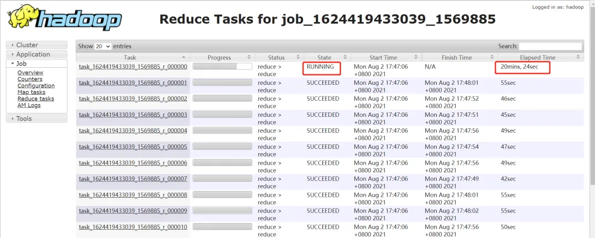

# Hive 数据倾斜

直接以例子来实践，排查是否出现了数据倾斜，具体是哪段代码导致的倾斜，怎么解决这段代码的倾斜。

当执行过程中任务卡在 99%，大概率是出现了数据倾斜，但是通常我们的 SQL 很大，需要判断出是哪段代码导致的倾斜，才能利于我们解决倾斜。通过下面这个非常简单的例子来看下如何定位产生数据倾斜的代码。

## 需求

### 表结构描述

先来了解下这些表中我们需要用的字段及数据量：

表的字段非常多，此处仅列出我们需要的字段

第一张表：user_info （用户信息表，用户粒度）

- 字段名,	字段含义,	字段描述
- userkey,	用户 key,	用户标识
- idno,	用户的身份证号,	用户实名认证时获取
- phone,	用户的手机号,	用户注册时的手机号
- name,	用户的姓名,	用户的姓名

user_info 表的数据量：1.02 亿，大小：13.9G，所占空间：41.7G（HDFS三副本）

第二张表：user_active （用户活跃表，用户粒度）

- 字段名,	字段含义,	字段描述
- userkey,	用户 key,	用户标识
- user_active_at,	活跃时间,	从埋点日志表中获取用户的最后活跃日期

user_active 表的数据量：1.1 亿

第三张表：user_intend（用户意向表，此处只取近六个月的数据，用户粒度）

- 字段名,	字段含义,	字段描述
- phone,	用户的手机号,	有意向的用户必须是手机号注册的用户
- intend_commodity, 用户意向次数最多的商品, 客户对某件商品意向次数最多
- intend_rank, 用户意向等级, 用户的购买意愿等级，级数越高，意向越大

user_intend 表的数据量：800 万

第四张表：user_order（用户订单表，此处只取近六个月的订单数据，用户粒度）

- 字段名,	字段含义,	字段描述
- idno, 用户的身份证号, 下订单的用户都是实名认证的
- order_num, 用户的订单次数, 用户近六个月下单次数
- order_amount, 用户的订单金额, 用户近六个月下单金额

user_order 表的数据量：640 万

### 需求描述

需求非常简单，就是将以上四张表关联组成一张大宽表，大宽表中包含用户的基本信息，活跃情况，购买意向及此用户下订单情况。

```sql
select
  a.userkey,
  a.idno,
  a.phone,
  a.name,
  b.user_active_at,
  c.intend_commodity,
  c.intend_rank,
  d.order_num,
  d.order_amount
from user_info a
left join user_active b on a.userkey = b.userkey
left join user_intend c on a.phone = c.phone
left join user_order d on a.idno = d.idno;
```

执行上述语句，在执行到某个 job 时任务卡在 99%：


这时我们就应该考虑出现数据倾斜了。其实还有一种情况可能是数据倾斜，就是任务超时被杀掉，Reduce 处理的数据量巨大，在做 full gc 的时候，stop the world。导致响应超时，超出默认的 600 秒，任务被杀掉。报错信息一般如下：

```sh
AttemptID:attempt_1624419433039_1569885_r_000000 Timed outafter 600 secs Container killed by the ApplicationMaster. Container killed onrequest. Exit code is 143 Container exited with a non-zero exit code 143
```

### 倾斜问题排查

数据倾斜大多数都是大 key 问题导致的。

如何判断是大 key 导致的问题，可以通过下面方法：

#### 1. 通过时间判断

如果某个 reduce 的时间比其他 reduce 时间长的多，如下图，大部分 task 在 1 分钟之内完成，只有 r_000000 这个 task 执行 20 多分钟了还没完成。



注意：要排除两种情况：

1. 如果每个 reduce 执行时间差不多，都特别长，不一定是数据倾斜导致的，可能是 reduce 设置过少导致的。

2. 有时候，某个 task 执行的节点可能有问题，导致任务跑的特别慢。这个时候，mapreduce 的推测执行，会重启一个任务。如果新的任务在很短时间内能完成，通常则是由于 task 执行节点问题导致的个别 task 慢。但是如果推测执行后的 task 执行任务也特别慢，那更说明该 task 可能会有倾斜问题

#### 2. 通过数据量判断
通过任务 Counter 判断

Counter 会记录整个 job 以及每个 task 的统计信息。counter 的 url 一般类似：

```
http://bd001:8088/proxy/application_1624419433039_1569885/mapreduce/singletaskcounter/task_1624419433039_1569885_r_000000/org.apache.hadoop.mapreduce.FileSystemCounter
```

通过输入记录数，普通的 task counter 如下，输入的记录数是 13 亿多:


而 task=000000 的 counter 如下，其输入记录数是 230 多亿。是其他任务的 100 多倍：


###   定位 SQL 代码

#### 1. 确定任务卡住的 stage

通过 jobname 确定 stage：

一般 Hive 默认的 jobname 名称会带上 stage 阶段，如下通过 jobname 看到任务卡住的为 Stage-4：


如果 jobname 是自定义的，那可能没法通过 jobname 判断 stage。需要借助于任务日志：

找到执行特别慢的那个 task，然后 Ctrl+F 搜索 “CommonJoinOperator: JOIN struct” 。Hive 在 join 的时候，会把 join 的 key 打印到日志中。如下：


上图中的关键信息是：struct<_col0:string, _col1:string, _col3:string>

这时候，需要参考该 SQL 的执行计划。通过参考执行计划，可以断定该阶段为 Stage-4 阶段：


#### 2. 确定 SQL 执行代码

确定了执行阶段，即 stage。通过执行计划，则可以判断出是执行哪段代码时出现了倾斜。还是从此图，这个 stage 中进行连接操作的表别名是 d：


就可以推测出是在执行下面红框中代码时出现了数据倾斜，因为这行的表的别名是 d：

```sql
select
  a.userkey,
  a.idno,
  a.phone,
  a.name,
  b.user_active_at,
  c.intend_commodity,
  c.intend_rank,
  d.order_num,
  d.order_amount
from user_info a
left join user_active b on a.userkey = b.userkey
left join user_intend c on a.phone = c.phone
left join user_order d on a.idno = d.idno;
```

### 5. 解决倾斜

我们知道了哪段代码引起的数据倾斜，就针对这段代码查看倾斜原因，看下这段代码的表中数据是否有异常。

#### 倾斜原因:

本文的示例数据中 user_info 和 user_order 通过身份证号关联，检查发现 user_info 表中身份证号为空的有 7000 多万，原因就是这 7000 多万数据都分配到一个 reduce 去执行，导致数据倾斜。

#### 解决方法：

可以先把身份证号为空的去除之后再关联，最后按照 userkey 连接，因为 userkey 全部都是有值的：

```sql
with t1 as(
select
  u.userkey,
  o.*
from user_info u
left join user_order o
on u.idno = o.idno
where u.idno is not null
--是可以把where条件写在后面的，hive会进行谓词下推，先执行where条件在执行 left join
)

select
  a.userkey,
  a.idno,
  a.phone,
  a.name,
  b.user_active_at,
  c.intend_commodity,
  c.intend_rank,
  d.order_num,
  d.order_amount
from user_info a
left join user_active b on a.userkey = b.userkey
left join user_intend c on a.phone = c.phone
left join t1 d on a.userkey = d.userkey;
```
也可以这样，给身份证为空的数据赋个随机值，但是要注意随机值不能和表中的身份证号有重复：
```sql
select
  a.userkey,
  a.idno,
  a.phone,
  a.name,
  b.user_active_at,
  c.intend_commodity,
  c.intend_rank,
  d.order_num,
  d.order_amount
from user_info a
left join user_active b on a.userkey = b.userkey
left join user_intend c on a.phone = c.phone
left join user_order d on nvl(a.idno,concat(rand(),'idnumber')) = d.idno;
```
其他的解决数据倾斜的方法：

1. 过滤掉脏数据

如果大 key 是无意义的脏数据，直接过滤掉。本场景中大 key 有实际意义，不能直接过滤掉。

2. 数据预处理

数据做一下预处理（如上面例子，对 null 值赋一个随机值），尽量保证 join 的时候，同一个 key 对应的记录不要有太多。

3. 增加 reduce 个数

如果数据中出现了多个大 key，增加 reduce 个数，可以让这些大 key 落到同一个 reduce 的概率小很多。

配置 reduce 个数：

`set mapred.reduce.tasks = 15;`

4. 转换为 mapjoin

如果两个表 join 的时候，一个表为小表，可以用 mapjoin 做。

配置 mapjoin：

```sh
set hive.auto.convert.join = true;  是否开启自动mapjoin，默认是true
set hive.mapjoin.smalltable.filesize=100000000;   mapjoin的表size大小
```

5. 启用倾斜连接优化

hive 中可以设置 `hive.optimize.skewjoin` 将一个 join sql 分为两个 job。
同时可以设置下 `hive.skewjoin.key`，此参数表示 join 连接的 key 的行数超过指定的行数，就认为该键是偏斜连接键，就对 join 启用倾斜连接优化。
默认 key 的行数是 100000。

配置倾斜连接优化：

```sh
set hive.optimize.skewjoin=true; 启用倾斜连接优化
set hive.skewjoin.key=200000; 超过20万行就认为该键是偏斜连接键
```

6. 调整内存设置

适用于那些由于内存超限任务被 kill 掉的场景。通过加大内存起码能让任务跑起来，不至于被杀掉。该参数不一定会明显降低任务执行时间。

配置内存：
```sh
set mapreduce.reduce.memory.mb=5120; 设置reduce内存大小
set mapreduce.reduce.java.opts=-Xmx5000m -XX:MaxPermSize=128m;
```

附：Hive 配置属性官方链接：https://cwiki.apache.org/confluence/display/Hive/Configuration+Properties


