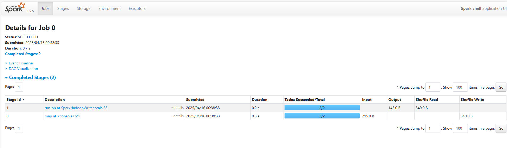

# RDD

Spark使用称为RDD(弹性分布式数据集)的专用基础数据结构，该结构是跨机器分区的逻辑数据集合。
RDD可以通过两种方式创建：
- 一种是通过引用外部存储系统中的数据集，
- 第二种是通过对现有RDD进行转换(例如，映射，过滤器，化简，联接)。

RDD抽象是通过语言集成的API公开的。

特性：

- Resilient（弹性）：RDD之间会形成有向无环图（DAG），如果RDD丢失了或者失效了，可以从父RDD重新计算得到。即容错性。
- Distributed（分布式）：RDD的数据是以逻辑分区的形式分布在集群的不同节点的。
- Dataset（数据集）：即RDD存储的数据记录，可以从外部数据生成RDD，例如Json文件，CSV文件，文本文件，数据库等。

- 内存计算: RDD可以被缓存到内存中，以便在本地进行快速计算。
- 并行计算: RDD可以并行计算，以便利用集群的多核CPU。
- 惰性求值: RDD的操作不会立即执行，而是等到需要结果的时候才执行。
- 容错性: RDD可以容忍节点失效和数据丢失。
- 不变性: RDD的操作不会改变RDD的结构和内容。
- 持久化: RDD可以持久化到内存或磁盘，以便在集群的不同节点上进行计算。

## 1. 创建RDD

### 1.1 引用外部存储系统中的数据集

Spark可以从各种外部存储系统（如Hadoop，HBase，Cassandra，Kafka等）中读取数据集并创建RDD。
- 存储系统的数据集， local, hdfs, hbase, cassandra, kafka, mongoDB, redis等。
- 读取方式：
  - 文本文件：sc.textFile("file:///path/to/file")
  - 压缩文件：sc.textFile("file:///path/to/file.gz")
  - 目录：sc.wholeTextFiles("file:///path/to/dir")
  - 数据库：
    - JDBC：sc.jdbc("jdbc:mysql://localhost/test", "table", "columns")
    - Hive：sc.sql("select * from table")
    - Presto：sc.presto("select * from table")
    - Elasticsearch：sc.es("http://localhost:9200/index/type")
    - 其他：sc.newAPIHadoopFile("file:///path/to/file", "inputformat", "keyclass", "valueclass", conf)
- Scala 集合创建：
  - 键值对：sc.parallelize(Seq((1, "a"), (2, "b"), (3, "c")))
  - 序列：sc.parallelize(Seq(1, 2, 3))
  - 集合：sc.parallelize(Set(1, 2, 3))
  - 数组：sc.parallelize(Array(1, 2, 3))
  - 元组：sc.parallelize(Seq((1, "a"), (2, "b"), (3, "c")))
  - 字典：sc.parallelize(Map(1 -> "a", 2 -> "b", 3 -> "c"))
  - 其他：sc.emptyRDD()
- 其他RDD转换：
  - 键值对：rdd.map(t => (t._2, t._1))
  - flatMap：rdd.flatMap(t => t.split(" "))
  - makeRDD：sc.makeRDD(List(1,2,3,4,5,6,7,8))

  

```scala
// 从Hadoop文件系统中读取数据集
val rdd = sc.textFile("hdfs://path/to/file")


// 从HBase表中读取数据集
val rdd = sc.newAPIHadoopRDD(
    "org.apache.hadoop.hbase.mapreduce.TableInputFormat",
    "org.apache.hadoop.hbase.io.ImmutableBytesWritable",
    "org.apache.hadoop.hbase.client.Result",
    conf)
```

### 1.2 对现有RDD进行转换

RDD 支持两种操作：

- 转换操作（Transformation）
- 行动操作（Actions）

#### 1.2.1 转换操作：

转换操作以RDD做为输入参数，然后输出一个或者多个RDD。转换操作不会修改输入RDD。Map()、Filter()这些都属于转换操作。

转换操作是惰性求值操作，只有在碰到行动操作（Actions）的时候，转换操作才会真正实行。转换操作分两种：窄依赖和宽依赖（上文提到过）。
窄依赖， 即输入RDD的每个分区只依赖于一个分区(前RDD)的输出结果，如map()操作。 1v1
宽依赖， 即输入RDD的每个分区依赖于整个(多个前)RDD的输出结果，如reduce()操作。 Nv1

- map：对每个元素进行映射操作, 结果仍然是RDD。 
- mapPartitions：对每个分区进行映射操作，func在类型T的RDD上运行时必须为`Iterator <T>⇒Iterator <U>`类型。
- mapPartitionsWithIndex：对每个分区进行映射操作，当在类型T的RDD上运行时，func的类型必须为`(Int，Iterator <T>)⇒Iterator <U>`。
- mapValues：对每个键值对的value进行映射操作，结果仍然是RDD。

- filter：过滤出满足条件的元素。
- flatMap：对每个元素进行映射操作, 每个输入项都可以映射到0个或多个输出项(因此func应该返回Seq而不是单个项)。
- flatMapValues：对每个键值对的value进行映射操作，然后将结果展开。
- sample：随机抽样, 结果仍然是RDD。
- union(otherDataSet)：将两个RDD合并, 结果仍然是RDD。
- intersection(otherDataSet)：求两个RDD的交集。
- subtract(otherDataSet)：求两个RDD的差集。
- distinct：去除重复元素。
- groupBy：将元素分组。
- groupByKey：将元素按键值对分组, 在(K，V)对的数据集上调用时，返回`(K，Iterable <V>)`对的数据集,注–如果要分组以便对每个键执行聚合(例如求和或平均值)，则使用reduceByKey或AggregateByKey将产生更好的性能。
- reduceByKey(func, [numTasks])：对每个键值对进行聚合操作, 在(K，V)对的数据集上调用时，返回(K，V)对的数据集，其中每个键的值使用给定的reduce函数func进行汇总，该函数必须为(V，V)⇒V类型与groupByKey中一样，reduce任务的数量可以通过可选的第二个参数进行配置。
- aggregateByKey(zeroValue, seqOp, combOp)：与reduceByKey类似，但允许用户提供一个初始值，该初始值将与每个键的初始值一起使用，并与每个分区的元素一起聚合。在(K，V)对的数据集上调用时，返回(K，U)对的数据集，其中每个键的值使用给定的Combine函数和中性的“零”值进行汇总。允许与输入值类型不同的聚合值类型，同时避免不必要的分配。像groupByKey中一样，reduce任务的数量可以通过可选的第二个参数进行配置。
- sortByKey：根据键值对进行排序。在由K实现Ordered的(K，V)对的数据集上调用时，返回(K，V)对的数据集，按布尔值升序参数指定按键升序或降序排序。
- sort：排序。

- join(otherDataSet, [numTasks])：将两个RDD进行连接操作, 结果仍然是RDD。在(K，V)和(K，W)类型的数据集上调用时，返回(K，(V，W))对的数据集，其中每个键都有所有成对的元素。通过leftOuterJoin，rightOuterJoin和fullOuterJoin支持外部联接。
- cogroup(otherDataSet, [numTasks])：将两个RDD进行合并分组操作, 结果仍然是RDD。在(K，V)和(K，W)类型的数据集上调用时，返回`(K，(Iterable <V>，Iterable <W>))`对的数据集，其中每个键都有所有元素。
- cartesian：笛卡尔积。在类型T和U的数据集上调用时，返回(T，U)对(所有元素对)的数据集。
- pipe(command, [envVars])：在RDD上执行外部命令。通过shell命令通过管道传输RDD的每个分区Perl或bash脚本。将RDD元素写入进程的stdin，并将输出到其stdout的行作为字符串的RDD返回。
- coalesce(numPartitions)：合并分区。将RDD中的分区数减少到numPartitions.
- repartition(numPartitions)：重新分区。将RDD中的分区数重新设置为numPartitions。保持分区平衡.
- repartitionAndSortWithinPartitions(partitioner, [ascending])：重新分区并排序。与repartition类似，但在每个分区内进行排序。

#### 1.2.2 行动操作：

- reduce(func)：对元素进行聚合操作。
- collect：将RDD中的元素收集到Driver程序中,返回数组。
- count：计算元素数量。
- first：返回第一个元素。
- take(n)：返回前n个元素。
- takeSample(withReplacement, num, [seed])：随机抽样。
- takeOrdered(n, [ordering])：返回前n个元素，按排序顺序。

- saveAsTextFile(path)：将RDD中的元素保存到文本文件中。写入本地文件系统，HDFS或任何其他Hadoop支持的文件系统中的给定目录中。 Spark在每个元素上调用toString将其转换为文件中的一行文本。
- saveAsSequenceFile(path)：将RDD中的元素保存到SequenceFile中。
- saveAsObjectFile(path)：将RDD中的元素保存到对象文件中。

- countByKey：计算每个键的元素数量。仅在类型(K，V)的RDD上可用。返回(K，Int)对的哈希图以及每个键的计数.

- foreach(func)：对每个元素进行操作。
- foreachPartition(func)：对每个分区进行操作。
- foreachPartitionWithIndex(func)：对每个分区进行操作，同时传入分区索引。


## 例子，WordCount

```sh
docker run -ti --rm --name spark -p 4040:4040 -p 8080:8080 -p 7077:7077 -v ./data:/opt/spark/work-dir/data spark:3.5.5  bash -c "../bin/spark-shell"
```

data/input.txt
```
people are not as beautiful as they look, 
as they walk or as they talk.
they are only as beautiful  as they love, 
as they care as they share.
```

```scala
./bin/spark-shell

scala> val input = sc.textFile("input.txt")
input: org.apache.spark.rdd.RDD[String] = input.txt MapPartitionsRDD[1] at textFile at <console>:24

scala> val words = input.flatMap(_.split(" "))
words: org.apache.spark.rdd.RDD[String] = MapPartitionsRDD[2] at flatMap at <console>:25

scala> val pairs = words.map( (_, 1))
pairs: org.apache.spark.rdd.RDD[(String, Int)] = MapPartitionsRDD[3] at map at <console>:26

scala> val counts = pairs.reduceByKey(_ + _)
counts: org.apache.spark.rdd.RDD[(String, Int)] = ShuffledRDD[4] at reduceByKey at <console>:27

scala> counts.saveAsTextFile("output")//触发action操作,才会去执行持久化

scala> sc.stop()    
```

```scala
sc.textFile("data/input.txt").flatMap(_.split(" ")).map((_,1)).reduceByKey(_ + _).saveAsTextFile("output.txt")
```

检查输出：

```
ls -al output/
part-00000 
part-00001 
_SUCCESS

cat output/part-00000 
(people,1) 
(are,2) 
(not,1) 
(as,8) 
(beautiful,2) 
(they, 7) 
(look,1) 

cat output/part-00001 
(walk, 1) 
(or, 1) 
(talk, 1) 
(only, 1) 
(love, 1) 
(care, 1) 
(share, 1) 
```

ui 查看

localhost:4040


