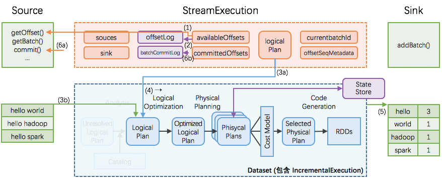

# Structured Streaming 之 Source 解析

**_[ Spark] Structured Streaming 源码解析系列_**

```md
本文内容适用范围：
* 2018.11.02 update, Spark 2.4 全系列 √ (已发布：2.4.0)
```

阅读本文前，请一定先阅读  [Structured Streaming 实现思路与实现概述](./Structured-Streaming-Implementation-and-Overview.md)  一文，其中概述了 Structured Streaming 的实现思路（包括 StreamExecution, Source, Sink 等在 Structured Streaming 里的作用），有了全局概念后再看本文的细节解释。

## 引言

Structured Streaming 非常显式地提出了输入(Source)、执行(StreamExecution)、输出(Sink)的 3 个组件，并且在每个组件显式地做到 fault-tolerant，由此得到整个 streaming 程序的 end-to-end exactly-once guarantees.

具体到源码上，Source 是一个抽象的接口 [trait Source](https://github.com/apache/spark/blob/master/sql/core/src/main/scala/org/apache/spark/sql/execution/streaming/Source.scala) [1]，包括了 Structured Streaming 实现 end-to-end exactly-once 处理所一定需要提供的功能（我们将马上详细解析这些方法）：

```scala
trait Source  {
  /* 方法 (1) */ def schema: StructType
  /* 方法 (2) */ def getOffset: Option[Offset]
  /* 方法 (3) */ def getBatch(start: Option[Offset], end: Offset): DataFrame
  /* 方法 (4) */ def commit(end: Offset) : Unit = {}
  /* 方法 (5) */ def stop(): Unit
}
```

相比而言，前作 Spark Streaming 的输入 InputDStream 抽象 [2] 并不强制要求可靠和可重放，因而也存在一些不可靠输入源（如 Receiver-based 输入源），在失效情形下丢失源头输入数据；这时即使 Spark Streaming 框架本身能够重做，但由于源头数据已经不存在了，也会导致计算本身不是 exactly-once 的。当然，Spark Streaming 对可靠的数据源如 HDFS, Kafka 等的计算给出的 guarantee 还是 exactly-once。

进化到 Structured Streaming 后，只保留对 **_可靠数据源_** 的支持：

- 已支持
  - Kafka，具体实现是 KafkaSource extends Source
  - HDFS-compatible file system，具体实现是 FileStreamSource extends Source
  - RateStream，具体实现是 RateStreamSource extends Source
- 预计后续很快会支持
  - RDBMS

## Source：方法与功能

在 Structured Streaming 里，由 StreamExecution 作为持续查询的驱动器，分批次不断地：



1. 在每个 StreamExecution 的批次最开始，StreamExecution 会向 Source 询问当前 Source 的最新进度，即最新的 offset
   - 这里是由 StreamExecution 调用 Source 的 `def getOffset: Option[Offset]`，即方法 (2)
   - Kafka (KafkaSource) 的具体 `getOffset()` 实现 ，会通过在 driver 端的一个长时运行的 consumer 从 kafka brokers 处获取到各个 topic 最新的 offsets（注意这里不存在 driver 或 consumer 直接连 zookeeper），比如 `topicA_partition1:300, topicB_partition1:50, topicB_partition2:60`，并把 offsets 返回
   - HDFS-compatible file system (FileStreamSource) 的具体 `getOffset()` 实现，是先扫描一下最新的一组文件，给一个递增的编号并持久化下来，比如 `2 -> {c.txt, d.txt}`，然后把编号 `2` 作为最新的 offset 返回
2. 这个 Offset 给到 StreamExecution 后会被 StreamExecution 持久化到自己的 WAL 里
3. 由 Source 根据 StreamExecution 所要求的 start offset、end offset，提供在 `(start, end]` 区间范围内的数据
   - 这里是由 StreamExecution 调用 Source 的 `def getBatch(start: Option[Offset], end: Offset): DataFrame`，即方法 (3)
   - 这里的 start offset 和 end offset，通常就是 Source 在上一个执行批次里提供的最新 offset，和 Source 在这个批次里提供的最新 offset；但需要注意区间范围是 **_左开右闭_** ！
   - 数据的返回形式的是一个 DataFrame（这个 DataFrame 目前只包含数据的描述信息，并没有发生实际的取数据操作）
4. StreamExecution 触发计算逻辑 logicalPlan 的优化与编译
5. 把计算结果写出给 Sink
   - 注意这时才会由 Sink 触发发生实际的取数据操作，以及计算过程
6. 在数据完整写出到 Sink 后，StreamExecution 通知 Source 可以废弃数据；然后把成功的批次 id 写入到 batchCommitLog
   - 这里是由 StreamExecution 调用 Source 的 `def commit(end: Offset): Unit`，即方法 (4)
   - `commit()` 方法主要是帮助 Source 完成 garbage-collection，如果外部数据源本身即具有 garbage-collection 功能，如 Kafka，那么在 Source 的具体 `commit()` 实现上即可为空、留给外部数据源去自己管理

到此，是解析了 Source 的方法 (2) (3) (4) 在 StreamExecution 的具体批次执行中，所需要实现的语义和被调用的过程。

另外还有方法 (1) 和 (5)：

- 方法 (1) `def schema: StructType`
  - 返回一个本 Source 数据的 schema 描述，即每列数据的名称、类型、是否可空等
  - 本方法在 Structured Streaming 开始真正执行每个批次开始前调用，不在每个批次执行时调用
- 方法 (5) `def stop(): Unit`
  - 当一个持续查询结束时，Source 会被调用此方法

## Source 的具体实现：HDFS-compatible file system, Kafka, Rate

我们总结一下截至目前，Source 已有的具体实现：

|             Sources             | 是否可重放 | 原生内置支持 |                      注解                       |
| :-----------------------------: | :--------: | :----------: | :---------------------------------------------: |
| **HDFS-compatible file system** |     √      |    已支持    | 包括但不限于 text, json, csv, parquet, orc, ... |
|            **Kafka**            |     √      |    已支持    |                  Kafka 0.10.0+                  |
|         **RateStream**          |     √      |    已支持    |               以一定速率产生数据                |
|           **Socket**            |     ×      |    已支持    |       主要用途是在技术会议/讲座上做 demo        |

这里我们特别强调一下，虽然 Structured Streaming 也内置了 `socket` 这个 Source，但它并不能可靠重放、因而也不符合 Structured Streaming 的结构体系。它的主要用途只是在技术会议/讲座上做 demo，不应用于线上生产系统。

## 扩展阅读

1. [Structured Streaming + Kafka Integration Guide (Kafka broker version 0.10.0 or higher)](https://spark.apache.org/docs/latest/structured-streaming-kafka-integration.html)

## 参考资料

1. [Github: org/apache/spark/sql/execution/streaming/Source.scala](https://github.com/apache/spark/blob/master/sql/core/src/main/scala/org/apache/spark/sql/execution/streaming/Source.scala)
2. [Github: org/apache/spark/streaming/dstream/InputDStream.scala](https://github.com/apache/spark/blob/master/streaming/src/main/scala/org/apache/spark/streaming/dstream/InputDStream.scala)

<br/>
<br/>
