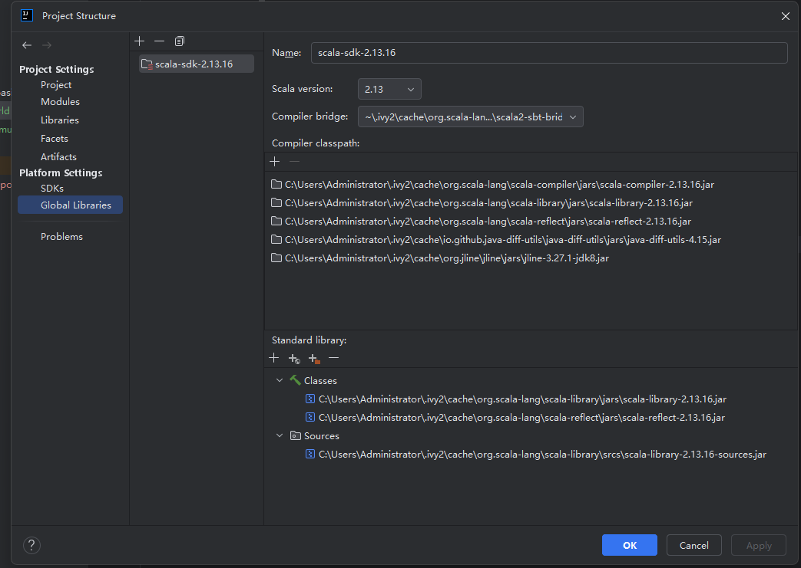
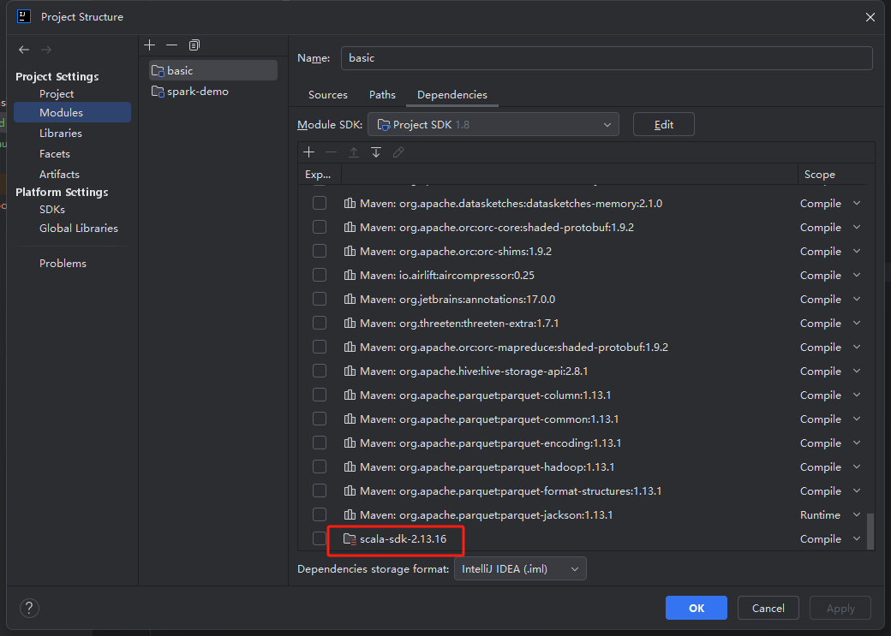
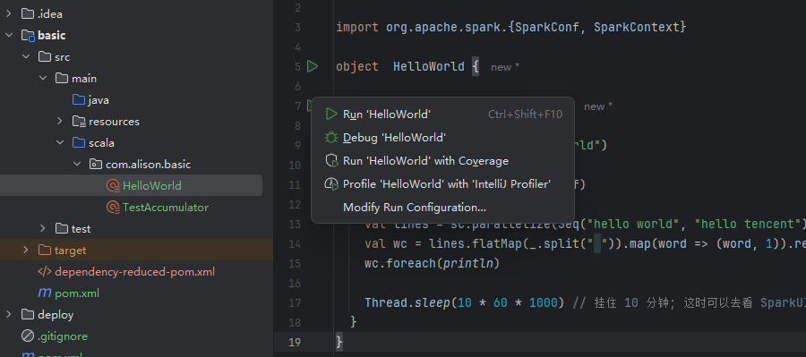

# Spark Code Quick Start

## 项目结构

```
spark-demo
├── pom.xml
└── basic
    ├── pom.xml
    ├── src
    │   ├── main
    │   │   ├── scala
    │   │   │   └── com
    │   │   │       └── alison
    │   │   │           └── basic
    │   │   │               └── HelloWorld.scala
    │   │   └── resources
    │   │       └── log4j.properties
    │   └── test
    │       └── scala
    │           └── com
    │               └── alison
    │                   └── basic
    │                       └── HelloWorldTest.scala

```

## 创建 Maven 项目

其中 basic/pom.xml 文件内容如下：

```xml
<project xmlns="http://maven.apache.org/POM/4.0.0" xmlns:xsi="http://www.w3.org/2001/XMLSchema-instance"
         xsi:schemaLocation="http://maven.apache.org/POM/4.0.0 http://maven.apache.org/xsd/maven-4.0.0.xsd">
    <modelVersion>4.0.0</modelVersion>
    <parent>
        <groupId>org.example</groupId>
        <artifactId>spark-demo</artifactId>
        <version>1.0-SNAPSHOT</version>
    </parent>

    <artifactId>basic</artifactId>
    <packaging>jar</packaging>

    <name>basic</name>
    <url>http://maven.apache.org</url>

    <properties>
        <project.build.sourceEncoding>UTF-8</project.build.sourceEncoding>
        <maven.compiler.source>1.8</maven.compiler.source>
        <maven.compiler.target>1.8</maven.compiler.target>
        <scala.version>2.13</scala.version>
        <scala-lib.version>2.13.8</scala-lib.version>
        <spark.version>3.5.1</spark.version>
    </properties>

    <dependencies>
        <dependency>
            <groupId>org.apache.spark</groupId>
            <artifactId>spark-core_2.13</artifactId>
            <version>${spark.version}</version>
        </dependency>
        <dependency>
            <groupId>org.apache.spark</groupId>
            <artifactId>spark-sql_2.13</artifactId>
            <version>${spark.version}</version>
        </dependency>
    </dependencies>
    <build>
        <plugins>
            <!-- 该插件用于将 Scala 代码编译成 class 文件 -->
            <plugin>
                <groupId>net.alchim31.maven</groupId>
                <artifactId>scala-maven-plugin</artifactId>
                <version>4.9.0</version>
                <executions>
                    <execution>
                        <!-- 声明绑定到 maven 的 compile 阶段 -->
                        <goals>
                            <goal>compile</goal>
                            <goal>testCompile</goal>
                        </goals>
                    </execution>
                </executions>
            </plugin>
            <plugin>
                <groupId>org.apache.maven.plugins</groupId>
                <artifactId>maven-assembly-plugin</artifactId>
                <version>3.1.0</version>
<!--                <configuration>-->
<!--                    <descriptorRefs>-->
<!--                        <descriptorRef>jar-with-dependencies</descriptorRef>-->
<!--                    </descriptorRefs>-->
<!--                </configuration>-->
<!--                更侧重于将项目的各种文件（包括代码、依赖、文档等）打包成不同格式的归档文件 -->
<!--                <executions>-->
<!--                    <execution>-->
<!--                        <id>make-assembly</id>-->
<!--                        <phase>package</phase>-->
<!--                        <goals>-->
<!--                            <goal>single</goal>-->
<!--                        </goals>-->
<!--                    </execution>-->
<!--                </executions>-->
            </plugin>
            <plugin>
                <groupId>org.apache.maven.plugins</groupId>
                <artifactId>maven-shade-plugin</artifactId>
                <version>3.4.1</version>
                <executions>
                    <execution>
                        <phase>package</phase>
                        <goals>
                            <goal>shade</goal>
                        </goals>
                        <configuration>
                            <transformers>
                                <transformer implementation="org.apache.maven.plugins.shade.resource.ManifestResourceTransformer">
                                    <!-- 设置主类，替换为你的实际主类名 -->
                                    <mainClass>com.alison.basic.HelloWorld</mainClass>
                                </transformer>
                            </transformers>
                        </configuration>
                    </execution>
                </executions>
            </plugin>
        </plugins>
    </build>

</project>

```


## 配置

下载 idea 插件，并配置好 scala 插件。

项目的 project structure 如下：





注意，需要将默认的依赖替换一下, scala-sdk-2.13 替换成 global libraries中下载的scala sdk-2.13.16

## 编写代码

HelloWorld.scala

```scala    
package com.alison.basic

import org.apache.spark.{SparkConf, SparkContext}

object  HelloWorld {

  def main(args: Array[String]) {
    val conf = new SparkConf()
    conf.setAppName("SparkHelloWorld")
    conf.setMaster("local[2]")
    val sc = new SparkContext(conf)

    val lines = sc.parallelize(Seq("hello world", "hello tencent"))
    val wc = lines.flatMap(_.split(" ")).map(word => (word, 1)).reduceByKey(_ + _)
    wc.foreach(println)

    Thread.sleep(10 * 60 * 1000) // 挂住 10 分钟; 这时可以去看 SparkUI: http://localhost:4040
  }
}

```

log4j.properties

```properties
log4j.rootCategory=ERROR, console
log4j.appender.console=org.apache.log4j.ConsoleAppender
log4j.appender.console.target=System.err
log4j.appender.console.layout=org.apache.log4j.PatternLayout
log4j.appender.console.layout.ConversionPattern=%d{yy/MM/dd HH:mm:ss} %p %c{1}: %m%n
# Set the default spark-shell log level to ERROR. When running the spark-shell, the
# log level for this class is used to overwrite the root logger's log level, so that
# the user can have different defaults for the shell and regular Spark apps.

log4j.logger.org.apache.spark.repl.Main=ERROR

# Settings to quiet third party logs that are too verbose
log4j.logger.org.spark_project.jetty=ERROR
log4j.logger.org.spark_project.jetty.util.component.AbstractLifeCycle=ERROR
log4j.logger.org.apache.spark.repl.SparkIMain$exprTyper=ERROR
log4j.logger.org.apache.spark.repl.SparkILoop$SparkILoopInterpreter=ERROR
log4j.logger.org.apache.parquet=ERROR
log4j.logger.parquet=ERROR

# SPARK-9183: Settings to avoid annoying messages when looking up nonexistent UDFs in SparkSQL with Hive support
log4j.logger.org.apache.hadoop.hive.metastore.RetryingHMSHandler=FATAL
log4j.logger.org.apache.hadoop.hive.ql.exec.FunctionRegistry=ERROR
```

## 运行

### idea 运行

右键点击 HelloWorld.scala 选择 run 'HelloWorld'



### 通过 java -jar xx

或者通过 jar 包运行

```
mvn clean package -DskipTests -f basic/pom.xml
```
会生成 basic/target/basic-1.0-SNAPSHOT.jar

```
java -jar basic/target/basic-1.0-SNAPSHOT.jar
```
### 通过 java -cp xx.jar com.alison.basic.HelloWorld 运行

注释掉 pom.xml 中的 shade 插件， 打开 assembly 插件的注释

```
mvn clean package -DskipTests -f basic/pom.xml
java -cp basic/target/basic-1.0-SNAPSHOT.jar com.alison.basic.HelloWorld
```

