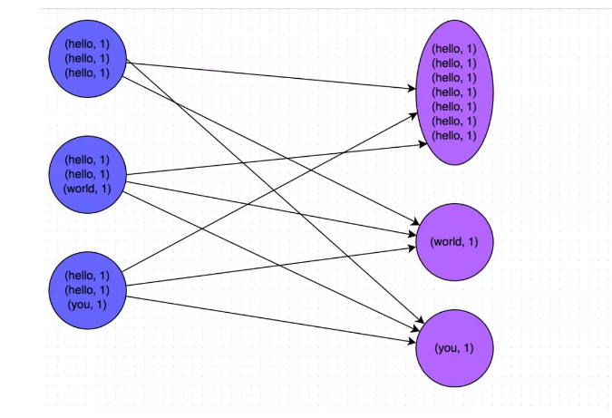
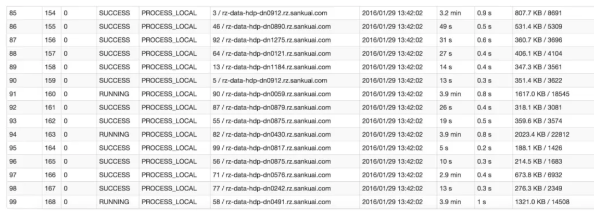
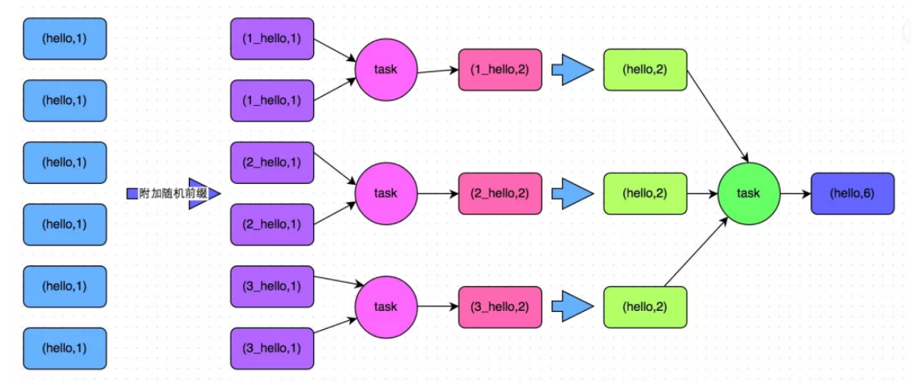
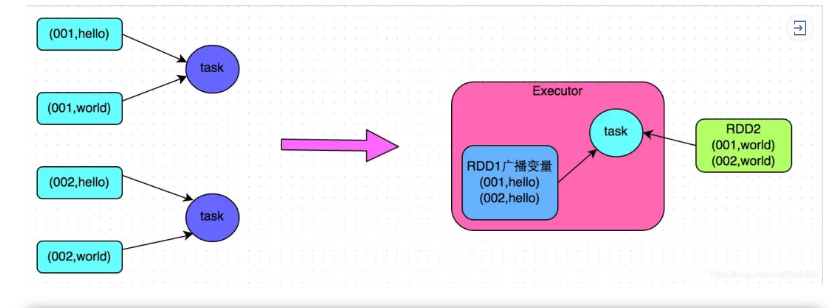
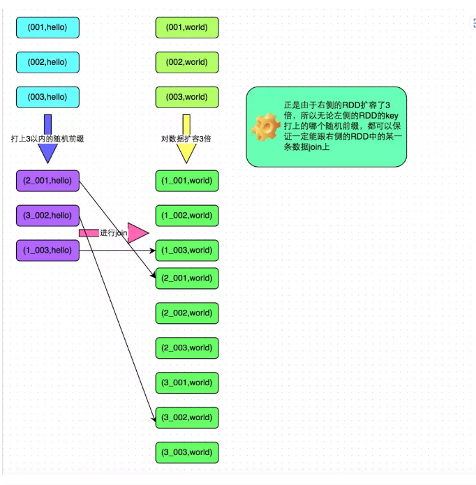

## 一、调优概述

有的时候，我们可能会遇到大数据计算中一个最棘手的问题——数据倾斜，此时Spark作业的性能会比期望差很多。数据倾斜调优，就是使用各种技术方案解决不同类型的数据倾斜问题，以保证Spark作业的性能。

## 二、数据倾斜发生时的现象

绝大多数task执行得都非常快，但个别task执行极慢。比如，总共有1000个task，997个task都在1分钟之内执行完了，但是剩余两三个task却要一两个小时。这种情况很常见。原本能够正常执行的Spark作业，某天突然报出OOM（内存溢出）异常，观察异常栈，是我们写的业务代码造成的。这种情况比较少见。

## 三、数据倾斜发生的原理

**数据倾斜的原理很简单**：在进行shuffle的时候，必须将各个节点上相同的key拉取到某个节点上的一个task来进行处理，比如按照key进行聚合或join等操作。此时如果某个key对应的数据量特别大的话，就会发生数据倾斜。比如大部分key对应10条数据，但是个别key却对应了100万条数据，那么大部分task可能就只会分配到10条数据，然后1秒钟就运行完了；但是个别task可能分配到了100万数据，要运行一两个小时。因此，整个Spark作业的运行进度是由运行时间最长的那个task决定的。

因此出现数据倾斜的时候，Spark作业看起来会运行得非常缓慢，甚至可能因为某个task处理的数据量过大导致内存溢出。

下图就是一个很清晰的例子：hello这个key，在三个节点上对应了总共7条数据，这些数据都会被拉取到同一个task中进行处理；而world和you这两个key分别才对应1条数据，所以另外两个task只要分别处理1条数据即可。此时第一个task的运行时间可能是另外两个task的7倍，而整个stage的运行速度也由运行最慢的那个task所决定。



## 四、如何定位导致数据倾斜的代码

数据倾斜只会发生在shuffle过程中。这里给大家罗列一些常用的并且可能会触发shuffle操作的算子：distinct、groupByKey、reduceByKey、aggregateByKey、join、cogroup、repartition等。出现数据倾斜时，可能就是你的代码中使用了这些算子中的某一个所导致的。

## 五、某个task执行特别慢的情况

首先要看的，就是数据倾斜发生在第几个stage中。如果是用yarn-client模式提交，那么本地是直接可以看到log的，可以在log中找到当前运行到了第几个stage，可以看下之前写的Hive数据倾斜：[Hive 数据倾斜问题定位排查及解决](../hive/hive-数据倾斜.md)

如果是用yarn-cluster模式提交，则可以通过Spark Web UI来查看当前运行到了第几个stage。

此外，无论是使用yarn-client模式还是yarn-cluster模式，我们都可以在Spark Web UI上深入看一下当前这个stage各个task分配的数据量，从而进一步确定是不是task分配的数据不均匀导致了数据倾斜。

比如下图中，倒数第三列显示了每个task的运行时间。明显可以看到，有的task运行特别快，只需要几秒钟就可以运行完；而有的task运行特别慢，需要几分钟才能运行完，此时单从运行时间上看就已经能够确定发生数据倾斜了。此外，倒数第一列显示了每个task处理的数据量，明显可以看到，运行时间特别短的task只需要处理几百KB的数据即可，而运行时间特别长的task需要处理几千KB的数据，处理的数据量差了10倍。此时更加能够确定是发生了数据倾斜。



知道数据倾斜发生在哪一个stage之后，接着我们就需要根据stage划分原理，推算出来发生倾斜的那个stage对应代码中的哪一部分，这部分代码中肯定会有一个shuffle类算子。

精准推算stage与代码的对应关系，需要对Spark的源码有深入的理解，这里我们可以介绍一个相对简单实用的推算方法：**只要看到Spark代码中出现了一个shuffle类算子或者是Spark SQL的SQL语句中出现了会导致shuffle的语句（比如group by语句），那么就可以判定，以那个地方为界限划分出了前后两个stage**。这里我们就以Spark最基础的入门程序——单词计数来举例，如何用最简单的方法大致推算出一个stage对应的代码。如下示例，在整个代码中，只有一个reduceByKey是会发生shuffle的算子，因此就可以认为，以这个算子为界限，会划分出前后两个stage。

- **stage0**，主要是执行从textFile到map操作，以及执行shuffle write操作。shuffle write操作，我们可以简单理解为对pairs RDD中的数据进行分区操作，每个task处理的数据中，相同的key会写入同一个磁盘文件内。
- **stage1**，主要是执行从reduceByKey到collect操作，stage1的各个task一开始运行，就会首先执行shuffle read操作。执行shuffle read操作的task，会从stage0的各个task所在节点拉取属于自己处理的那些key，然后对同一个key进行全局性的聚合或join等操作，在这里就是对key的value值进行累加。stage1在执行完reduceByKey算子之后，就计算出了最终的wordCounts RDD，然后会执行collect算子，将所有数据拉取到Driver上，供我们遍历和打印输出。

```scala
val conf = new SparkConf()
val sc = new SparkContext(conf)
val lines = sc.textFile("hdfs://...")
val words = lines.flatMap(_.split(" "))
val pairs = words.map((_, 1))
val wordCounts = pairs.reduceByKey(_ + _)
wordCounts.collect().foreach(println(_))
```

通过对单词计数程序的分析，希望能够让大家了解最基本的stage划分的原理，以及stage划分后shuffle操作是如何在两个stage的边界处执行的。然后我们就知道如何快速定位出发生数据倾斜的stage对应代码的哪一个部分了。比如我们在Spark Web UI或者本地log中发现，stage1的某几个task执行得特别慢，判定stage1出现了数据倾斜，那么就可以回到代码中定位出stage1主要包括了reduceByKey这个shuffle类算子，此时基本就可以确定是由educeByKey算子导致的数据倾斜问题。比如某个单词出现了100万次，其他单词才出现10次，那么stage1的某个task就要处理100万数据，整个stage的速度就会被这个task拖慢。

## 六、某个task莫名其妙内存溢出的情况

这种情况下去定位出问题的代码就比较容易了。我们建议直接看yarn-client模式下本地log的异常栈，或者是通过YARN查看yarn-cluster模式下的log中的异常栈。一般来说，通过异常栈信息就可以定位到你的代码中哪一行发生了内存溢出。然后在那行代码附近找找，一般也会有shuffle类算子，此时很可能就是这个算子导致了数据倾斜。但是大家要注意的是，不能单纯靠偶然的内存溢出就判定发生了数据倾斜。因为自己编写的代码的bug，以及偶然出现的数据异常，也可能会导致内存溢出。因此还是要按照上面所讲的方法，通过Spark Web UI查看报错的那个stage的各个task的运行时间以及分配的数据量，才能确定是否是由于数据倾斜才导致了这次内存溢出。

## 七、查看导致数据倾斜的key的数据分布情况

知道了数据倾斜发生在哪里之后，通常需要分析一下那个执行了shuffle操作并且导致了数据倾斜的RDD/Hive表，查看一下其中key的分布情况。这主要是为之后选择哪一种技术方案提供依据。针对不同的key分布与不同的shuffle算子组合起来的各种情况，可能需要选择不同的技术方案来解决。此时根据你执行操作的情况不同，可以有很多种查看key分布的方式：

- 如果是Spark SQL中的group by、join语句导致的数据倾斜，那么就查询一下SQL中使用的表的key分布情况。
- 如果是对Spark RDD执行shuffle算子导致的数据倾斜，那么可以在Spark作业中加入查看key分布的代码，比如RDD.countByKey()。然后对统计出来的各个key出现的次数，collect/take到客户端打印一下，就可以看到key的分布情况。

举例来说，对于上面所说的单词计数程序，如果确定了是stage1的reduceByKey算子导致了数据倾斜，那么就应该看看进行reduceByKey操作的RDD中的key分布情况，在这个例子中指的就是pairs RDD。如下示例，我们可以先对pairs采样10%的样本数据，然后使用countByKey算子统计出每个key出现的次数，最后在客户端遍历和打印样本数据中各个key的出现次数。

```
val sampledPairs = pairs.sample(false, 0.1)
val sampledWordCounts = sampledPairs.countByKey()
sampledWordCounts.foreach(println(_))
```

## 八、数据倾斜的解决方案

#### 解决方案一：使用 Hive ETL 预处理数据

**方案适用场景**：导致数据倾斜的是Hive表。如果该Hive表中的数据本身很不均匀（比如某个key对应了100万数据，其他key才对应了10条数据），而且业务场景需要频繁使用Spark对Hive表执行某个分析操作，那么比较适合使用这种技术方案。

**方案实现思路**：此时可以评估一下，是否可以通过Hive来进行数据预处理（即通过Hive ETL预先对数据按照key进行聚合，或者是预先和其他表进行join），然后在Spark作业中针对的数据源就不是原来的Hive表了，而是预处理后的Hive表。此时由于数据已经预先进行过聚合或join操作了，那么在Spark作业中也就不需要使用原先的shuffle类算子执行这类操作了。

**方案实现原理**：这种方案从根源上解决了数据倾斜，因为彻底避免了在Spark中执行shuffle类算子，那么肯定就不会有数据倾斜的问题了。但是这里也要提醒一下大家，这种方式属于治标不治本。因为毕竟数据本身就存在分布不均匀的问题，所以Hive ETL中进行group by或者join等shuffle操作时，还是会出现数据倾斜，导致Hive ETL的速度很慢。我们只是把数据倾斜的发生提前到了Hive ETL中，避免Spark程序发生数据倾斜而已。

**方案优点**：实现起来简单便捷，效果还非常好，完全规避掉了数据倾斜，Spark作业的性能会大幅度提升。

**方案缺点**：治标不治本，Hive ETL中还是会发生数据倾斜。

**方案实践经验**：在一些Java系统与Spark结合使用的项目中，会出现Java代码频繁调用Spark作业的场景，而且对Spark作业的执行性能要求很高，就比较适合使用这种方案。将数据倾斜提前到上游的Hive ETL，每天仅执行一次，只有那一次是比较慢的，而之后每次Java调用Spark作业时，执行速度都会很快，能够提供更好的用户体验。

**项目实践经验**：在美团·点评的交互式用户行为分析系统中使用了这种方案，该系统主要是允许用户通过Java Web系统提交数据分析统计任务，后端通过Java提交Spark作业进行数据分析统计。要求Spark作业速度必须要快，尽量在10分钟以内，否则速度太慢，用户体验会很差。所以我们将有些Spark作业的shuffle操作提前到了Hive ETL中，从而让Spark直接使用预处理的Hive中间表，尽可能地减少Spark的shuffle操作，大幅度提升了性能，将部分作业的性能提升了6倍以上。

#### 解决方案二：过滤少数导致倾斜的key

**方案适用场景**：如果发现导致倾斜的key就少数几个，而且对计算本身的影响并不大的话，那么很适合使用这种方案。比如99%的key就对应10条数据，但是只有一个key对应了100万数据，从而导致了数据倾斜。

**方案实现思路**：如果我们判断那少数几个数据量特别多的key，对作业的执行和计算结果不是特别重要的话，那么干脆就直接过滤掉那少数几个key。比如，在Spark SQL中可以使用where子句过滤掉这些key或者在Spark Core中对RDD执行filter算子过滤掉这些key。如果需要每次作业执行时，动态判定哪些key的数据量最多然后再进行过滤，那么可以使用sample算子对RDD进行采样，然后计算出每个key的数量，取数据量最多的key过滤掉即可。

**方案实现原理**：将导致数据倾斜的key给过滤掉之后，这些key就不会参与计算了，自然不可能产生数据倾斜。

**方案优点**：实现简单，而且效果也很好，可以完全规避掉数据倾斜。

**方案缺点**：适用场景不多，大多数情况下，导致倾斜的key还是很多的，并不是只有少数几个。

**方案实践经验**：在项目中我们也采用过这种方案解决数据倾斜。有一次发现某一天Spark作业在运行的时候突然OOM了，追查之后发现，是Hive表中的某一个key在那天数据异常，导致数据量暴增。因此就采取每次执行前先进行采样，计算出样本中数据量最大的几个key之后，直接在程序中将那些key给过滤掉。

#### 解决方案三：提高shuffle操作的并行度

**方案适用场景**：如果我们必须要对数据倾斜迎难而上，那么建议优先使用这种方案，因为这是处理数据倾斜最简单的一种方案。

**方案实现思路**：在对RDD执行shuffle算子时，给shuffle算子传入一个参数，比如reduceByKey(1000)，该参数就设置了这个shuffle算子执行时shuffle read task的数量。对于Spark SQL中的shuffle类语句，比如group by、join等，需要设置一个参数，即spark.sql.shuffle.partitions，该参数代表了shuffle read task的并行度，该值默认是200，对于很多场景来说都有点过小。

**方案实现原理**：增加shuffle read task的数量，可以让原本分配给一个task的多个key分配给多个task，从而让每个task处理比原来更少的数据。举例来说，如果原本有5个key，每个key对应10条数据，这5个key都是分配给一个task的，那么这个task就要处理50条数据。而增加了shuffle read task以后，每个task就分配到一个key，即每个task就处理10条数据，那么自然每个task的执行时间都会变短了。具体原理如下图所示。

**方案优点**：实现起来比较简单，可以有效缓解和减轻数据倾斜的影响。

**方案缺点**：只是缓解了数据倾斜而已，没有彻底根除问题，根据实践经验来看，其效果有限。

**方案实践经验**：该方案通常无法彻底解决数据倾斜，因为如果出现一些极端情况，比如某个key对应的数据量有100万，那么无论你的task数量增加到多少，这个对应着100万数据的key肯定还是会分配到一个task中去处理，因此注定还是会发生数据倾斜的。所以这种方案只能说是在发现数据倾斜时尝试使用的第一种手段，尝试去用嘴简单的方法缓解数据倾斜而已，或者是和其他方案结合起来使用。


#### 解决方案四：两阶段聚合（局部聚合+全局聚合）

**方案适用场景**：对RDD执行reduceByKey等聚合类shuffle算子或者在Spark SQL中使用group by语句进行分组聚合时，比较适用这种方案。

**方案实现思路**：这个方案的核心实现思路就是进行两阶段聚合。第一次是局部聚合，先给每个key都打上一个随机数，比如10以内的随机数，此时原先一样的key就变成不一样的了，比如(hello, 1) (hello, 1) (hello, 1) (hello, 1)，就会变成(1_hello, 1) (1_hello, 1) (2_hello, 1) (2_hello, 1)。接着对打上随机数后的数据，执行reduceByKey等聚合操作，进行局部聚合，那么局部聚合结果，就会变成了(1_hello, 2) (2_hello, 2)。然后将各个key的前缀给去掉，就会变成(hello,2)(hello,2)，再次进行全局聚合操作，就可以得到最终结果了，比如(hello, 4)。

**方案实现原理**：将原本相同的key通过附加随机前缀的方式，变成多个不同的key，就可以让原本被一个task处理的数据分散到多个task上去做局部聚合，进而解决单个task处理数据量过多的问题。接着去除掉随机前缀，再次进行全局聚合，就可以得到最终的结果。具体原理见下图。

**方案优点**：对于聚合类的shuffle操作导致的数据倾斜，效果是非常不错的。通常都可以解决掉数据倾斜，或者至少是大幅度缓解数据倾斜，将Spark作业的性能提升数倍以上。

**方案缺点**：仅仅适用于聚合类的shuffle操作，适用范围相对较窄。如果是join类的shuffle操作，还得用其他的解决方案。



```
// 第一步，给RDD中的每个key都打上一个随机前缀。
JavaPairRDD<String, Long> randomPrefixRdd = rdd.mapToPair(
        new PairFunction<Tuple2<Long,Long>, String, Long>() {
            private static final long serialVersionUID = 1L;
            @Override
            public Tuple2<String, Long> call(Tuple2<Long, Long> tuple)
                    throws Exception {
                Random random = new Random();
                int prefix = random.nextInt(10);
                return new Tuple2<String, Long>(prefix + "_" + tuple._1, tuple._2);
            }
        });

// 第二步，对打上随机前缀的key进行局部聚合。
JavaPairRDD<String, Long> localAggrRdd = randomPrefixRdd.reduceByKey(
        new Function2<Long, Long, Long>() {
            private static final long serialVersionUID = 1L;
            @Override
            public Long call(Long v1, Long v2) throws Exception {
                return v1 + v2;
            }
        });

// 第三步，去除RDD中每个key的随机前缀。
JavaPairRDD<Long, Long> removedRandomPrefixRdd = localAggrRdd.mapToPair(
        new PairFunction<Tuple2<String,Long>, Long, Long>() {
            private static final long serialVersionUID = 1L;
            @Override
            public Tuple2<Long, Long> call(Tuple2<String, Long> tuple)
                    throws Exception {
                long originalKey = Long.valueOf(tuple._1.split("_")[1]);
                return new Tuple2<Long, Long>(originalKey, tuple._2);
            }
        });

// 第四步，对去除了随机前缀的RDD进行全局聚合。
JavaPairRDD<Long, Long> globalAggrRdd = removedRandomPrefixRdd.reduceByKey(
        new Function2<Long, Long, Long>() {
            private static final long serialVersionUID = 1L;
            @Override
            public Long call(Long v1, Long v2) throws Exception {
                return v1 + v2;
            }
        });
```

#### 解决方案五：将reduce join转为map join

**方案适用场景**：在对RDD使用join类操作，或者是在Spark SQL中使用join语句时，而且join操作中的一个RDD或表的数据量比较小（比如几百M或者一两G），比较适用此方案。

**方案实现思路**：不使用join算子进行连接操作，而使用Broadcast变量与map类算子实现join操作，进而完全规避掉shuffle类的操作，彻底避免数据倾斜的发生和出现。将较小RDD中的数据直接通过collect算子拉取到Driver端的内存中来，然后对其创建一个Broadcast变量；接着对另外一个RDD执行map类算子，在算子函数内，从Broadcast变量中获取较小RDD的全量数据，与当前RDD的每一条数据按照连接key进行比对，如果连接key相同的话，那么就将两个RDD的数据用你需要的方式连接起来。

**方案实现原理**：普通的join是会走shuffle过程的，而一旦shuffle，就相当于会将相同key的数据拉取到一个shuffle read task中再进行join，此时就是reduce join。但是如果一个RDD是比较小的，则可以采用广播小RDD全量数据+map算子来实现与join同样的效果，也就是map join，此时就不会发生shuffle操作，也就不会发生数据倾斜。具体原理如下图所示。**方案优点**：对join操作导致的数据倾斜，效果非常好，因为根本就不会发生shuffle，也就根本不会发生数据倾斜。**方案缺点**：适用场景较少，因为这个方案只适用于一个大表和一个小表的情况。毕竟我们需要将小表进行广播，此时会比较消耗内存资源，driver和每个Executor内存中都会驻留一份小RDD的全量数据。如果我们广播出去的RDD数据比较大，比如10G以上，那么就可能发生内存溢出了。因此并不适合两个都是大表的情况。



```
// 首先将数据量比较小的RDD的数据，collect到Driver中来。
List<Tuple2<Long, Row>> rdd1Data = rdd1.collect()
// 然后使用Spark的广播功能，将小RDD的数据转换成广播变量，这样每个Executor就只有一份RDD的数据。
// 可以尽可能节省内存空间，并且减少网络传输性能开销。
final Broadcast<List<Tuple2<Long, Row>>> rdd1DataBroadcast = sc.broadcast(rdd1Data);

// 对另外一个RDD执行map类操作，而不再是join类操作。
JavaPairRDD<String, Tuple2<String, Row>> joinedRdd = rdd2.mapToPair(
        new PairFunction<Tuple2<Long,String>, String, Tuple2<String, Row>>() {
            private static final long serialVersionUID = 1L;
            @Override
            public Tuple2<String, Tuple2<String, Row>> call(Tuple2<Long, String> tuple)
                    throws Exception {
                // 在算子函数中，通过广播变量，获取到本地Executor中的rdd1数据。
                List<Tuple2<Long, Row>> rdd1Data = rdd1DataBroadcast.value();
                // 可以将rdd1的数据转换为一个Map，便于后面进行join操作。
                Map<Long, Row> rdd1DataMap = new HashMap<Long, Row>();
                for(Tuple2<Long, Row> data : rdd1Data) {
                    rdd1DataMap.put(data._1, data._2);
                }
                // 获取当前RDD数据的key以及value。
                String key = tuple._1;
                String value = tuple._2;
                // 从rdd1数据Map中，根据key获取到可以join到的数据。
                Row rdd1Value = rdd1DataMap.get(key);
                return new Tuple2<String, String>(key, new Tuple2<String, Row>(value, rdd1Value));
            }
        });

// 这里得提示一下。
// 上面的做法，仅仅适用于rdd1中的key没有重复，全部是唯一的场景。
// 如果rdd1中有多个相同的key，那么就得用flatMap类的操作，在进行join的时候不能用map，而是得遍历rdd1所有数据进行join。
// rdd2中每条数据都可能会返回多条join后的数据。
```

#### 解决方案六：采样倾斜key并分拆join操作

**方案适用场景**：两个RDD/Hive表进行join的时候，如果数据量都比较大，无法采用“解决方案五”，那么此时可以看一下两个RDD/Hive表中的key分布情况。如果出现数据倾斜，是因为其中某一个RDD/Hive表中的少数几个key的数据量过大，而另一个RDD/Hive表中的所有key都分布比较均匀，那么采用这个解决方案是比较合适的。

**方案实现思路**：

- 对包含少数几个数据量过大的key的那个RDD，通过sample算子采样出一份样本来，然后统计一下每个key的数量，计算出来数据量最大的是哪几个key。
- 然后将这几个key对应的数据从原来的RDD中拆分出来，形成一个单独的RDD，并给每个key都打上n以内的随机数作为前缀，而不会导致倾斜的大部分key形成另外一个RDD。
- 接着将需要join的另一个RDD，也过滤出来那几个倾斜key对应的数据并形成一个单独的RDD，将每条数据膨胀成n条数据，这n条数据都按顺序附加一个0~n的前缀，不会导致倾斜的大部分key也形成另外一个RDD。
- 再将附加了随机前缀的独立RDD与另一个膨胀n倍的独立RDD进行join，此时就可以将原先相同的key打散成n份，分散到多个task中去进行join了。
- 而另外两个普通的RDD就照常join即可。
- 最后将两次join的结果使用union算子合并起来即可，就是最终的join结果。

**方案实现原理**：对于join导致的数据倾斜，如果只是某几个key导致了倾斜，可以将少数几个key分拆成独立RDD，并附加随机前缀打散成n份去进行join，此时这几个key对应的数据就不会集中在少数几个task上，而是分散到多个task进行join了。具体原理见下图。

**方案优点**：对于join导致的数据倾斜，如果只是某几个key导致了倾斜，采用该方式可以用最有效的方式打散key进行join。而且只需要针对少数倾斜key对应的数据进行扩容n倍，不需要对全量数据进行扩容。避免了占用过多内存。

**方案缺点**：如果导致倾斜的key特别多的话，比如成千上万个key都导致数据倾斜，那么这种方式也不适合。



```java
// 首先从包含了少数几个导致数据倾斜key的rdd1中，采样10%的样本数据。
JavaPairRDD<Long, String> sampledRDD = rdd1.sample(false, 0.1);

// 对样本数据RDD统计出每个key的出现次数，并按出现次数降序排序。
// 对降序排序后的数据，取出top 1或者top 100的数据，也就是key最多的前n个数据。
// 具体取出多少个数据量最多的key，由大家自己决定，我们这里就取1个作为示范。
JavaPairRDD<Long, Long> mappedSampledRDD = sampledRDD.mapToPair(
        new PairFunction<Tuple2<Long,String>, Long, Long>() {
            private static final long serialVersionUID = 1L;
            @Override
            public Tuple2<Long, Long> call(Tuple2<Long, String> tuple)
                    throws Exception {
                return new Tuple2<Long, Long>(tuple._1, 1L);
            }     
        });
JavaPairRDD<Long, Long> countedSampledRDD = mappedSampledRDD.reduceByKey(
        new Function2<Long, Long, Long>() {
            private static final long serialVersionUID = 1L;
            @Override
            public Long call(Long v1, Long v2) throws Exception {
                return v1 + v2;
            }
        });
JavaPairRDD<Long, Long> reversedSampledRDD = countedSampledRDD.mapToPair( 
        new PairFunction<Tuple2<Long,Long>, Long, Long>() {
            private static final long serialVersionUID = 1L;
            @Override
            public Tuple2<Long, Long> call(Tuple2<Long, Long> tuple)
                    throws Exception {
                return new Tuple2<Long, Long>(tuple._2, tuple._1);
            }
        });
final Long skewedUserid = reversedSampledRDD.sortByKey(false).take(1).get(0)._2;

// 从rdd1中分拆出导致数据倾斜的key，形成独立的RDD。
JavaPairRDD<Long, String> skewedRDD = rdd1.filter(
        new Function<Tuple2<Long,String>, Boolean>() {
            private static final long serialVersionUID = 1L;
            @Override
            public Boolean call(Tuple2<Long, String> tuple) throws Exception {
                return tuple._1.equals(skewedUserid);
            }
        });
// 从rdd1中分拆出不导致数据倾斜的普通key，形成独立的RDD。
JavaPairRDD<Long, String> commonRDD = rdd1.filter(
        new Function<Tuple2<Long,String>, Boolean>() {
            private static final long serialVersionUID = 1L;
            @Override
            public Boolean call(Tuple2<Long, String> tuple) throws Exception {
                return !tuple._1.equals(skewedUserid);
            } 
        });

// rdd2，就是那个所有key的分布相对较为均匀的rdd。
// 这里将rdd2中，前面获取到的key对应的数据，过滤出来，分拆成单独的rdd，并对rdd中的数据使用flatMap算子都扩容100倍。
// 对扩容的每条数据，都打上0～100的前缀。
JavaPairRDD<String, Row> skewedRdd2 = rdd2.filter(
         new Function<Tuple2<Long,Row>, Boolean>() {
            private static final long serialVersionUID = 1L;
            @Override
            public Boolean call(Tuple2<Long, Row> tuple) throws Exception {
                return tuple._1.equals(skewedUserid);
            }
        }).flatMapToPair(new PairFlatMapFunction<Tuple2<Long,Row>, String, Row>() {
            private static final long serialVersionUID = 1L;
            @Override
            public Iterable<Tuple2<String, Row>> call(
                    Tuple2<Long, Row> tuple) throws Exception {
                Random random = new Random();
                List<Tuple2<String, Row>> list = new ArrayList<Tuple2<String, Row>>();
                for(int i = 0; i < 100; i++) {
                    list.add(new Tuple2<String, Row>(i + "_" + tuple._1, tuple._2));
                }
                return list;
            }

        });

// 将rdd1中分拆出来的导致倾斜的key的独立rdd，每条数据都打上100以内的随机前缀。
// 然后将这个rdd1中分拆出来的独立rdd，与上面rdd2中分拆出来的独立rdd，进行join。
JavaPairRDD<Long, Tuple2<String, Row>> joinedRDD1 = skewedRDD.mapToPair(
        new PairFunction<Tuple2<Long,String>, String, String>() {
            private static final long serialVersionUID = 1L;
            @Override
            public Tuple2<String, String> call(Tuple2<Long, String> tuple)
                    throws Exception {
                Random random = new Random();
                int prefix = random.nextInt(100);
                return new Tuple2<String, String>(prefix + "_" + tuple._1, tuple._2);
            }
        })
        .join(skewedUserid2infoRDD)
        .mapToPair(new PairFunction<Tuple2<String,Tuple2<String,Row>>, Long, Tuple2<String, Row>>() {
                        private static final long serialVersionUID = 1L;
                        @Override
                        public Tuple2<Long, Tuple2<String, Row>> call(
                            Tuple2<String, Tuple2<String, Row>> tuple)
                            throws Exception {
                            long key = Long.valueOf(tuple._1.split("_")[1]);
                            return new Tuple2<Long, Tuple2<String, Row>>(key, tuple._2);
                        }
                    });

// 将rdd1中分拆出来的包含普通key的独立rdd，直接与rdd2进行join。
JavaPairRDD<Long, Tuple2<String, Row>> joinedRDD2 = commonRDD.join(rdd2);

// 将倾斜key join后的结果与普通key join后的结果，uinon起来。
// 就是最终的join结果。
JavaPairRDD<Long, Tuple2<String, Row>> joinedRDD = joinedRDD1.union(joinedRDD2);
```

#### 解决方案七：使用随机前缀和扩容RDD进行join

**方案适用场景**：如果在进行join操作时，RDD中有大量的key导致数据倾斜，那么进行分拆key也没什么意义，此时就只能使用最后一种方案来解决问题了。

**方案实现思路**：

- 该方案的实现思路基本和“解决方案六”类似，首先查看RDD/Hive表中的数据分布情况，找到那个造成数据倾斜的RDD/Hive表，比如有多个key都对应了超过1万条数据。
- 然后将该RDD的每条数据都打上一个n以内的随机前缀。
- 同时对另外一个正常的RDD进行扩容，将每条数据都扩容成n条数据，扩容出来的每条-数据都依次打上一个0~n的前缀。
- 最后将两个处理后的RDD进行join即可。

**方案实现原理**：将原先一样的key通过附加随机前缀变成不一样的key，然后就可以将这些处理后的“不同key”分散到多个task中去处理，而不是让一个task处理大量的相同key。该方案与“解决方案六”的不同之处就在于，上一种方案是尽量只对少数倾斜key对应的数据进行特殊处理，由于处理过程需要扩容RDD，因此上一种方案扩容RDD后对内存的占用并不大；而这一种方案是针对有大量倾斜key的情况，没法将部分key拆分出来进行单独处理，因此只能对整个RDD进行数据扩容，对内存资源要求很高。

**方案优点**：对join类型的数据倾斜基本都可以处理，而且效果也相对比较显著，性能提升效果非常不错。

**方案缺点**：该方案更多的是缓解数据倾斜，而不是彻底避免数据倾斜。而且需要对整个RDD进行扩容，对内存资源要求很高。

**方案实践经验**：曾经开发一个数据需求的时候，发现一个join导致了数据倾斜。优化之前，作业的执行时间大约是60分钟左右；使用该方案优化之后，执行时间缩短到10分钟左右，性能提升了6倍。

```
// 首先将其中一个key分布相对较为均匀的RDD膨胀100倍。
JavaPairRDD<String, Row> expandedRDD = rdd1.flatMapToPair(
        new PairFlatMapFunction<Tuple2<Long,Row>, String, Row>() {
            private static final long serialVersionUID = 1L;
            @Override
            public Iterable<Tuple2<String, Row>> call(Tuple2<Long, Row> tuple)
                    throws Exception {
                List<Tuple2<String, Row>> list = new ArrayList<Tuple2<String, Row>>();
                for(int i = 0; i < 100; i++) {
                    list.add(new Tuple2<String, Row>(0 + "_" + tuple._1, tuple._2));
                }
                return list;
            }
        });

// 其次，将另一个有数据倾斜key的RDD，每条数据都打上100以内的随机前缀。
JavaPairRDD<String, String> mappedRDD = rdd2.mapToPair(
        new PairFunction<Tuple2<Long,String>, String, String>() {
            private static final long serialVersionUID = 1L;
            @Override
            public Tuple2<String, String> call(Tuple2<Long, String> tuple)
                    throws Exception {
                Random random = new Random();
                int prefix = random.nextInt(100);
                return new Tuple2<String, String>(prefix + "_" + tuple._1, tuple._2);
            }
        });

// 将两个处理后的RDD进行join即可。
JavaPairRDD<String, Tuple2<String, Row>> joinedRDD = mappedRDD.join(expandedRDD);
```

#### 解决方案八：多种方案组合使用

在实践中发现，很多情况下，如果只是处理较为简单的数据倾斜场景，那么使用上述方案中的某一种基本就可以解决。但是如果要处理一个较为复杂的数据倾斜场景，那么可能需要将多种方案组合起来使用。比如说，我们针对出现了多个数据倾斜环节的Spark作业，可以先运用解决方案一和二，预处理一部分数据，并过滤一部分数据来缓解；其次可以对某些shuffle操作提升并行度，优化其性能；最后还可以针对不同的聚合或join操作，选择一种方案来优化其性能。大家需要对这些方案的思路和原理都透彻理解之后，在实践中根据各种不同的情况，灵活运用多种方案，来解决自己的数据倾斜问题。


https://mp.weixin.qq.com/s/oho_WMbe-wy5vZkSZIMDhA
