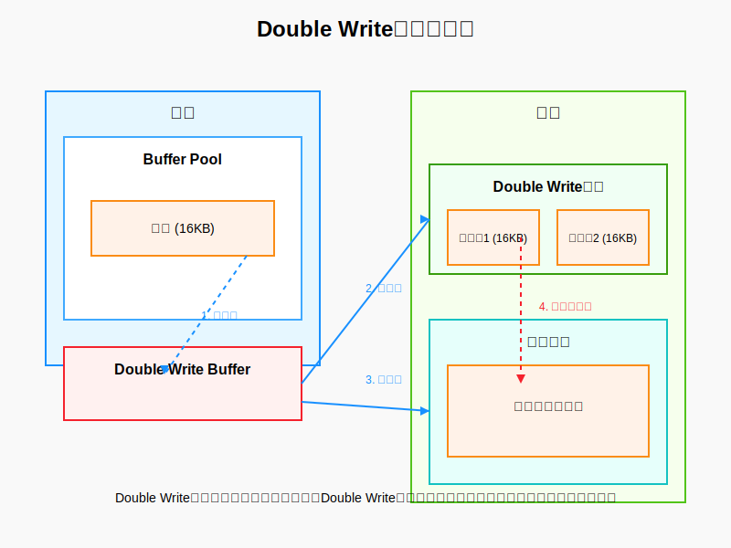

# Double Write

Double Write 机制是 InnoDB 为了解决数据页的部分写失效问题而提出的一种优化策略。

innodb page 16kb
os page 4kb

部分写失效： innnod Page 16KB，磁盘写单位4kb, 一页分4次写，由于硬件故障导致某次写失效，导致数据丢失。
发生在脏页刷盘的过程中.

## Double Write 机制

- 首先，将数据页分成两个部分，分别对应两个磁盘页，称为物理日志页和逻辑日志页。
- 然后，将物理日志页写入磁盘，并将逻辑日志页写入内存。
- 当数据页发生部分写失效时，可以从内存中恢复出逻辑日志页，并将其写入物理日志页，从而保证数据完整性。



## 为什么不能用redo log来解决部分写失效问题？

- redo log 记录的是物理日志页的写入，而部分写失效问题发生在脏页刷盘的过程中，redo log 记录的只是物理日志页的写入.
- redo log 是在数据库执行事务的时候，事务提交或者redo log buffer达到一定阈值，将 Redo log buffer 中的内容刷新到磁盘上的 Redo log 文件中。这个过程是顺序写入磁盘，效率较高。
- double write 是在脏页刷盘的过程.

## Double write 流程

```md
1. 脏页准备阶段
当 InnoDB 的 Buffer Pool 中的某个数据页（16KB）被标记为脏页（即已修改但未持久化到磁盘），且满足刷盘条件（如检查点触发、Buffer Pool 空间不足等）时，Double Write 机制开始介入。
2. 内存复制阶段
完整页复制：首先将整个 16KB 的脏页从 Buffer Pool 复制到内存中的 Double Write Buffer。这是一个连续的内存区域，专门用于暂存即将写入磁盘的数据页。
3. 磁盘写入阶段（分两次写入 Double Write 区域）
第一次写入（4KB）：
将 Double Write Buffer 中的前 4KB 数据写入共享表空间的 Double Write 区域。
这部分数据通常包含数据页的头部信息（如页号、校验和、LSN 等）。
第二次写入（4KB）：
将 Double Write Buffer 中的第二个 4KB 数据写入 Double Write 区域的下一个位置。
第三次写入（4KB）：
将 Double Write Buffer 中的第三个 4KB 数据写入 Double Write 区域。
第四次写入（4KB）：
将 Double Write Buffer 中的最后 4KB 数据写入 Double Write 区域。
关键点：
整个 16KB 的数据页被分四次写入 Double Write 区域，每次写入 4KB，确保数据页的完整备份。
Double Write 区域是磁盘上的连续空间，顺序写入四次 4KB 比直接写入 16KB 更可靠，减少了单次写入失败的风险。
4. 写入实际数据文件
在完成 Double Write 区域的四次写入后，开始将数据页写入实际的数据文件位置：
第一次写入（4KB）：将数据页的前 4KB 写入数据文件的对应位置。
第二次写入（4KB）：将数据页的第二个 4KB 写入数据文件。
第三次写入（4KB）：将数据页的第三个 4KB 写入数据文件。
第四次写入（4KB）：将数据页的最后 4KB 写入数据文件。
风险点：如果在这四次写入过程中发生系统崩溃，可能导致数据页只有部分内容被写入，形成部分写失效。
5. 崩溃恢复阶段
检测数据页完整性：数据库重启时，InnoDB 会首先检查数据文件中的数据页是否完整。通过校验和或其他机制判断数据页是否存在部分写失效。
从 Double Write 区域恢复：
如果发现某个数据页不完整（如校验和失败），则从 Double Write 区域读取该数据页的完整副本（四次写入的总和）。
将完整的副本覆盖到数据文件中的损坏页，修复数据页的完整性。
应用 Redo Log：在修复数据页后，再根据 Redo Log 中的记录，将未完成的事务操作应用到数据页上，确保数据的一致性。

流程图解
plaintext
脏页(16KB) → Double Write Buffer → Double Write区域(四次4KB写入) → 数据文件(四次4KB写入)
                                                          ↓
                                                  崩溃恢复时使用

为什么需要分四次写入？
磁盘 IO 基本单位：大多数磁盘设备的最小 IO 单位是 4KB，即使数据库请求写入 16KB，底层仍会分多次 4KB 进行操作。
部分写失效风险：如果直接将 16KB 写入数据文件，一旦在写入过程中发生崩溃，可能只有部分 4KB 被成功写入，导致数据页损坏。
Double Write 的保护：通过先将数据页分四次写入 Double Write 区域（每次 4KB），确保完整备份。即使后续写入数据文件时发生部分写失效，也能从 Double Write 区域获取完整副本。
性能与可靠性的平衡
开销：Double Write 机制增加了四次额外的 4KB 写入（先写入 Double Write 区域），理论上会降低写入性能。
优化：
Double Write 区域是连续磁盘空间，顺序写入四次 4KB 的性能损失相对可控。
现代磁盘设备的顺序写入性能远高于随机写入，因此这种设计在可靠性和性能之间取得了平衡。
```

> [double write buffer 原文](https://blog.csdn.net/liuxiao723846/article/details/103509226)

```md
innodb page 16kb
os page 4kb

in-memory: 16kb 一个页
on-disk: 4kb 单位插入

写入一个page, 需要 4次写入磁盘.
这个操作并非原子操作，执行到一半断电，会不会出现问题？ 出现部分页写失效，页数据损坏。

如果，写入 page=1的页到磁盘，出现断电，重启后，物理上page=1的页数据出现丢失。

redo 无法修复这类“页数据损坏”的异常，修复的是事务下的数据操作，针对的是页数据正确的场景，在逻辑层面上，一页为单位的数据。

如何解决这类页数据损坏的问题？

拥有一个double write buffer的副本，进行数据页的完整备份，保证数据页的完整性。

传统的buffer，大部分是内存存储，而double write buffer的数据是，在内存中一块，在磁盘的表空间中有一块double write 区域(double write buffer），

当有页数据要刷盘时：
1. 页数据先在memory中拷贝到 double write buffer中。速度快
2. 再将double write buffer中的数据，分成四份，分别写入磁盘的double write 区域的四个位置。
3. 再将double write buffer中的数据，写入实际的数据文件。

这里发生了两次写入，一次内存double write buffer，一次磁盘double write 区域。
第二次内存double write buffer, 写入到数据文件。

page 16kb
double write buffer 2M = 16 kb * 128， 有128个页
磁盘表空间的double write 区域 2M, 

double write buffer 为什么能解决页数据损坏问题？

假设步骤2断电，磁盘里依然是1+2+3+4的完整数据.
画外音：只要有页数据完整，就能通过redo还原数据。

假如步骤3掉电，DWB里数据文件的页数据存在部分写失效，但是磁盘存储着完整的数据在double write 区域。
可以根据double write 区域的数据，还原出完整的数据。

所以，一定不会出现“页数据损坏”问题。

画外音：写了2次，总有一个地方的数据是OK的。


double write buffer 2M, 逻辑上分两次，一次1M, 实际磁盘每次4kb操作，1M/4kb=256次.

**性能如何**

1. 第一步，页数据memcopy到DWB的内存，速度很快；
2. 第二步，DWB的内存fsync刷到DWB的磁盘，属于顺序追加写，速度也很快；
3. 第三步，刷磁盘，随机写，本来就需要进行，不属于额外操作；


综上，性能会有所影响，但影响并不大。

画外音：
（1）write­-ahead-log之所以性能高，就是因为顺序追加写；
（2）有第三方测评，评估约10%性能损失；
```

## 总结

- 物理层面的数据页完整性保证--double write
- 逻辑层面的事务的数据页完整性保证--redo log
