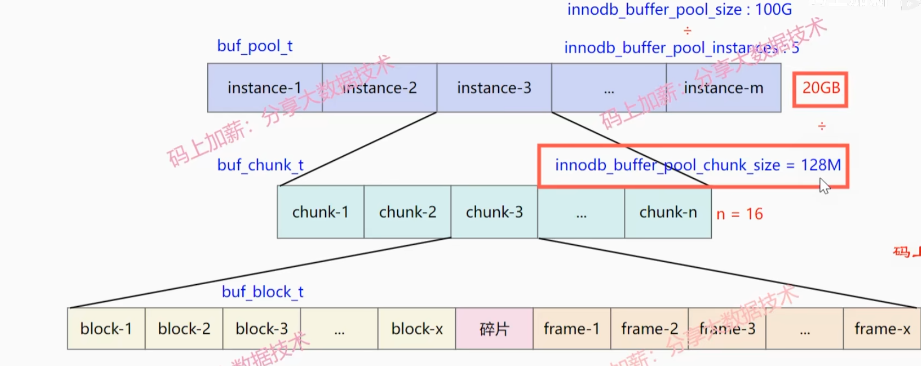
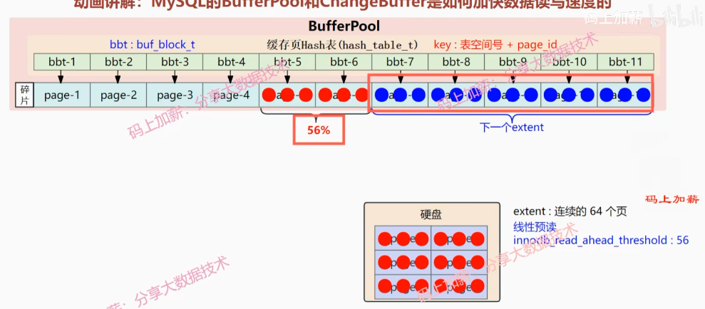

# MySQL Buffer Pool

## Introduction

Buffer pool is a memory area where MySQL stores data that is being read or written to disk. It is responsible for reducing disk I/O operations and improving query performance.

为了提高读写效率，MySQL使用了缓冲池.缓冲池是一个内存区域，其中存储了需要从磁盘读取或写入的数据.缓冲池的作用是减少磁盘I/O操作，提高查询性能.

1. 客户端--》执行器
2. 执行器到缓存中查询数据，没有就到磁盘查询，并将缓存数据加载到buffer pool中.
3. 将旧数据记录到Undo log中，便于回滚数据,mvcc.
4. 客服端进行更新SQL，将buffer pool中的缓存页数据更新，此时缓存页被更新的数据就是脏页(dirty page,跟数据库中的数据不一致).
5. 将脏页数据写入磁盘，并清空缓存页.
6. 缓存页被清空，下次再访问该页时，会重新从磁盘读取.
7. 更新数据前先写redo log, 记录更新操作，写入redolog buffer.便于crash recovery.数据恢复时，从redolog文件中恢复数据.
    - 参数 innodb_flush_method=O_DIRECT, 即将数据写入磁盘时，使用O_DIRECT方式，避免系统调用.
    - 参数 innodb_log_file_size=5M, 即redolog文件大小为5M.
    - 参数 innodb_log_buffer_size=8M, 即redolog buffer大小为8M.
    - 参数 innodb_flush_log_at_trx_commit=1, 实时写，实时刷
    - 参数 innodb_flush_log_at_trx_commit=2, 实时写，延迟刷
    - 参数 innodb_flush_log_at_trx_commit=0, 延迟写，延迟刷,后台延迟1s写.
8. 遇到commit, 将redolog buffer中的数据写入Page Cache, 并清空redolog buffer.
9. 后台线程将Page Cache 中的数据fsync 到redolog文件中.
10. 准备提交事务, sync_binlog=0, 事务提交时，不写入binlog.写入page cache, 后台线程将page cache中的数据fsync到binlog文件中.
    sync_binlog=1, 事务提交时，写入binlog.

- redolog: 解决系统异常数据恢复问题.
- binlog: 记录数据库的变更信息, 用于主从复制.
- undolog: 记录数据修改前的状态, 用于数据回滚.
- page cache: 缓存磁盘数据, 减少磁盘I/O.
- buffer pool: 缓存数据, 减少内存使用.
- flush: 将脏页数据写入磁盘.
- fsync: 将数据写入磁盘.
- mvcc: 多版本并发控制, 解决脏读问题.
- dirty page: 脏页, 跟数据库中的数据不一致.
- flush log: 将redolog buffer中的数据写入Page Cache, 并清空redolog buffer.

## BufferPool和ChangeBuffer是如何加快数据读写速度的

buffer pool

- instance groups 实例数组
- chunk groups  缓存快数组, 128M
- blocks groups 控制块数组

page,16KB

instance1:

- block1,block2,...,碎片,page-1,page-2,...,碎片

free linked table: free 链表，存储缓存的数据
flush linked table: flush 链表，存储需要刷新的缓存页

线性预读, innodb_read_ahead_threshold=16M, 预读16M数据到buffer pool中.
innodb_read_ahead_threshold=12, 预读12个页的数据到buffer pool中.
随机预读，innodb_random_read_aheah=on, 随机预读数据到buffer pool中.

## MySQL 数据结构

- 内存结构 In-Memory Data Structures: 内存数据结构, 如 Hash, B-Tree, RB-Tree, AVL-Tree, Splay-Tree, Skip-List, 等.
- 磁盘结构 On-Disk Data Structures: 磁盘数据结构, 如 B+Tree, LSM-Tree, 等.

### 内存结构

- Buffer Pool: 缓存池，作用就是用来缓存表数据和索引数据，减少磁盘IO操作，提高查询性能.
- Change Buffer: 变更缓存，写缓存区，是针对二级索引页（辅助索引）的更新优化措施.
- Log Buffer: 日志缓存，用来缓存写入磁盘上log文件(redolog和binlog)的数据，日志缓存区的内容会定期的刷新到磁盘log文件中.主要作用是，用来优化每次更新操作之后都要写入redolog文件，降低磁盘IO操作.
- Adaptive Hash Index: 自适应哈希索引，是一种索引结构，它根据访问的频率来动态调整索引的高度，以提高查询效率.大数据量的访问场景下，自适应哈希索引可以有效降低磁盘IO操作.
  InnoDB 不支持手动创建哈希索引的，但是InnoDB会进行自调优，如果判断自适应哈希索引能够提升查询效率，InnoDB会自动创建哈希索引.
