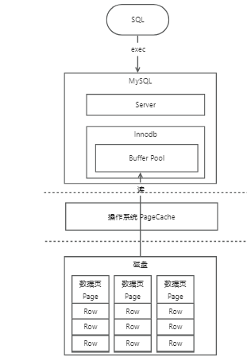
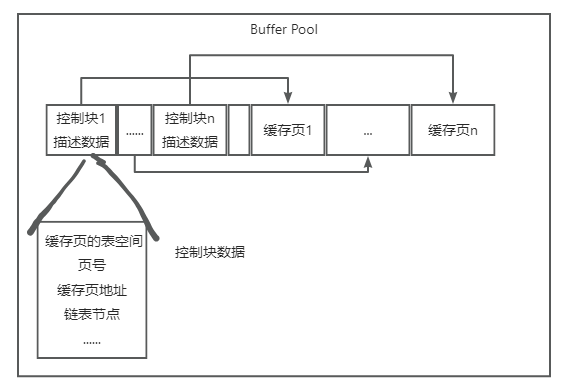
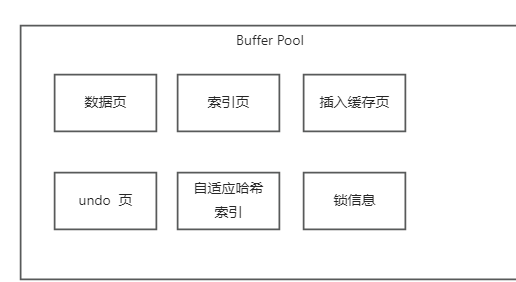
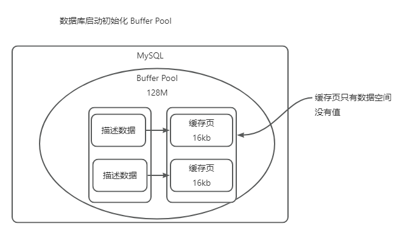
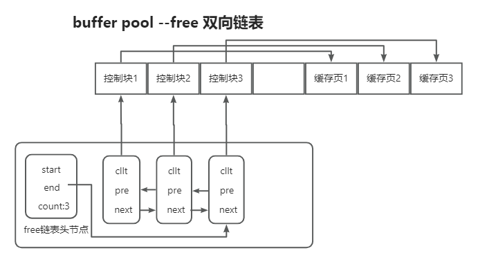
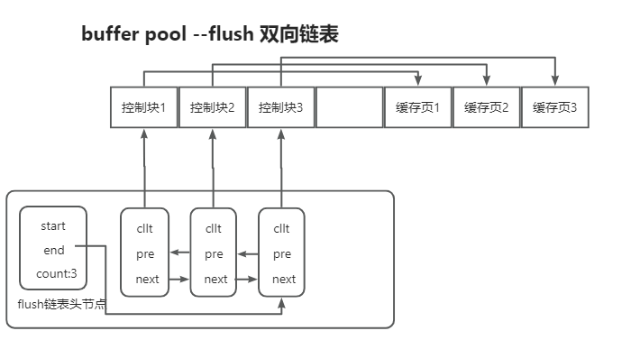
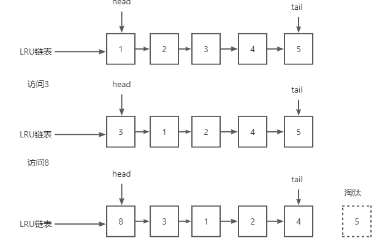
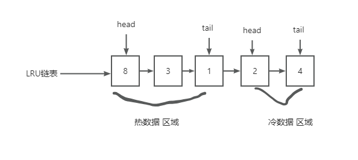

# MySQL BufferPool 之 Free Flush LRU

>管理空闲缓存页,  free 链表
>管理脏页,  flush 链表
>管理清除算法的, LRU 链表

## 重要问题汇总: ---重要

1. buffer pool 的数据结构,  缓存页, 索引页,undo页,自适应哈希索引, 锁信息, free链表, flush链表, lru链表
2. 为什么存在脏页, 更新缓存页数据
3. 为什么需要分成free链表, flush链表, lru链表

## InnoDB Buffer Pool

- Free 链表
- Flush 链表
- LRU 链表

## 初始化

### 读

#### 如何知道哪些缓存页是空的

初始化： 缓冲池中的所有缓冲页都会被加入 free 链表，此时链表长度等于缓冲池的总缓冲页数量。

大小: 由innodb_buffer_pool_size  参数决定

运行期间：

- 移除: 随着数据的读取与写入操作，缓冲页会从 free 链表移除并加入其他链表（像 flush 链表、LRU 链表等），free 链表长度会随之减少。
- 添加: 而当某些缓冲页不再被使用时，它们又会重新回到 free 链表，使得链表长度增加。

#### 为什么要有 free 链表

- 在buffer pool中找不到,从B+树中搜索到数据存储到buffer pool, 不知道哪块缓存页是空的,
没有存储数据.

#### 为什么设计成双向链表

- 高效的删除操作： 若要删除一个节点，仅需修改该节点前后节点的指针即可；如果是单向链表，要删除一个节点，就必须先找到该节点的前一个节点，这会使删除操作的时间复杂度从 O(1) 变为 O(n)。
- 反向遍历：双向链表支持从后往前遍历, 在内存管理中，可能需要从链表尾部开始查找合适的空闲块；单向链表只能从头部开始顺序遍历.
- 合并相邻空闲块更方便： 在内存管理里，当一个内存块被释放时，需要检查其相邻的空闲块是否可以合并成一个更大的空闲块。双向链表能够轻松访问前后相邻的块，方便进行合并操作。若为单向链表，处理相邻块合并就会复杂许多.

### 磁盘上的页如何读取到Buffer Pool的缓存页中去

首先，需要从free链表里获取一个控制块，然后就可以获取到这个控制块对应的空闲缓存页；
接着就可以把磁盘上的数据页读取到对应的缓存页里去，同时把相关的一些数据写入控制块里去，比如这个数据页所属的表空间之类的信息
最后把那个控制块从free链表里去除就可以了。
MySQL怎么知道某个数据页已经被缓存了
就是有一个哈希表
key: 表空间 + 数据的缓存页号
value: 缓存页地址

解释:

数据的缓存页号,数据页号, 是指数据页的编号, 逻辑上的编号
可以通过表空间 + 数据页号 找到唯一的数据页

数据页地址, 是对应的数据缓存的内存地址, 内存物理地址

没被缓存: 

在执行增删改查的时候，肯定是先看看这个数据页有没有被缓存，如果没被缓存就走上面的逻辑，
从free链表中找到一个空闲的缓存页，从磁盘上读取数据页写入缓存页，写入控制数据，
还存储一个hash表,key=表空间号+数据页号, value是 数据页地址
从free链表中移除这个控制块。

被缓存:

但是如果数据页已经被缓存了，那么就会直接使用了。
所以其实数据库还会有一个哈希表数据结构，他会用表空间号+ 数据页号，作为一个key，
然后缓存页的地址作为value。当你要使用一个数据页的时候，
通过“表空间号+数据页号”作为key去这个哈希表里查一下，
如果没有就读取数据页，如果已经有了，就说明数据页已经被缓存了

## 写

### 管理脏页-flush链表

### 为什么会有脏页

如果你要更新的数据页都会在Buffer Pool的缓存页里，供你在内存中直接执行增删改的操作。
mysql此时一旦更新了缓存页中的数据，
那么缓存页里的数据和磁盘上的数据页里的数据，就不一致了，那么就说这个缓存页是脏页。
脏页怎么刷回磁盘

为了能快速知道哪些缓存页是脏的，于是就设计出 Flush 链表，它跟 Free 链表类似的，
链表的节点也是控制块，区别在于 Flush 链表的元素都是脏页。

有了 Flush 链表后，后台线程就可以遍历 Flush 链表，将脏页写入到磁盘。

### 多次读, 有限内存

#### 提高缓存命中率-LRU链表

LRU链表来判断哪些缓存页是不常用的。Least Recently Used，最近最少使用。整体思想就是，链表头部的节点是最近使用的，而链表末尾的节点是最久没被使用的。那么，当空间不够了，就淘汰最久没被使用的节点，从而腾出空间。

#### 简单的LRU链表

● 当访问的页在 Buffer Pool 里，就直接把该页对应的 LRU 链表节点移动到链表的头部。
● 当访问的页不在 Buffer Pool 里，除了要把页放入到 LRU 链表的头部，还要淘汰 LRU 链表末尾的节点。

#### 为什么设置冷热数据区域

● 全表扫描, 会将数据缓存起来,之前数据淘汰,下次查询的数据又需要缓存, 全表扫描并不是常见的语句,导致真正的热数据被淘汰
● 预读失效,同样是由于预读一部分数据,导致真正的热数据被淘汰

#### 存在问题1-预读失效

什么是预读失效
MySQL 的预读机制：程序是有空间局部性的，靠近当前被访问数据的数据，在未来很大概率会被访问到。
所以，MySQL 在加载数据页时，会提前把它相邻的数据页一并加载进来，目的是为了减少磁盘 IO。

但是可能这些被提前加载进来的数据页，并没有被访问，相当于这个预读是白做了，这个就是预读失效。

如果使用简单的 LRU 算法，就会把预读页放到 LRU 链表头部，
而当 Buffer Pool空间不够的时候，还需要把末尾的页淘汰掉。

如果这些预读页如果一直不会被访问到，就会出现一个很奇怪的问题，
不会被访问的预读页却占用了 LRU 链表前排的位置，而末尾淘汰的页，
可能是频繁访问的页，这样就大大降低了缓存命中率。

如何解决

首先不能害怕预读失效就把预读机制去了，空间局部性原理在大部分场景下是成立且有效的

而要避免预读失效带来影响，最好就是让预读的页停留在 Buffer Pool 里的时间要尽可能的短，
让真正被访问的页才移动到 LRU 链表的头部，从而保证真正被读取的热数据留在 Buffer Pool 
里的时间尽可能长。

Mysql将LRU链表划分成了两个区域：冷数据 区域 和 热数据 区域。
热数据 区域在 LRU 链表的前半部分，冷数据 区域则是在后半部分

划分这两个区域后，预读的页就只需要加入到 冷数据 区域的头部，
当页被真正访问的时候，才将页插入 热数据 区域的头部。

如果预读的页一直没有被访问，就会从 冷数据 区域移除，这样就不会影响 热数据 区域中的热点数据。

MySQL 中 Buffer Pool 的冷数据区域和热数据区域的空间大小由参数innodb_old_blocks_pct控制，
默认情况下冷数据区占整个 Buffer Pool 内存空间的 37%，热数据区占 63%

冷数据:热数据=4:6

#### 什么是 Buffer Pool 污染

在数据访问阶段, 存在多次访问数据大量数据的情况, 会根据 LRU 算法将其移动到 热数据 区的头部. 等其他热数据被访问时候, 由于缓存未命中，就会产生大量的磁盘 IO，MySQL 性能就会急剧下降，这个过程被称为 Buffer Pool 污染。
如何解决-引入时间间隔机制
在一段时间1s内, 再次被访问,其数据还保留到冷数据区域, 在时间间隔之后,再次访问,就移动到热数据区域.

Select/Update/Insert/Delete对free,flush,lru链表 影响
buffer pool
free 链表
flush 链表
lru 链表

初始化: free 链表满
select 阶段:

(豆包解释)

- FREE链表：如果Buffer Pool中没有所需数据，需要从磁盘加载数据页到Buffer Pool时，
会从FREE链表中获取空闲的缓存页。若FREE链表中没有足够的空闲缓存页，
可能会触发淘汰LRU链表尾部的缓存页来释放空间，将释放后的缓存页加入FREE链表，
再从FREE链表中取出供新数据页使用。
- FLUSH链表：一般情况下，单纯的SELECT操作不会直接导致数据页被加入FLUSH链表，
因为SELECT操作通常不会修改数据页内容使其成为脏页。但如果在SELECT操作过程中，
由于一些特殊情况（如查询缓存的更新等）导致数据页被标记为脏页，那么该数据页会被加入FLUSH链表。
- LRU链表：当数据页被加载到Buffer Pool后，会被放入LRU链表的冷数据区头部。
如果数据页在冷数据区停留超过innodb_old_blocks_time（默认 1000ms）后再次被访问，
或者直接在热数据区被访问，会根据LRU算法规则，
将其移动到热数据区头部（如果处于热数据区后 2/3 区域），以表示它是最近使用的数据

(自己整理)

- 数据为缓存, 磁盘B+树读缓存页数据, 
- 到free 链表找空闲缓存页, 找到即删除对应节点
  - 根据key到hash表找是否已经存储到缓存页, key=表空间+数据页号,value=数据页地址
- 将数据填充到缓存页,在填充缓存页对应的描述数据的控制块
- 填充hash表
- 添加到lru 链表中, 第一次填充到冷数据区域, 第二次填充到热数据区域, 分冷热是mysql有预读机制

update:

- FREE链表：通常UPDATE操作不会直接影响FREE链表。但如果UPDATE操作导致数据页发生变化，
需要更多的空间来存储新的数据或者索引信息，可能会导致页分裂等情况，
这时可能需要从FREE链表中获取空闲页来存储相关数据。
- FLUSH链表：UPDATE操作会修改数据页中的数据，使数据页变为脏页，
该数据页会被加入到FLUSH链表中，以便后续将其刷入磁盘，保证数据的持久化。
- LRU链表：UPDATE操作会访问数据页，所以该数据页在LRU链表中的位置会根据访问情况进行调整。
如果数据页在冷数据区，且满足进入热数据区的条件（如在冷数据区停留超过innodb_old_blocks_time后
被访问），则会被移动到热数据区头部；如果在热数据区，
同样会根据其在热数据区的位置（前 1/3 或后 2/3）来决定是否移动到热数据区头部。

Delete:

- FREE链表：与UPDATE操作类似，一般情况下DELETE操作本身不会直接影响FREE链表。
但如果DELETE操作导致数据页空间利用率发生较大变化，可能会触发页合并等操作，
释放出的页会被加入FREE链表。
- FLUSH链表：如果DELETE操作修改了数据页中的数据，使数据页变为脏页，
那么该数据页会被加入FLUSH链表，后续会被刷入磁盘。
- LRU链表：DELETE操作会访问数据页，因此数据页在LRU链表中的位置会根据访问情况进行调整，
与UPDATE操作对LRU链表的影响类似，即根据数据页所在冷、热数据区的位置以及访问时间等因素，
决定是否将其移动到热数据区头部。

INSERT操作：

- FREE链表：INSERT操作需要将新的数据插入到数据页中，如果当前数据页有足够的空闲空间，
则不会影响FREE链表。但如果数据页已满，需要分配新的数据页来存储新插入的数据，
这时会从FREE链表中获取空闲页。如果FREE链表中没有空闲页，
就可能会触发淘汰LRU链表尾部的缓存页来释放空间，以供新数据页使用。
- FLUSH链表：INSERT操作会使数据页变为脏页，所以会将相关数据页加入FLUSH链表，
以便后续将脏页刷入磁盘。
- LRU链表：新插入的数据所在的数据页被加载到Buffer Pool后，会被放入LRU链表的冷数据区头部。
如果该数据页后续被访问，会按照LRU算法的规则，根据其在冷数据区的停留时间以及是否进入热数据区等条件，
来调整其在LRU链表中的位置。

LRU 链表本身并没有定时 IO 线程专门在空闲时将冷数据的缓存刷入磁盘。

后台的page cleaner线程， 会在脏页的数量达到一定阈值、数据库空闲时间超过一定时长、
redo log 空间不足等情况下, 被触发来执行刷脏页的操作，
这些脏页可能来自 LRU 链表的不同位置，不仅仅是冷数据区。

参考： https://segmentfault.com/a/1190000045465976#item-2