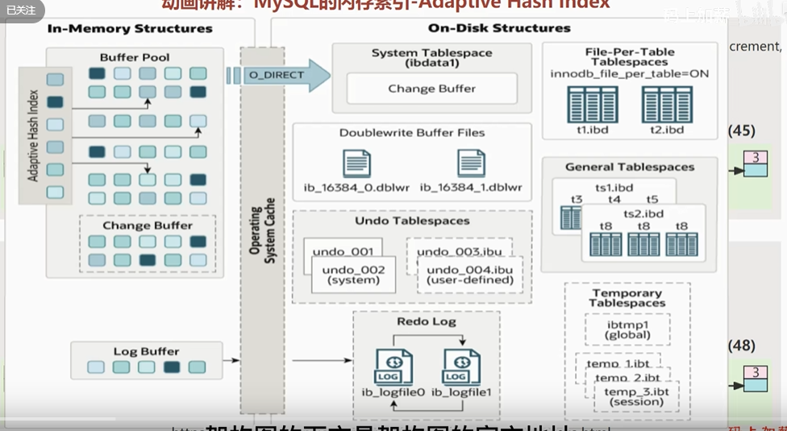

# MySQL 内存自适应哈希索引

## index

- clustered index (primary key)
- non-clustered index(secondary key)


```sql
create table t1 (
    id int primary key,
    name varchar(50),
    age int,
    index idx_name (name) 
)engine=innodb default charset=utf8mb4;


select * from t1 where name='abc';

- 先普通索引查找id, 再根据id到主键索引查找行数据
- 会锁主普通索引对应的行，再锁住主键索引对应的行，加入的是X锁


```

clustered index:

- 主键索引
- 聚集索引
- 索引的顺序决定了数据在磁盘上的物理存储顺序
- 主键索引的选择非常重要，主键索引的选择会影响到数据的存储和查询效率
- 主键非叶子节点存主键，叶子节点存数据
- 叶子节点是双向循环的链表，便于范围查询

secondary index:

- 非主键索引
- 非聚集索引
- 普通索引，非叶子节点存储索引对应的列字段值，叶子节点存主键值和列字段值
- 叶子节点是双向链表，支持范围查询

adaptive hash index:

- MySQL 5.7 引入的一种新索引类型
- 基于内存的索引，适用于内存不足的情况
- 索引的构建过程在内存中进行，不需要将数据全部加载到内存中
- 索引的维护和维护过程也在内存中进行，不需要将数据全部加载到内存中

- 适用于大数据量的表，可以有效地减少内存的使用
- 适用于对查询性能要求不高的场景，减少对磁盘的读写
- 适用于对索引的维护频繁的场景，减少对磁盘的读写
- 适用于对索引的维护要求不高的场景，减少对磁盘的读写

- 适用场景：
- 内存不足，需要使用内存自适应哈希索引
- 索引维护频繁，需要使用内存自适应哈希索引

- adaptive hash index, 适用于大数据量的表，可以有效地减少内存的使用
- 一些热点数据，频繁访问，超过3次，会将数据转换成 adaptive hash index， key-是热点key, value-key对应的页数
- 针对innodb 表，可以将热点数据转换成 adaptive hash index，减少内存的使用
- 索引的索引，可以减少查询的路径.

- 注意事项:
- 只支持等值查询(基于主键的等值查询AHI效果更好),例如用户登录
- 基于主键的搜索，几乎都是hash searches;
- 基于普通索引的搜索，大部分是 non-hash searches;
- 无序，没有树高，对热点buffer pool 建立 AHI，非持久化
- 自适应哈希索引，
- 只能用于等值比较 (=,in), 无法用于排序，存在hash 冲突
- set global innodb_adaptive_hash_index=on/off;

innodb Buffer Pool
  - adaptive hash index

## MySQL architecture 图



```text
in-memory structure
- buffer pool: 内存中缓存数据页的区域，大小由参数innodb_buffer_pool_size控制，默认大小为128M。
    - adaptive hash index: 缓存索引页的区域，大小由参数innodb_adaptive_hash_index_size控制，默认大小为16M。
    - change buffer: 缓存对数据页的修改，大小由参数innodb_change_buffer_size控制，默认大小为256K。
- log buffer: 缓存日志的区域，大小由参数innodb_log_buffer_size控制，默认大小为8M。

operating system cache: 缓存磁盘块的区域，大小由操作系统决定。

disk structure
- data files: 数据文件，存储表数据。
- index files: 索引文件，存储索引数据。

- System tablespace: 系统表空间，存储系统表数据。
    - Change buffer: 缓存对系统表的修改，大小由参数innodb_change_buffer_size控制，默认大小为256K。

- Transactional tablespace: 事务表空间，存储事务数据。
- Undo tablespace: 回滚段文件，存储事务回滚信息。
- File-Per-Table Tablespace: 文件-表空间，存储数据文件和索引文件。
- General Tablespace: 通用表空间，存储普通表数据。
    - ts1.ibd
        - t1.ibd
        - t2.ibd
    - ts2.ibd
- Temporary Tablespace: 临时表空间，存储临时表数据。

- Redo log files: 重做日志文件，存储事务日志。
- DoubleWrite buffer file: 双写缓冲区文件，存储数据页的副本，用于数据页的刷新。
- redo log files: 重做日志文件，存储事务日志。
    - ib_logfile0: 第一个日志文件，大小由参数innodb_log_file_size控制，默认大小为5M。
    - ib_logfile1: 第二个日志文件，大小由参数innodb_log_file_size控制，默认大小为5M。
- undo files: 回滚段文件，存储事务回滚信息。
    - undo tablespaces: 回滚段文件，存储事务回滚信息。
    - undo logs: 回滚日志文件，存储事务回滚信息。
    - undo log 版本链: 回滚日志版本链，存储事务回滚信息。
```

