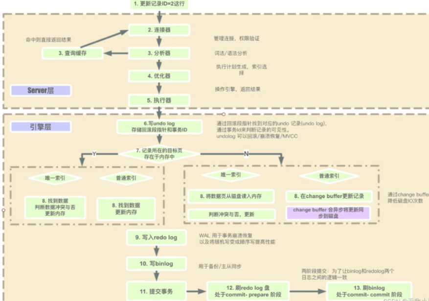

# MySQL 面试题

## 1. MySQL是怎么执行一条SQL语句

1. 连接管理与权限验证

    - 客户端与 MySQL 服务器建立连接，服务器会验证客户端的身份和权限，只有通过验证的用户才能执行后续操作。

2. 解析

    - 词法分析：MySQL 将输入的 SQL 语句按照词法规则进行拆分，识别出关键字、标识符、常量等。例如，对于语句SELECT * FROM users WHERE age > 18;，会将其拆分为SELECT（关键字）、*（通配符）、FROM（关键字）、users（表名，标识符）等。
    - 语法分析：根据 MySQL 的语法规则，对词法分析后的结果进行语法检查和结构分析，构建出对应的解析树。如果 SQL 语句语法错误，在此阶段就会被发现并返回错误信息。

3. 查询优化
    - 逻辑优化：对解析树进行优化，例如简化查询条件、消除冗余的子查询或视图等。如查询SELECT * FROM (SELECT * FROM users) AS t;，会被优化为SELECT * FROM users;。
    - 物理优化：根据表的索引、数据分布等信息，选择最优的查询执行计划，包括决定使用何种索引、连接方式以及表的扫描顺序等。例如，若users表的age字段上有索引，对于SELECT * FROM users WHERE age > 18;语句，优化器可能会选择使用该索引来快速定位满足条件的记录。

4. 查询执行
    - 按照优化后的执行计划，调用存储引擎的接口来获取数据。如果需要进行表连接、排序、分组等操作，在这个阶段会按照相应的算法进行处理。例如，使用嵌套循环连接算法来连接多个表，使用快速排序算法对结果集进行排序等。

5. 结果集返回

    - 将查询结果返回给客户端。如果查询语句是INSERT、UPDATE、DELETE等修改数据的操作，则返回受影响的行数等信息。

- undo log, mvcc
- redolog，wal
- binlog，备份，主从

> [redo log video](https://www.bilibili.com/video/BV1Zz42197cF/?spm_id_from=333.1387.upload.video_card.click&vd_source=5a41e8ae8c0a4c2c6809a5ccf977c1a9)
