# 21-25

## 22 | MySQL有哪些“饮鸩止渴”提高性能的方法

### 短连接风暴

max_connections
wait_timeout 参数，一个线程空闲这么多秒后自动断开连接。

- 断开占着连接不工作线程，先考虑事务外进程。服务端主动断开连接，客户端不一定能正确处理。
- 减少连接过程的消耗，–skip-grant-tables 参数，不安全。

### 慢查询性能问题

- 索引问题
- 建索引
主备架构，先增加备库索引。更新前执行set sql_log_bin=off。
- 语句问题
- qps突增问题


## 23 | MySQL是怎么保证数据不丢的

### binlog写入机制

事务执行，把日志写到binlog cache，事务提交，把binlog cache写到binlog文件中，binlog不同事务分头写，所以不需要锁。
一个事务的binlog不能被拆开。

每个线程分配一个binlog cache，binlog_cache_size控制，超过这个参数要暂存磁盘。


上图说明事务提交时，执行器把 binlog cache 里的完整事务写入到 binlog 中，并清空binlog cache。
图中的write只是写文件系统的page cache。

write 和 fsync 的时机，是由参数 sync_binlog 控制的：

- sync_binlog=0 的时候，表示每次提交事务都只 write，不 fsync；
- sync_binlog=1 的时候，表示每次提交事务都会执行 fsync；
- sync_binlog=N(N>1) 的时候，表示每次提交事务都 write，但累积 N 个事务后才 fsync。

### redo log写入机制

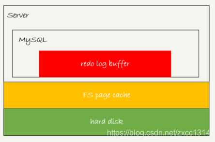

redo log buffer不需要每次都持久化硬盘，mysql异常重启，这部分日志就会丢失。

未提交的事务可能会被持久化到硬盘。

关于控制刷盘的innodb_flush_log_at_trx_commit参数，在02 | 日志系统：一条SQL更新语句是如何执行的中提到过。

Innodb还有一个后台线程，每隔一秒，就会把 redo log buffer 中的日志，调用 write 写到文件系统的件系统的 page cache，然后调用 fsync 持久化到磁盘。

除了后台线程每秒一次的轮询，还有两个场景会让一个没有提交的事务的redo log刷盘。

- 当redo log buffer占用空间即将达到innodb_log_buffer_size一半时，后台线程会主动刷盘。该动作只是写到page cache。
- 并行事务提交时，会顺带刷盘。A事务写了一些redo log buffer，另一个事务B提交，innodb_flush_log_at_trx_commit=1，所以事务B要把redo log buffer的日志全部刷盘。这时会把事务A在redo log buffer日志一起刷盘。

如果把innodb_flush_log_at_trx_commit设置成1，redo log在prepare需持久化一次，所以在15 | 答疑文章（一）：日志和索引相关问题中，提到redo log 已经prepare，并且已经写完binlog就可以异常恢复。

每秒一次后台轮询刷盘，再加上崩溃恢复的逻辑，InnoDB 就认为 redo log 在 commit 的时候就不需要 fsync 了，只会 write 到文件系统的 page cache 中就够了。

### 组提交（group commit）机制

日志逻辑序列号（log sequence number，LSN）是单调递增的，用来对应 redo log 的写入点。每次写入长度为 length 的 redo log，LSN 的值就会加上 length。

LSN 也会写到 InnoDB 的数据页中，来确保数据页不会被多次执行重复的 redo log。

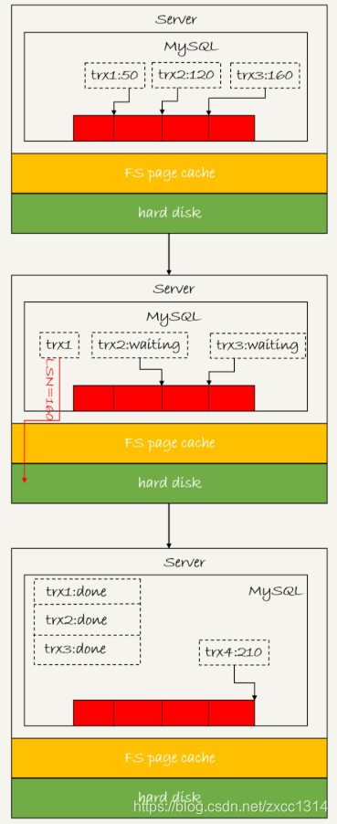

上图三个并发事务（trx1，trx2，trx3）在prepare阶段写完redo log buffer，持久化到磁盘的过程，对应的 LSN 分别是 50、120 和 160。当trx1开始刷盘，trx1会被选为leader，这个组有三个事务，这时LSN变成160，trx1写盘时会把LSN小于160的redo log都持久化，这时trx2和trx3可以直接返回。

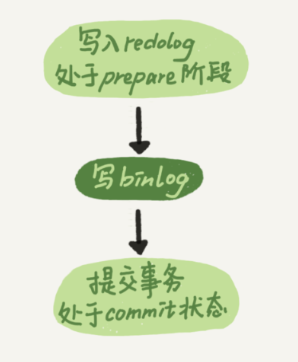

实际上write是两步，如下图。

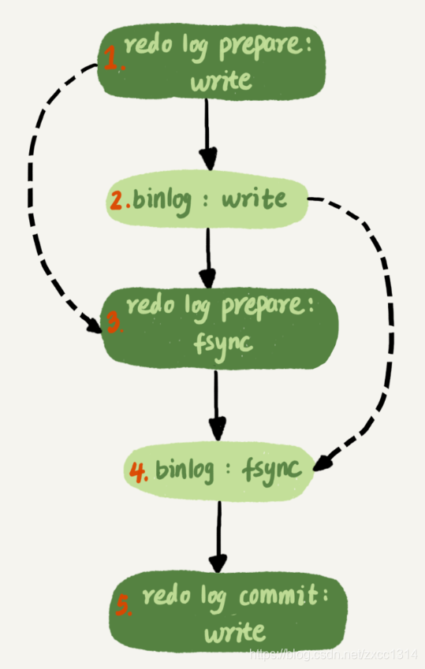

所以binlog也可以组提交，不过通常情况第三步执行较快，binlog组提交效果较差。所以可以优化以下两个参数。

- binlog_group_commit_sync_delay参数，表示延迟多少微秒后才调用 fsync;
- binlog_group_commit_sync_no_delay_count 参数，表示累积多少次以后才调用 fsync。

不建议将innodb_flush_log_at_trx_commit设置成0，设置成2只是多一个写page cache，效率相差不大，但2在mysql异常重启不会丢数据，只在主机掉电才会丢数据。

如果 binlog 写完盘以后发生 crash，这时候还没给客户端答复就重启了。等客户端再重连进来，发现事务已经提交成功了，这不是 bug。

数据库的 crash-safe 保证的是：

- 如果客户端收到事务成功的消息，事务就一定持久化了；
- 如果客户端收到事务失败（比如主键冲突、回滚等）的消息，事务就一定失败了；
- 如果客户端收到“执行异常”的消息，应用需要重连后通过查询当前状态来继续后续的逻辑。此时数据库只需要保证内部（数据和日志之间，主库和备库之间）一致就可以了。

关于1应该是不一定的。

sync_binlog = N：每个事务write后就响应客户端了。刷盘是N次事务后刷盘。N次事务之间宕机，数据丢失。
binlog_group_commit_sync_no_delay_count=N： 必须等到N个后才能提交。换言之，会增加响应客户端的时间。但是一旦响应了，那么数据就一定持久化了。宕机的话，数据是不会丢失的。

innodb的 redo log 在commit的时候不进行fsync，只会write 到page cache中。当sync_binlog>1,如果redo log 完成了prepare持久化落盘，binlog只是write page cache，此时commit标识完成write 但没有落盘，而client收到commit成功，这个时候主机掉电，启动的时候做崩溃恢复，没有commit标识和binglog，事务会回滚。sync_binlog设置为大于1的值，会丢binlog日志,此时数据也会丢失。


## 24 | MySQL是怎么保证主备一致的

### MySQL 主备的基本原理

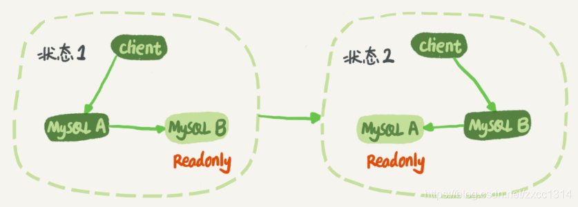

将备库设置成read only防止双写情况方式。read only对超级权限用户无效，所以可以同步。

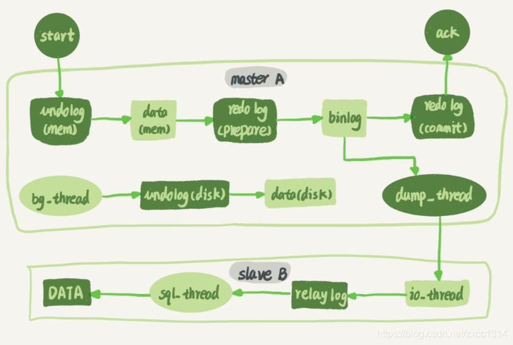

上图展示了update主从同步的过程。

### binlog 的三种格式对比

表结构：

```sql
mysql> CREATE TABLE `t` (
  `id` int(11) NOT NULL,
  `a` int(11) DEFAULT NULL,
  `t_modified` timestamp NOT NULL DEFAULT CURRENT_TIMESTAMP,
  PRIMARY KEY (`id`),
  KEY `a` (`a`),
  KEY `t_modified`(`t_modified`)
) ENGINE=InnoDB;

insert into t values(1,1,'2018-11-13');
insert into t values(2,2,'2018-11-12');
insert into t values(3,3,'2018-11-11');
insert into t values(4,4,'2018-11-10');
insert into t values(5,5,'2018-11-09');
mysql> delete from t /*comment*/  where a>=4 and t_modified<='2018-11-10' limit 1;
```

#### 当 binlog_format=statement 时，binlog 里面记录的就是 SQL 语句的原文。

```sql
mysql> show binlog events in 'master.000001';
```


delete 命令的执行效果图：


statement 格式，并且语句中有 limit，这个命令可能是 unsafe 的，可能会出现主备数据不一致。
比如上面那个delete：

- 如果delete使用索引A，那么会根据索引 a 找到第一个满足条件的行，也就是说删除的是a=4 这一行；
- 但如果使用的是索引 t_modified，那么删除的就是 t_modified='2018-11-09’也就是 a=5这一行。

因为主备使用索引不一致会导致删除不同数据。

#### binlog_format=‘row’

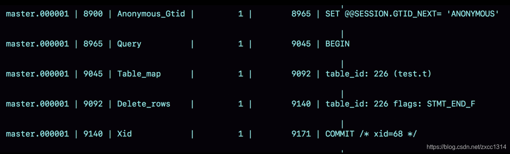

- Table_map event，用于说明接下来要操作的表是test 库的表 t;
- Delete_rows event，用于定义删除的行为。

上图显示事务从8900开始，借助mysqlbinlog 工具，可以看到详细的log。

`mysqlbinlog  -vv data/master.000001 --start-position=8900;`

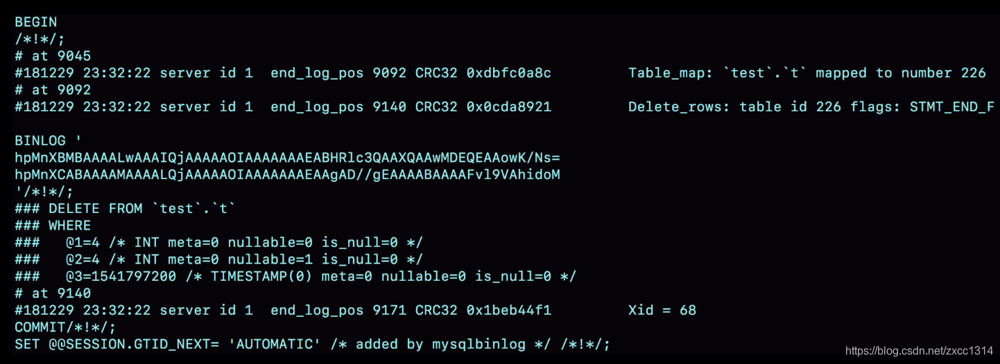

- 事务在server id 1这个库执行。
- 每个event都有crc32的值，binlog_checksum控制。
- Table_map event表示打开的表，map到数字226，如果有多张表，每个表都有一个对应的 Table_map event、都会 map 到一个单独的数字。
- mysqlbinlog -vv 参数是为了把内容都解析出来，所以从结果里面可以看到各个字段的值（比如，@1=4、 @2=4 这些值）。
- binlog_row_image 的默认配置是 FULL，因此 Delete_event 里面，包含了删掉的行的所有字段的值。如果设置为 MINIMAL，只会记录 id=4 这个信息。

### 为什么会有 mixed 格式的 binlog？

因为row格式如果删除10万行，就要记录10万条记录到binlog，会占据大量的存储空间和IO资源。
mixed 格式会判断sql是否会引起主备不一致，有可能，就用 row 格式，否则就用 statement 格式。

主流还是使用row 格式，因为该格式可以恢复数据。

用 binlog 来恢复数据的标准做法是，用 mysqlbinlog 工具解析出来，然后把解析结果发给整个MySQL 执行。类似下面的命令：

`mysqlbinlog master.000001  --start-position=2738 --stop-position=2973 | mysql -h127.0.0.1 -P13000 -u$user -p$pwd;`

### 循环复制问题

实际生产上使用比较多的是双 M 结构。

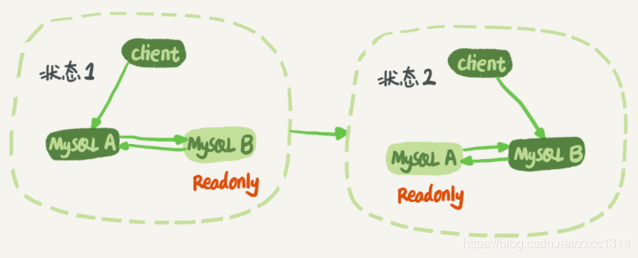

业务逻辑在节点 A 上更新了一条语句，然后再把生成的 binlog 发给节点 B，节点 B 执行完这条更新语句后也会生成 binlog。（参数 log_slave_updates 设置为 on，表示备库执行 relay log 后生成 binlog）。

下面逻辑可以解决两个节点间的循环复制的问题：

- 规定两个库的 server id 必须不同；
- 一个备库接到 binlog 并在重放的过程中，生成与原 binlog 的 server id 相同的新的 binlog；
- 每个库收到主库发来的日志，判断server id是否和自己相同，相同直接丢弃日志。

## 25 | MySQL是怎么保证高可用的？

### 主备延迟

1. 主库A完成事务写入binlog，这个时刻记为T1；
2. 之后传给备库B，备库接受完binlog的时刻记为T2；
3. 备库B执行完这个事务记为T3。

所谓主备延迟，就是同一个事务T3-T1。

在备库执行`show slave status` 命令，`seconds_behind_master`显示了当前备库延迟，精度秒。

延迟来源：

1. 为了省钱，备库机器较差。
2. 备库常用来读，查询压力大。一般可以这样处理：一主多从，或者通过binlog输出到外部系统，比如Hadoop。
3. 大事务，因为主库上必须等事务执行完成才会写入binlog。
4. 大表DDL。
5. 主备延迟的一个大方向原因，备库的并行复制能力。

### 可靠性优先策略

优先考虑。
在上图双M结果下，从状态1到状态2切换的详细过程：

- 判断备库B现在的seconds_behind_master，如果小于某个值（比如 5 秒）继续下一步，否则持续重试这一步；
- 把主库A改成只读状态，即把readonly 设置成true；
- 判断备库 B 的 seconds_behind_master的值，直到这个值变成 0 为止；
- 把备库 B 改成可读写状态，也就是把 readonly 设置为 false；
- 把业务请求切到备库 B。

上述切换流程，一般由专门的HA系统完成，但会存在一段时间都不可用时间。

#### 可用性优先策略

如果强行把步骤4、5调整到最开始执行，这样就几乎不存在不可用时间，但会引起数据不一致。
数据不一致的例子，表结构如下（自增id）：

```sql
mysql> CREATE TABLE `t` (
  `id` int(11) unsigned NOT NULL AUTO_INCREMENT,
  `c` int(11) unsigned DEFAULT NULL,
  PRIMARY KEY (`id`)
) ENGINE=InnoDB;

insert into t(c) values(1),(2),(3);
```

执行两条插入语句：

```sql
insert into t(c) values(4);
insert into t(c) values(5);
```

假设，现在主库其他数据表有大量更新，主备延迟达到5秒。在插入一条c=4语句，发起主备切换。
下图，binlog_format=mixed时


- 步骤2，主库A执行完insert，插入一行（4,4），之后开始进行主备切换。
- 步骤3，由于5秒延迟，备库还没来得及应用“插入c=4”这个中转日志，就开始接受客户端“插入c=5”的命令。
- 步骤4，备库B插入一行（4,5），并把这个binlog发给主库A。
- 步骤5，备库B执行“插入c=4”，插入一行（5,4）。binlog传给A，插入（5,5）.

binlog_format=row时

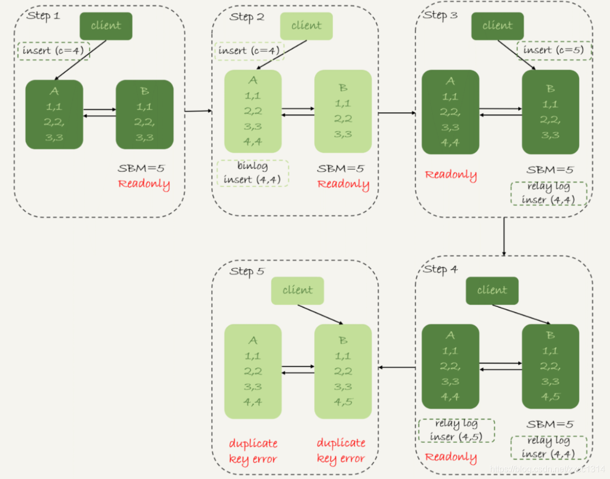

因为该格式会记录插入行的所有字段值，所以只会有一行不一致。两边的主备同步的应用线程会报错 duplicate key error 并停止。

可靠性异常切换
假设，主库A和备库B主备延迟30分钟，这时A掉电，HA系统要切换B作为主库。

这时必须等到备库B `seconds_behind_master=0` 之后，才能切换。

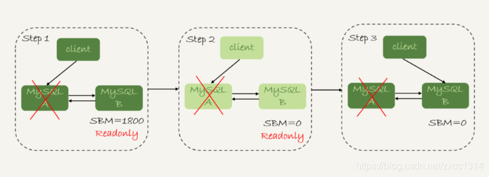

