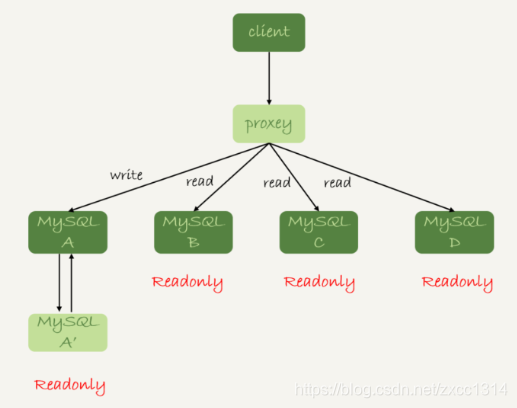

# 读写分离有哪些坑

上节的主从是由客户端直联的。
另一种架构proxy：

代理架构，客户端不会感知数据库端的细节，只需对接代理。但加一层代理，链路会变长，而且代理也需要高可用架构。
不管是哪种架构，主备都存在延迟。

## 强制走主库方案

对于一些需要拿到实时结果的请求，分发到主库上。但对一些都需要实时结果的金融业务，就需要放弃读写分离。

## sleep方案

延迟几秒再去读从库，但超过这个时间的同步还是拿不到最新的数据。

## 判断主备无延迟方案

1. 判断show slave status 结果里的 seconds_behind_master 参数的值是否等于0，但该值精度为秒。
2. 对比位点确保主备无延迟，Master_Log_File 和 Relay_Master_Log_File、Read_Master_Log_Pos 和 Exec_Master_Log_Pos 这两组值完全相同，就表示接收到的日志已经同步完成。
3. 对比 GTID 集合确保主备无延迟，Retrieved_Gtid_Set、Executed_Gtid_Set是否相同。

上述方案，只会判断从库已经收到的事务，是否执行完，但对于一些主库已执行，但从库还没收到的情况，还是存在主备延迟。

## 配合 semi-sync

要解决这个问题，就要引入半同步复制，也就是semi-sync replication。

- 事务提交的时候，主库把 binlog 发给从库；
- 从库收到 binlog 以后，发回给主库一个 ack，表示收收到；
- 主库收到这个 ack 以后，才能给客户端返回“事务完成”的确认。

但一主多从的情况主库只要收到一个从库返回ack，就会提交事务。所以在查询其他从库时，可能还是会存在主备延迟。
其实，判断同步位点的方案还有另外一个潜在的问题，即：如果在业务更新的高峰期，主库的位点或者 GTID 集合更新很快，那么上面的两个位点等值判断就会一直不成立，很可能出现从库上迟迟无法响应查询请求的情况。

## 等主库位点方案

实际上并不需要等待主备完全同步，其实从库查询trx1时只需要该事务完成就可以返回：

首先看一条sql

`select master_pos_wait(file, pos[, timeout]);`

1. 它是在从库执行的；
2. 参数 file 和 pos 指的是主库上的文件名和位置；
3. timeout 可选，设置为正整数 N 表示这个函数最多等待N 秒。

这个会返回一个正整数 M，表示从命令开始执行，到应用完 file 和 pos 表示的 binlog 位置，执行了多少事务。除了正常返回之外，还会返回：

1. 如果执行期间，备库同步线程发生异常，则返回 NULL；
2. 如果等待超过 N 秒，就返回 -1；
3. 如果刚开始执行的时候，就发现已经执行过这个位置了，则返回 0。

所以可以这么判断：

1. trx1 事务更新完成后，马上执行 show master status 得到当前主库执行到的File 和 Position；
2. 选定一个从库执行查询语句；
3. 在从库上执行 select master_pos_wait(File, Position, 1)；
4. 如果返回值是 >=0 的正整数，则在这个从库执行查询语句；
5. 否则，到主库执行查询语句。

所以可能存在将流量打到主库的情况，所以需要做好主库限流策略。

## GTID 方案

`select wait_for_executed_gtid_set(gtid_set, 1);`

- 等待，直到这个库执行的事务中包含传入的 gtid_set，返回 0；
- 超时返回 1。

MySQL 5.7.6 版本开始，允许在执行完更新类事务后，把这个事务的 GTID 返回给客户端，这样等 GTID 的方案就可以减少一次查询。

- trx1 事务更新完成后，从返回包直接获取这个事务的 GTID，记为 gtid1；
- 选定一个从库执行查询语句；
- 在从库上执行 select wait_for_executed_gtid_set(gtid1, 1)；
- 如果返回值是 0，则在这个从库执行查询语句；
- 否则，到主库执行查询语句。

