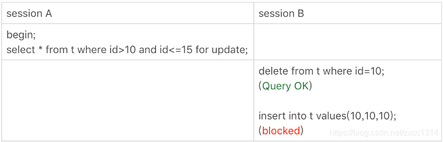
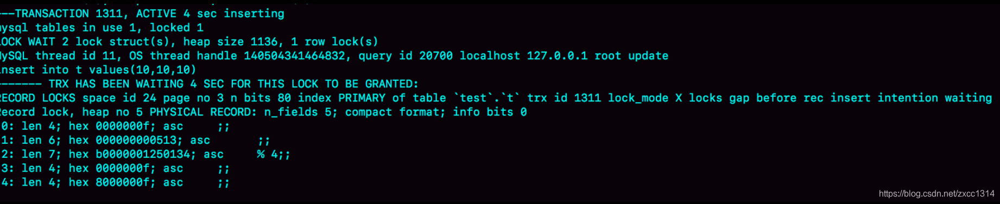
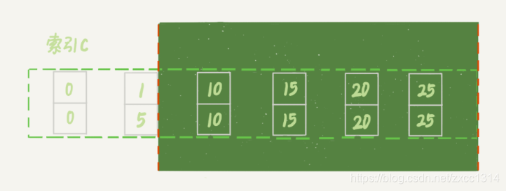

# 29-33

## 29 | 如何判断一个数据库是不是出问题

### select 1 判断

当前并发查询数超过innodb_thread_concurrency时， 
select 1会返回，但执行查询命令时会等待。

该参数默认值是0，表示不限制并发查询数，建议把 innodb_thread_concurrency 设置为 64~128 之间的值。不是并发连接数。

### 查表判断

在系统库（mysql 库）里创建一个表，比如命名为 health_check，里面只放一行数据，然后定期执行：

`select * from mysql.health_check`

但有其他一个问题，更新事务要写 binlog，binlog 所在磁盘的空间占用率达到 100%，那么所有的更新语句和事务提交的 commit 语句就都会被堵住。但是，系统这时候还是可以正常读数据的。

### 更新判断

常见做法是放一个 timestamp 字段，用来表示最后一次执行检测的时间。但备库不能写同一行，所以需要使用多行，id为server_id。

`update mysql.health_check set t_modified=now();`

但有可能，机器的I/O已经100%，但刚好健康检查的sql拿到了资源，成功返回了。

### 内部统计

关于磁盘利用率100%的问题。
MySQL 5.6 版本以后提供的 performance_schema 库，就在 file_summary_by_event_name 表里统计了每次 IO 请求的时间。

老师比较倾向的方案，是优先考虑 update 系统表，，然后再配合增加检测 performance_schema的信息。

## 30 | 答疑文章（二）：用动态的观点看加锁

先复习一下老师在 21 | 为什么我只改一行的语句，锁这么多？ 文章中提到了两个“原则”、两个“优化”和一个“bug”。
该文章基于下面的表结构：

```sql
CREATE TABLE `t` (
  `id` int(11) NOT NULL,
  `c` int(11) DEFAULT NULL,
  `d` int(11) DEFAULT NULL,
  PRIMARY KEY (`id`),
  KEY `c` (`c`)
) ENGINE=InnoDB;

insert into t values(0,0,0),(5,5,5),
(10,10,10),(15,15,15),(20,20,20),(25,25,25);
```

### 不等号条件里的等值查询

等值查询和“遍历”有什么区别？为什么我们文章的例子里面，where 条件是不等号，这个过程里也有等值查询？

```sql
begin;
select * from t where id>9 and id<12 order by id desc for update;
```

上面的规则可以知道加锁区间(0,5]、(5,10] 和 (10, 15)。

- 首先这个查询语句的语义是 order by id desc，要拿到满足条件的所有行，优化器必须先找到“第一个 id<12 的值”。
- 这个过程是通过索引树的搜索过程得到的，在引擎内部，其实是要找id=12 的这个值，只是最终没找到，但找到了(10,15) 这个间隙。
- 然后向左遍历，在遍历过程中，就不是等值查询了，会扫描到 id=5 这一行，所以会加一个 next-key lock (0,5]。

也就是说，在执行过程中，通过树搜索的方式定位记录的时候，用的是“等值查询”的方法。

### 等值查询的过程

下面这个语句的加锁范围是什么？

```sql
begin;
select id from t where c in(5,20,10) lock in share mode;

explain select id from t where c in(5,20,10) lock in share mode;

-id,select_type, table_partition,type, possible_keys, key_len, ref, rows, filtered, extra
- 1, simple, t, null, range, c, c, 5, null, 3, 100.00 , Using where, Using index
```

- in 语句使用了索引 c 并且 rows=3，说明这三个值都是通过 B+ 树搜索定位的。
- 在查找 c=5 的时候，先锁住了 (0,5]。但是因为 c 不是唯一索引，为了确认还有没有别的记录 c=5，就要向右遍历，找到 c=10 才确认没有了，这个过程满足优化 2，所以加了间隙锁 (5,10)。
- 同样的，执行 c=10 这个逻辑的时候，加锁的范围是(5,10] 和 (10,15)；执行 c=20 这个逻辑的时候，加锁的范围是 (15,20] 和 (20,25)。
- 这条语句在索引 c 上加的三个记录锁的顺序是：先加 c=5 的记录锁，再加 c=10 的记录锁，最后加 c=20 的记录锁。

### 怎么看死锁？

```sql
select id from t where c in(5,20,10) order by c desc for update;
```

当执行上述命令时，加锁顺序和会之前那句相反，会产生死锁。

```sql
show engine innodb status;
```


三部分：

- TRANSACTION，是第一个事务的信息；
- TRANSACTION，是第二个事务的信息；
- WE ROLL BACK TRANSACTION (1)，最终回滚了第一个事务。

得到的结论：

- 由于锁是一个个加的，要避免死锁，对同一组资源，要按照尽量相同的顺序访问；
- 在发生死锁的时刻，for update 这条语句占有的资源更多，回滚成本更大，所以 InnoDB 选择了回滚成本更小的 lockin share mode 语句，来回滚。

### 怎么看锁等待？



session A 并没有锁住 c=10 这个记录，delete之后不能insert。



由于 delete 操作把 id=10 这一行删掉了，原来的两个间隙 (5,10)、(10,15）变成了一个 (5,15)。

update 的例子


虽然session A 的加锁范围是索引 c 上的 (5,10]、(10,15]、(15,20]、(20,25] 和 (25,supremum]，但update后加锁范围变成了下图：




## 31 | 误删数据后除了跑路，还能怎么办？

千万不能误删

### 误删行

binlog_format=row 和 binlog_row_image=FULL 可以使用Flashback回放。
不建议直接在主库使用，应该在备库执行，然后再将确认过的临时库的数据，恢复回主库。

### 误删库 / 表

取全量备份，和全量备份时间点之后的binlog恢复。但mysqlbinlog不够快。
一个加速的方法，将全量备份恢复的临时实例，设置为线上备库的从库。

### 延迟复制备库

MySQL 5.6 版本引入，通过 CHANGE MASTER TO MASTER_DELAY = N 命令，可以指定这个备库持续保持跟主库有N 秒的延迟。

## 32 | 为什么还有kill不掉的语句

kill query + 线程 id：表示终止这个线程中正在执行的语句；

kill connection + 线程 id，这里 connection 可缺省，表示断开这个线程的连接，如果这个线程有语句正在执行，也是要先停止正在执行的语句的。

mysql kill命令不是直接终止线程。

- 把 session 的运行状态改成 THD::KILL_QUERY(将变量 killed 赋值为 THD::KILL_QUERY)；
- 给 session 的执行线程发一个信号。有些session 由于锁在等待，信号让session 退出等待来处理THD::KILL_QUERY 状态。

mysql处理过程中有许多埋点，这些“埋点”的地方判断线程状态，如果发现线程状态是 THD::KILL_QUERY，才开始进入语句终止逻辑。

如果碰到一个被 killed 的事务一直处于回滚状态，尽量不要重启，因为重启之后该做的回滚动作还是不能少的，所以从恢复速度的角度来说，应该让它自己结束。如果这个语句可能会占用别的锁，或者由于占用 IO 资源过多，从而影响到了别的语句执行的话，就需要先做主备切换，切到新主库提供服务。避免大事务


## 33-我查这么多数据，会不会把数据库内存打爆

### 全表扫描对 server 层的影响


- net_buffer由参数 net_buffer_length 定义的，默认是 16k。
- mysql是遍读遍发的，所以当net_buffer写满的时候就需要等待。使用show processlist可以看到state=“Sending to client”。
- mysql还要一个state=“Sending data”，它的意思只是“正在执行”。

### 全表扫描对 InnoDB 的影响

介绍 WAL 机制时，分析了Buffer Pool 加速更新的作用。
Buffer Pool 还有一个更重要的作用，就是加速查询。
执行 show engine innodb status可以查看一个系统当前的 BP 命中率。

InnoDB Buffer Pool 的大小是由参数 innodb_buffer_pool_size 确定的，一般建议设置成可用物理内存的 60%~80%。

InnoDB 内存管理用的是最近最少使用 (LRU) 算法，这个算法的核心就是淘汰最久未使用的数据。

如果在查询历史数据使用这个算法，会导致很多请求会从磁盘读取数据。所以mysql对LRU算法进行了改进。


在 InnoDB 实现上，按照 5:3 的比例把整个 LRU 链表分成了 young 区域和 old 区域。
1. 访问数据页P3，在young区所以把它移到链表同步。
2. 如果访问不存在的数据，则把链表尾部数据淘汰，但把新数据页Px放在LRU_old处。
3. 处于 old 区域的数据页，每次被访问的时候都要做下面这个判断：
4. 若这个数据页在 LRU 链表中存在的时间超过了 1 秒，就把它移动到链表头部；
5. 如果这个数据页在 LRU 链表中存在的时间短于 1 秒，位置保持不变。


1s由参数 innodb_old_blocks_time 控制的。其默认值是 1000，单位毫秒。

