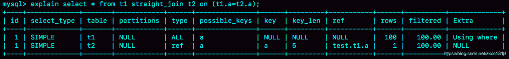

# 到底可不可以使用join？

数据准备

```sql
CREATE TABLE `t2` (
  `id` int(11) NOT NULL,
  `a` int(11) DEFAULT NULL,
  `b` int(11) DEFAULT NULL,
  PRIMARY KEY (`id`),
  KEY `a` (`a`)
) ENGINE=InnoDB;

drop procedure idata;
delimiter ;;
create procedure idata()
begin
  declare i int;
  set i=1;
  while(i<=1000)do
    insert into t2 values(i, i, i);
    set i=i+1;
  end while;
end;;
delimiter ;
call idata();

create table t1 like t2;
insert into t1 (select * from t2 where id<=100)
```

## Index Nested-loop join

```sql
select * from t1 straight_join t2 on t1.id = t2.id;
```

## Index Nested-Loop Join

t1 是驱动表，t2 是被驱动表。t1 全表扫描，t2 索引树扫描。

t1 是驱动表，t2 是被驱动表。



- 从表 t1 中读入一行数据 R；
- 从数据行R中，取出a字段到表t2里去查找。由于t2表的a字段有索引，所以是通过索引进行查找，先在索引树上找到对应的值，然后获取到对应的主键id，再根据主键id回表查询获取完整的行数据。
- 取出表t2中满足条件的行，跟R组成一行，作为结果集的一部分。
- 重复执行步骤 1 到 3，直到表 t1 的末尾循环结束

t1只有100行，所有一共扫描100行。

如果执行select * from t1，再执行select * from t2 where a=$R.a。虽然都可以走索引，也只扫描100行。但需要执行101行sql。

如果可以走索引：

- 使用 join 语句，性能比强行拆成多个单表执行 SQL 语句的性能要好；
- 如果使用 join 语句的话，需要让小表做驱动表。

性能分析

在上述流程中，对驱动表t1做了全表扫描。
假设t1表有N行数据，那么扫描t1表需要扫描N行。
而对于t1中的每一行数据，根据a字段去表t2查找时，走的是树搜索过程。
假设t2表有M行数据，每次搜索一棵树的近似复杂度是以 2 为底的M的对数，记为`log₂M`。
因为要先搜索索引a，再搜索主键索引，所以在被驱动表上查一行的时间复杂度是`2*log₂M`。
因此，整个执行过程的近似复杂度是 `N + N*2*log₂M`。
由此可见，N对扫描行数的影响更大，所以应该让小表来做驱动表，以减少总的扫描行数，提高性能。

适用场景

Index Nested - Loop Join 适用于被驱动表连接字段上有索引的情况。当连接条件中的字段在被驱动表上有索引时，MySQL 优化器通常会选择使用 Index Nested - Loop Join 算法来执行连接操作，以提高查询性能。

NLJ 算法的优点是简单、易于理解，缺点是性能不如 Hash Join 算法。因此，如果连接条件中的字段在被驱动表上没有索引，则 MySQL 会选择 Hash Join 算法来执行连接操作。

## Simple Nested-Loop join

当被驱动表连接字段上没有索引时，

就会使用 Simple Nested -Loop Join 算法，即每次从驱动表读取一行数据，都要到被驱动表进行全表扫描来找出匹配数据，性能较差。例如，若t1有 100 行数据，t2有 1000 行数据，使用 Simple Nested-Loop Join 算法就需要扫描t2表 100 次，总共扫描 100×1000 = 10 万行。

## Block Nested - Loop Join

MySQL 没有使用 Simple Nested-Loop Join 算法，而是使用了“Block Nested-Loop Join”算法，简称BNL。

是对 Simple Nested - Loop Join 的优化，针对被驱动表连接列上没索引的情况。该算法开辟了一块join_buffer内存，将驱动表的数据读入其中，然后扫描被驱动表，将被驱动表中的每一行与join_buffer中的数据进行匹配，减少了被驱动表的扫描次数。


1. 把表 t1 的数据读入线程内存 join_buffer 中，由于我们这个语句中写的是 select *，因此是把整个表 t1 放入了内存；
2. 扫描表 t2，把表 t2 中的每一行取出来，跟 join_buffer 中的数据做对比，满足 join 条件的，作为结果集的一部分返回。

虽然都会扫描100*1000行，但BNL是内存判断，所以会快一点。

小结

1. 如果可以使用被驱动表的索引，join 语句还是有其优势的；
2. 不能使用被驱动表的索引，只能使用 BNL 算法，这样的语句就尽量不要使用；
3. 在使用 join 的时候，应该让小表做驱动表。

如果被驱动表是个大表，会把冷数据的page加入到buffer pool，并且BNL要扫描多次，两次扫描的时间可能会超过1秒，使上节提到的分代LRU优化失效，把热点数据从buffer pool中淘汰掉，影响正常业务的查询效率。

## code

### simple nested-loop join

```python
for row_A in table_A:
    for row_B in table_B:
        if row_A.col == row_B.col:
            output(row_A, row_B)
```

特别是当表的规模较大时，需要进行大量的比较操作。其时间复杂度为 `O(n∗m)`，这里的 `n` 和 `m` 分别代表两个表的行数。

### Block Nested-Loop Join

```python
join_buffer = []
for row_A in table_A:
    join_buffer.append(row_A)
    for row_B in join_buffer:
        if row_A.col == row_B.col:
            output(row_A, row_B)
    join_buffer.remove(row_A)
```

### 两者区别：

- 内存使用：Simple Nested-Loop Join 没有利用额外的内存来优化连接操作，而 Block Nested-Loop Join 借助 join - buffer 来缓存驱动表的多行数据，减少了被驱动表的扫描次数。
- 扫描次数：Simple Nested-Loop Join 对被驱动表的扫描次数和驱动表的行数相同，也就是每处理驱动表的一行，就需要扫描一次被驱动表。而 Block Nested-Loop Join 把驱动表按块加载到 join-buffer 中，被驱动表的扫描次数和驱动表的块数相等，这就大大减少了扫描次数。
- 效率：由于 Block Nested-Loop Join 减少了被驱动表的扫描次数，所以在大多数情况下，其效率要高于 Simple Nested-Loop Join。

### 关于全表扫描

虽然 Block Nested-Loop Join 仍然需要对表进行全扫描，但通过 join-buffer 减少了扫描的次数，从而降低了 I/O 开销。
特别是在磁盘 I/O 成为性能瓶颈时，这种优化能显著提升连接操作的效率。
例如，假设驱动表有 1000 行，被驱动表有 100 行，Simple Nested-Loop Join 需要对被驱动表进行 1000 次扫描，
而 Block Nested-Loop Join 若每次将驱动表的 100 行加载到 join-buffer 中，那么只需要对被驱动表进行 10 次扫描。

