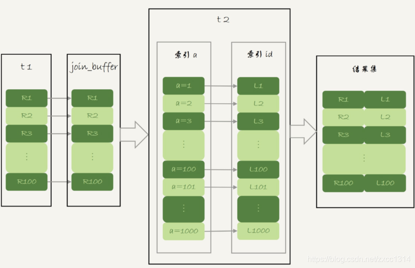

# Join 语句优化

表结构

```sql
create table t1(id int primary key, a int, b int, index(a));
create table t2 like t1;
drop procedure idata;
delimiter ;;
create procedure idata()
begin
  declare i int;
  set i=1;
  while(i<=1000)do
    insert into t1 values(i, 1001-i, i);
    set i=i+1;
  end while;
  
  set i=1;
  while(i<=1000000)do
    insert into t2 values(i, i, i);
    set i=i+1;
  end while;

end;;
delimiter ;
call idata();
```

## Multi-Range Read 优化

回忆一下回表。回表是指，InnoDB 在普通索引 a 上查到主键 id 的值后，再根据一个个主键 id 的值到主键 id 的值到主键索引上去查整行数据的过程。

主键索引是一棵 B+ 树，在这棵树上，每次只能根据一个主键 id 查到一行数据。

因此，回表肯定是一行行搜索主键索引的。


如果随着 a 的值递增顺序查询的话，id 的值就变成随机的，那么就会出现随机访问，性能相对较差。虽然“按行查”这个机制不能改，但是调整查询的顺序，还是能够加速的。

因为大多数的数据都是按照主键递增顺序插入得到的，所以我们可以认为，如果按照主键的递增顺序查询的话，对磁盘的读比较接近顺序读，能够提升读性能。

MRR 优化的设计思路：

- 根据索引 a，定位到满足条件的记录，将 id 值放入 read_rnd_buffer 中 ;
- 将 read_rnd_buffer 中的 id 进行递增排序；
- 排序后的 id 数组，依次到主键 id 索引中查记录，并作为结果返回。

read_rnd_buffer 的大小是由 read_rnd_buffer_size 参数控制。如果想要稳定地使用 MRR 优化的话，需要设置set optimizer_switch=“mrr_cost_based=off”，如果不设置，优化器会判断消耗，倾向于不使用MRR。

## Batched Key Access

MySQL 在 5.6 版本后开始引入的 Batched Key Acess(BKA) 算法了。其实就是对 NLJ 算法的优化。

NLJ 算法执行的逻辑是：从驱动表 t1，一行行地取出 a 的值，再到被驱动表 t2 去做 join。也就是说，对于表 t2 来说，每次都是匹配一个值。这时，MRR 的优势就用不上了。

BKA 算法就是缓存多行传给其他表，流程如下：



启动 BKA:

```sql
set optimizer_switch='mrr=on,mrr_cost_based=off,batched_key_access=on';
```

BNL 算法的性能问题

上篇文章末尾说了，如果一个使用 BNL 算法的 join 语句，多次扫描一个冷表，而且这个语句执行时间超过 1 秒，就会在再次扫描冷表的时候，把冷表的数据页移到LRU 链表头部。
为了减少这种影响，可以考虑增大join_buffer_size 的值，减少对被驱动表的扫描次数。

优化的常见做法是，给被驱动表的 join 字段加上索引，把 BNL 算法转成 BKA 算法。
还可以考虑使用临时表。使用临时表的大致思路是：

1. 把表 t2 中满足条件的数据放在临时表 tmp_t 中；
2. 为了让 join 使用 BKA 算法，给临时表 tmp_t 的字段 b 加上索引；
3. 让表 t1 和 tmp_t 做 join 操作。

```sql
create temporary table temp_t(id int primary key, a int, b int, index(b))engine=innodb;
insert into temp_t select * from t2 where b>=1 and b<=2000;
select * from t1 join temp_t on (t1.b=temp_t.b);
```

## 扩展 -hash join

mysql目前还没有hash索引，MariaDB支持。

所以可以自己实现在业务端。实现流程大致如下：

1. select * from t1;取得表 t1 的全部 1000 行数据，在业务端存入一个 hash 结构；
2. select * from t2 where b>=1 and b<=2000; 获取表 t2 中满足条件的 2000 行数据。
3. 把这 2000 行数据，一行一行地取到业务端，到 hash 结构的数据表中寻找匹配的数据。满足匹配的条件的这行数据，就作为结果集的一行。

这个过程会比临时表方案的执行速度还要快一些。
