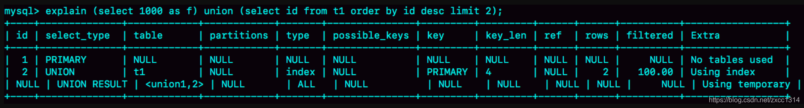
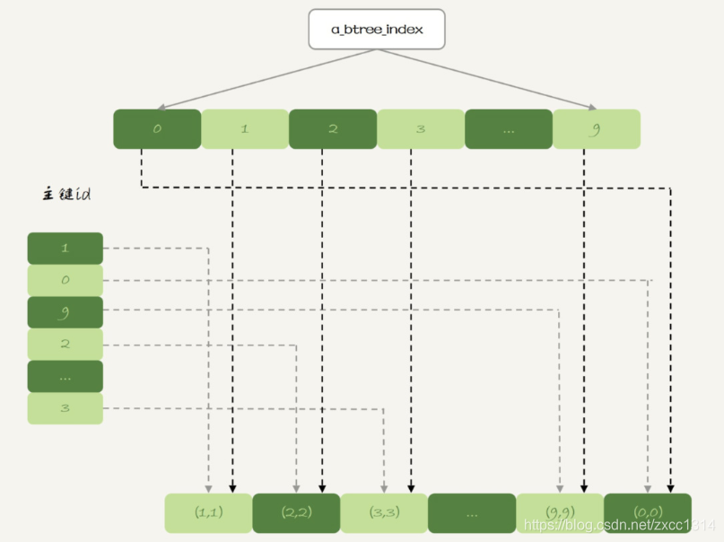

# 36-39-临时表-自增主键

## 36 | 为什么临时表可以重名？

上节提到了临时表。

如果是使用 InnoDB 引擎或者 MyISAM 引擎的临时表，写数据的时候是写到磁盘上的。当然，临时表也可以使用 Memory 引擎。
临时表的特点：

1. 临时表只能被创建它的 session 访问，对其他线程不可见。所以在这个 session 结束的时候，会自动删除临时表。
2. 临时表可以与普通表同名（还是不要这么做）。
3. session A 内有同名的临时表和普通表的时候，show create 语句，以及增删改查语句访问的是临时表。
4. show tables 命令不显示临时表。

### 临时表的应用

分表分库跨库查询

分库分表系统都有一个中间层 proxy，如果 sql 能够直接确定某个分表，这种情况是最理想的。

但如果涉及到跨库，一般有两种方式

1. 在 proxy 层的进程代码中实现排序，但对 proxy 的功能和性能要求较高。
2. 把各个分库拿到的数据，汇总到一个 MySQL 实例的一个表中，然后在这个汇总实例上做逻辑操作。如果每个分库的计算量都不饱和，那么直接可以在把临时表放到某个分库上。

### 为什么临时表可以重名？

MySQL 要给临时 InnoDB 表创建一个 frm 文件保存表结构定义，还要有地方保存表数据。
这个 frm 文件放在临时文件目录下，文件名的后缀是.frm，前缀是“#sql{进程 id}{线程 id} 序列号”。可以使用 select @@tmpdir 命令，来显示实例的临时文件目录。

表中数据存放：

1. MySQL5.6 会在临时文件目录下创建一个相同前缀、以.ibd 为后缀的文件，用来存放数据文件；
2. MySQL5.7版本开始引入了一个临时文件表空间，专门用来存放临时文件的数据。因此，我们就不需要再创建 ibd 文件了。

MySQL 维护数据表，除了物理上要有文件外，内存里面也有一套机制区别不同的表，每个表都对应一个table_def_key。

1. 一个普通表的 table_def_key 的值是由“库名+ 表名”得到。
2. 临时表，table_def_key 在“库名 + 表名”基础上，又加入了“server_id+thread_id”。

### 临时表和主备复制

如果当前的 binlog_format=row，那么跟临时表有关的语句，就不会记录到 binlog 里。
binlog_format=statment/mixed 的时候，binlog 中才会记录临时表的操作。

这种情况下，创建临时表的语句会传到备库执行，因此备库的同步线程就会创建这个临时表。
主库在线程退出的时候，会自动删除临时表，但是备库同步线程是持续在运行的。
所以，这时候我们就需要在主库上再写一个 DROP TEMPORARY TABLE 传给执行。

## 37 | 什么时候会使用内部临时表

```sql
create table t1(id int primary key, a int, b int, index(a));
delimiter ;;
create procedure idata()
begin
  declare i int;

  set i=1;
  while(i<=1000)do
    insert into t1 values(i, i, i);
    set i=i+1;
  end while;
end;;
delimiter ;
call idata();


(select 1000 as f) union (select id from t1 order by id desc limit 2);
```



- 第二行key=PRIMARY，说明第二个子句用到了索引 id
- 第三行 Extra 字段，说明 UNION 时使用了临时表 (Using temporary)

执行流程：

- 创建一个内存临时表，这个临时表只有一个整型字段 f，并且 f 是主键字段。
- 执行第一个子查询，得到 1000 这个值，并存入临时表中。
- 执行第二个子查询：拿到第一个1000，但已存在存入失败，拿到第二个999，存入成功。
- 从临时表中按行取出数据（1000和999两行），返回结果，并删除临时表。

如果把上面这个语句中的 union 改成 union all的话，就不需要“去重”。
这样执行的时候，就依次执行子查询，得到的结果直接作为结果集的一部分，发给客户端。因此也就不需要临时表了。

### group by 执行流程

```sql
select id%10 as m, count(*) as c from t1 group by m;
```


1. Using index，表示这个语句使用了覆盖索引，选择了索引 a，不需要回表；
2. Using temporary，表示使用了临时表；
3. Using filesort，表示需要排序。

执行流程：

- 创建内存临时表，表里有两个字段 m 和 c，主键是 m；
- 扫描表 t1 的索引 a，依次取出叶子节点上的 id 值，计算 id%10 的结果，记为 x；如果临时表中没有主键为 x 的行，就插入一个记录 (x,1)，如果表中有主键为 x 的行，就将 x 这一行的 c 值加 1；
- 遍历完成后，再根据字段 m 做排序（内存临时表的排序 17 篇文章有），得到结果集返回给客户端。

如果不需要排序则直接取内存临时表的数据。

但内存临时表的大小是有限制的，参数 tmp_table_size 就是控制这个内存大小的，默认是 16M。如果内存不够则使用磁盘临时表。

### group by 优化方法

索引
假设有个这样的数据结构：


如果可以确保输入的数据是有序的，那么计算 group by 的时候，就只需要从左到右，顺序扫描，依次累加。

- 当碰到第一个 1 的时候，已经知道累积了 X 个 0，结果集里的第一行就是 (0,X);
- 当碰到第一个 2 的时候，已经知道累积了 Y 个 1，结果集里的第二行就是 (1,Y);
  
InnoDB 的索引，就可以满足这个输入有序的条件。

- 直接排序
  如果临时表数据量特别大，可让 MySQL 直接走磁盘临时表，在 group by 语句中加入 SQL_BIG_RESULT 这个提示（hint）。
MySQL 的优化器会直接用数组来存，而不是B+ 树存储。这样

```sql
select SQL_BIG_RESULT id%100 as m, count(*) as c from t1 group by m;
```

执行流程：

- 初始化 sort_buffer，确定放入一个整型字段，记为 m；
- 扫描表 t1 的索引 a，依次取出里面的 id 值, 将 id%100 的值存入 sort_buffer 中；
- 扫描完成后，对 sort_buffer 的字段 m 做排序（如果 sort_buffer 内存不够用，，就会利用磁盘临时文件辅助排序）；
- 排序完成后，就得到了一个有序数组。

### 总结：

MySQL 什么时候会使用内部临时表？

- 如果语句执行过程可以一边读数据，一边直接得到结果，是不需要额外内存的，否则就需要额外的内存，来保存中间结果；
- join_buffer 是无序数组，sort_buffer 是有序数组，临时表是二维表结构；
- 如果执行逻辑需要用到二维表特性，就会优先考虑使用临时表。比如，union 需要用到唯一索引约束， group by 还需要用到另外一个字段来存累积计数。
  
group by使用的指导原则：

- 如果对 group by 语句的结果没有排序要求，要在语句后面加 order by null；
- 尽量让 group by 过程用上表的索引，确认方法是 explain 结果里没有 Using temporary 和 Using filesort；
- 如果 group by 需要统计的数据量不大，尽量只使用内存临时表；也可以通过适当调大 tmp_table_size 参数，来避免用到磁盘临时表；
- 如果数据量实在太大，使用 SQL_BIG_RESULT 这个提示，来告诉优化器直接使用排序算法得到 group by 的结果。

## 38 | 都说InnoDB好，那还要不要使用Memory引擎？

内存表的数据组织结构
表 t1 使用 Memory 引擎， 表 t2 使用InnoDB 引擎。

```sql
create table t1(id int primary key, c int) engine=Memory;
create table t2(id int primary key, c int) engine=innodb;
insert into t1 values(1,1),(2,2),(3,3),(4,4),(5,5),(6,6),(7,7),(8,8),(9,9),(0,0);
insert into t2 values(1,1),(2,2),(3,3),(4,4),(5,5),(6,6),(7,7),(8,8),(9,9),(0,0);
```


可以看到两个引擎顺序不一致。
InnoDB 表的数据就放在主键索引树上，主键索引是 B+ 树。
与 InnoDB 引擎不同，Memory 引擎的数据和索引是分开的。


内存表的数据部分以数组的方式单独存放，而主键 id 索引里，存的是每个数据的位置。主键 id 是 hash 索引，可以看到索引上的 key 并不是有序的。

在内存表 t1 中，执行 select * 按数组顺序全表扫描。因此，0 就是最后一个被读到。

所以InnoDB 和 Memory 引擎的数据组织方式是不同的：

1. InnoDB 引擎把数据放在主键索引上，其他索引上保存的是主键 id。这种方式，我们称之为索引组织表（Index Organizied Table）。
2. Memory 引擎采用的是把数据单独存放，索引上保存数据位置的数据组织形式，我们称之为堆组织表（Heap Organizied Table）。

两个引擎的一些典型不同：

1. InnoDB 表的数据总是有序存放的，而内存表的数据就是按照写入顺序存放的；
2. 当数据文件有空洞的时候，InnoDB 表在插入新数据的时候，为了保证数据有序性，只能在固定的位置写入新值，而内存表找到空位就可以插入新值；
3. 数据位置发生变化的时候，InnoDB 表只需要修改主键索引，而内存表需要修改所有索引；
4. InnoDB 表用主键索引查询时需要走一次索引查找，用普通索引查询的时候，需要走两次索引查找。而内存表没有这个区别，所有索引的“地位”都是相同的。
5. InnoDB 支持变长数据类型，不同记录的长度可能不同；内存表不支持 Blob 和 Text 字段，并且即使定义了 varchar(N)，实际也当作 char(N)，也就是固定长度字符串来存储，因此内存表的每行数据长度相同。

由于内存表的这些特性，每个数据行被删除以后，空出的这个位置都可以被接下来要插入的数据复用。
内存表 t1 的这个主键索引是哈希索引，因此如果执行范围查询是用不上主键索引的，需要走全表扫描。

### hash 索引和 B-Tree 索引

内存表也是支 B-Tree 索引的

```sql
alter table t1 add index a_btree_index using btree (id);
```



不建议你在生产环境上使用内存表
这里的原因主要包括两个方面：

- 内存表的锁
内存表不支持行锁，只支持表锁。
- 数据持久性问题
数据库重启的时候，所有的内存表都会被清空。
- 主从模式，从库掉电重启收到主库请求会找不到行。双主模式下，一台掉电重启会发送delete到另一台清空数据。

第 35 和 36 篇说到的用户临时表。在数据量可控，不会耗费过多内存的情况下，你可以考虑使用内存表。

```sql
create temporary table temp_t(id int primary key, a int, b int, index (b))engine=memory;
insert into temp_t select * from t2 where b>=1 and b<=2000;
select * from t1 join temp_t on (t1.b=temp_t.b);
```

