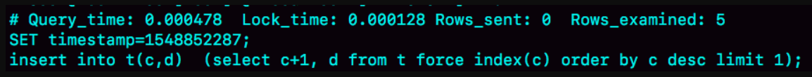

# 40-insert语句的锁为什么这么多

## 1. 锁的种类

- 表锁：对表的结构加锁，防止其他进程对表结构的修改。
- 行锁：对表中某一行加锁，防止其他进程对该行的修改。
- 页锁：对表中一页的数据加锁，防止其他进程对该页的修改。
- 外键锁：对表中外键约束加锁，防止其他进程对该约束的修改。
- 死锁：两个或多个事务在同一资源上互相等待，导致无限等待。

### 表锁

- X锁：对表结构加排它锁，防止其他进程对表结构的修改。
- S锁：对表结构加共享锁，允许其他进程读取表结构，但不允许修改。
- IS锁：对表结构加插入锁，允许其他进程读取表结构，但不允许插入或修改。
- IX锁：对表结构加排它插入锁，防止其他进程对表结构的修改和插入。

S锁和IX锁的冲突;
X锁和任意锁的冲突;
IX锁和其他锁兼容;
IS锁和其他锁兼容。

### 行锁

- 共享锁：允许其他进程读取某一行，但不允许修改。
- 排它锁：对某一行加排它锁，防止其他进程对该行的修改。
- 行锁的兼容性：S锁和X锁的冲突;S锁和IS锁的兼容;X锁和IX锁的冲突;IX锁和其他锁兼容。
- Recond Lock: 允许对某一行进行读操作，但不允许对该行进行写操作。
- Gap Lock: 允许对某一范围内的行进行读操作，但不允许对该范围内的行进行写操作。
- Next-Key Lock: 允许对某一范围内的行进行读操作和写操作，但不允许对该范围外的行进行任何操作。

## 2. insert语句的锁

- insert语句的锁类型：insert语句会对表加写锁，直到事务提交或回滚。
- 对于MyISAM表，insert语句会对整个表加写锁，直到事务提交或回滚。
- 对于InnoDB表，insert语句会对插入的行加写锁，直到事务提交或回滚。

### insert … select 语句

可重复读隔离级别下，binlog_format=statement。
表结构

准备

```sql
CREATE TABLE `t` (
  `id` int(11) NOT NULL AUTO_INCREMENT,
  `c` int(11) DEFAULT NULL,
  `d` int(11) DEFAULT NULL,
  PRIMARY KEY (`id`),
  UNIQUE KEY `c` (`c`)
) ENGINE=InnoDB;

insert into t values(null, 1,1);
insert into t values(null, 2,2);
insert into t values(null, 3,3);
insert into t values(null, 4,4);

create table t2 like t
```


session B执行时需要对表 t 的所有行和间隙加锁。
如果没有锁，就可能出现 session B 的 insert 语句先执行，但是后写入 binlog 的情况。所以会引起主备不一致。

### insert 循环写入

执行 insert … select 的时候，对目标表也不是锁全表，
而是只锁住需要访问的资源。

现在有这么一个需求：要往表 t2 中插入一行数据，这一行的 c 值是表 t 中 c 值的最大值加 1。

```sql
insert into t2(c,d)  (select c+1, d from t force index(c) order by c desc limit 1);
```

这个语句的加锁范围，就是表 t 索引 c 上的 (3,4]和 (4,supremum] 这两个 next-key lock，以及主键索引上 id=4 这一行。

它的执行流程也比较简单，从表 t 中按照索引 c 倒序，扫描第一行，拿到结果写入到表 t2 中。

```sql
insert into t(c,d)  (select c+1, d from t force index(c) order by c desc limit 1);
```

如果执行这句sql，可以看到，这时候的 Rows_examined 的值是 5。并且使用了临时表。




Explain 结果 rows=1 是因为受到了 limit 1 的影响。可能不准确。
使用执行Innodb_rows_read 语句查看查看sql执行前后扫描行数。


可以看到，这个语句执行前后，Innodb_rows_read 的值增加了 4。
因为默认临时表是使用 Memory 引擎的，所以这 4 行查的都是表 t，也就是说对表 t 做了全表扫描。
所以整个执行流程：

1. 创建临时表，表里有两个字段 c 和 d。
2. 按照索引 c 扫描表 t，依次取 c=4、3、2、1，然后回表，读到 c 和 d 的值写入临时表。这时，Rows_examined=4。
3. 由于语义里面有 limit 1，所以只取了临时表的第一行，再插入到表 t 中。这时，Rows_examined 的值加 1，变成了 5。


这个语句会导致在表 t 上做全表扫描，并且会给索引 c 上的所有间隙都加上共享的 next-key lock。

这个语句的执行为什么需要临时表，原因是这类一边遍历数据，一边更新数据的情况，
如果读出来的数据直接写回原表，就可能在遍历过程中，读到刚刚插入的记录，新插入的记录如果参与计算逻辑，就跟语义不符。

由于实现上这个语句没有在子查询中就直接使用 limit 1，从而导致了这个语句的执行需要遍历整个表 t。

优化方案：

```sql
create temporary table temp_t(c int,d int) engine=memory;
insert into temp_t  (select c+1, d from t force index(c) order by c desc limit 1);
insert into t select * from temp_t;
drop table temp_t;
```

### insert 唯一键冲突


session A 执行的 insert 语句，发生唯一键冲突的时候，并不只是简单地报错返回，还在冲突的索引上加了锁。
session A 持有索引 c 上的 (5,10] 共享 next-key lock（读锁）。

这个读锁作用上来看，这样做可以避免这一行被别的事务删掉。


执行相同的 insert 语句，发现了唯一键冲突，加上读锁（Next-key lock）。session A 回滚，session B 和 session C 都试图继续执行插入操作，都要加上插入意向锁（LOCK_INSERT_INTENTION）。

insert into … on duplicate key update

语义的逻辑是，插入一行数据，如果碰到唯一键约束，就执行后面的更新语句。

```sql
insert into t values(11,10,10) on duplicate key update d=100; 
```

如果有多个列违反了唯一性约束，就会按照索引的顺序，修改跟第一个索引冲突的行

