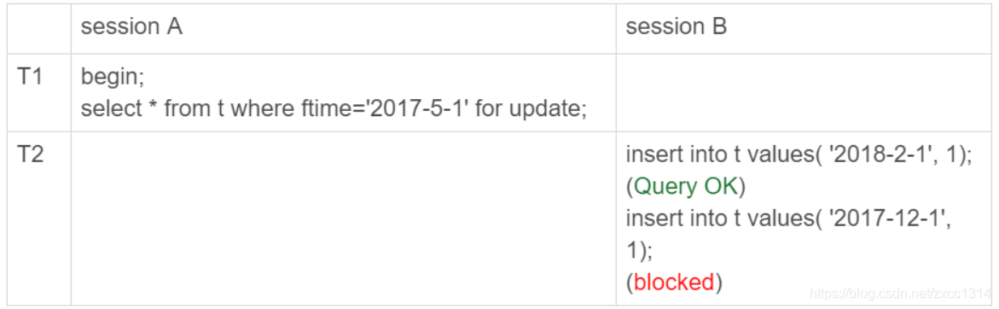
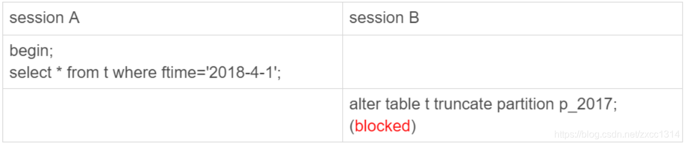

# 43 - 要不要使用分区表？

```sql
CREATE TABLE `t` (
  `ftime` datetime NOT NULL,
  `c` int(11) DEFAULT NULL,
  KEY (`ftime`)
) ENGINE=InnoDB DEFAULT CHARSET=latin1
PARTITION BY RANGE (YEAR(ftime))
(PARTITION p_2017 VALUES LESS THAN (2017) ENGINE = InnoDB,
 PARTITION p_2018 VALUES LESS THAN (2018) ENGINE = InnoDB,
 PARTITION p_2019 VALUES LESS THAN (2019) ENGINE = InnoDB,
PARTITION p_others VALUES LESS THAN MAXVALUE ENGINE = InnoDB);
insert into t values('2017-4-1',1),('2018-4-1',1);
```

磁盘文件


1. 对于引擎层来说，这是 4 个表；
2. 对于 Server 层来说，这是 1 个表。

分区表的引擎层行为




由于分区表的规则，session A 的 select 语句其实只操作了分区 p_2018。
如果是MyISAM则锁表p_2018 。

## 手动分表和分区表有什么区别

分区表和手工分表，一个是由 server 层来决定使用哪个分区，一个是由应用层代码来决定使用哪个分表。因此，从引擎层看，这两种方式也是没有差别的。
主要区别在server 层上，分区表一个被广为诟病的问题：打开表的行为。

## 分区策略

MyISAM 引擎每当第一次访问一个分区表的时候，MySQL 需要把所有的分区都访问一遍。MySQL 启动的时候，open_files_limit 参数使用的是默认值 1024，如果超过上限将报错。InnoDB 引擎的话，并不会出现这个问题。

分区表的 server 层行为

如果从 server 层看的话，一个分区表就只是一个表。



虽然 session B 只需要操作 p_2107 这个分区，但是由于 session A 持有整个表 t 的 MDL 锁，就导致了 session B 的 alter 语句被堵住。

## 分区表的应用场景

分区表的一个显而易见的优势是对业务透明，相对于用户分表来说，使用分区表的业务代码更简洁。还有，分区表可以很方便的清理历史数据。
按照时间分区的分区表，就可以直接通过 alter tablet drop partition …这个语法删掉分区，从而删掉过期的历史数据。
