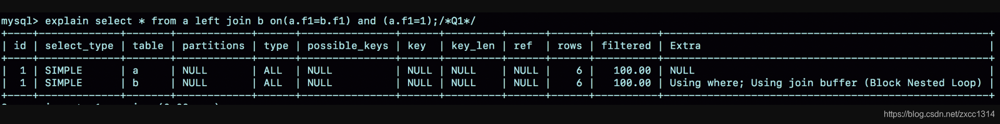

# 44-join问题

Join 写法

```sql
create table a(f1 int, f2 int, index(f1))engine=innodb;

create table b(f1 int, f2 int)engine=innodb;

insert into a values(1,1),(2,2),(3,3),(4,4),(5,5),(6,6);
insert into b values(3,3),(4,4),(5,5),(6,6),(7,7),(8,8);

```

1. 如果用 left join 的话，左边的表一定是驱动表吗？
2. 如果两个表的 join 包含多个条件的等值匹配，是都要写到 on 里面呢，还是只把一个条件写到 on 里面，其他条件写到 where 部分？

其实就是下面这两种写法的区别：

```sql
select * from a left join b on a.f1=b.f1 and a.f2=b.f2; /*Q1*/

select * from a left join b on a.f1=b.f1 where a.f2=b.f2; /*Q2*/
```

Q1：左边的表是驱动表，因为左边的表的索引是 f1，所以 join 过程只会扫描左边的表，所以效率更高。

Q2：如果两个表的 join 包含多个条件的等值匹配，则都要写到 on 里面，因为 on 里面只能写一个条件，所以只能把一个条件写到 on 里面。


Q1的explain：



Q1使用BNL算法，第 35 篇文章《join 语句怎么优化？》中讲过。
Block Nested Loop 算法的特点是先对驱动表进行全表扫描，然后对每个匹配的结果，再对被驱动表进行一次全表扫描。

Q2的explain：


Q1使用NLJ算法，执行流程是这样的：顺序扫描表 b，每一行用 b.f1 到表 a 中去查，匹配到记录后判断 a.f2=b.f2 是否满足，满足条件的话就作为结果集的一部分返回。

差别

在 MySQL 里，NULL 跟任何值执行等值判断和不等值判断的结果，都是 NULL。所以 Q2 没有1和2。

Q2这条语句虽然用的是 left join，但是语义跟 join 是一致的。优化器会把Q2优化成join。因为表 a 的 f1 上有索引，就把表 b 作为驱动表，这样就可以用上 NLJ 算法。使用show warning;可以看到优化后的语句。


所以使用 left join 时，左边的表不一定是驱动表。
如果需要 left join 的语义，就不能把被驱动表的字段放在 where 条件里面做等值判断或不等值判断，必须都写在 on 里面。

再来看两条sql：

```sql
select * from a join b on(a.f1=b.f1) and (a.f2=b.f2); /*Q3*/
select * from a join b on(a.f1=b.f1) where (a.f2=b.f2);/*Q4*/
12
```


在这种情况下，join 将判断条件是否全部放在 on 部分就没有区别了。

## Simple Nested Loop Join 的性能问题

Simple Nested Loop Join 算法，其实也是把数据读到内存里，然后按照匹配条件进行判断，为什么性能差距会这么大呢？
解释这个问题，需要用到 MySQL 中索引结构和 Buffer Pool 的相关知识点：

1. 在对被驱动表做全表扫描的时候，如果数据没有在 Buffer Pool 中，就需要等待这部分数据从磁盘读入；多次访问容易将这些数据页放到 Buffer Pool 的头部，影响 Buffer Pool 的命中率。
2. 即使被驱动表数据都在内存中，每次查找“下一个记录的操作”，都是类似指针操作。而 join_buffer 中是数组，遍历的成本更低。

## distinct 和 group by 的性能

```sql
select a from t group by a order by null;
select distinct a from t;
```

group by 没有聚合函数，这两句sql的效率相同。

1. 创建一个临时表，临时表有一个字段 a，并且在这个字段 a 上创建一个唯一索引；
2. 遍历表 t，依次取数据插入临时表中：如果发现唯一键冲突，就跳过；否则插入成功；
3. 遍历完成后，将临时表作为结果集返回给客户端

## 备库自增主键问题

第 39 篇文章《自增主键为什么不是连续的？》评论区，@帽子掉了 同学问到：在 binlog_format=statement 时，语句 A 先获取 id=1，然后语句 B 获取 id=2；接着语句 B 提交，写 binlog，然后语句 A 再写 binlog。这时候，如果 binlog 重放，是不是会发生语句 B 的 id 为 1，而语句 A 的 id 为 2 的不一致情况呢？
不会，虽然 statement 格式下“自增 id 的生成顺序，和 binlog 的写入顺序可能是不同的”。

```sql
create table t(id int auto_increment primary key);
insert into t values(null);
```
主库上语句 A 的 id 是 1，语句 B 的 id 是 2，但是写入 binlog 的顺序先 B 后 A，那么binlog 就变成：

```sql
set insert_id=2;
statement B;
set insert_id=1;
statement A;
```
