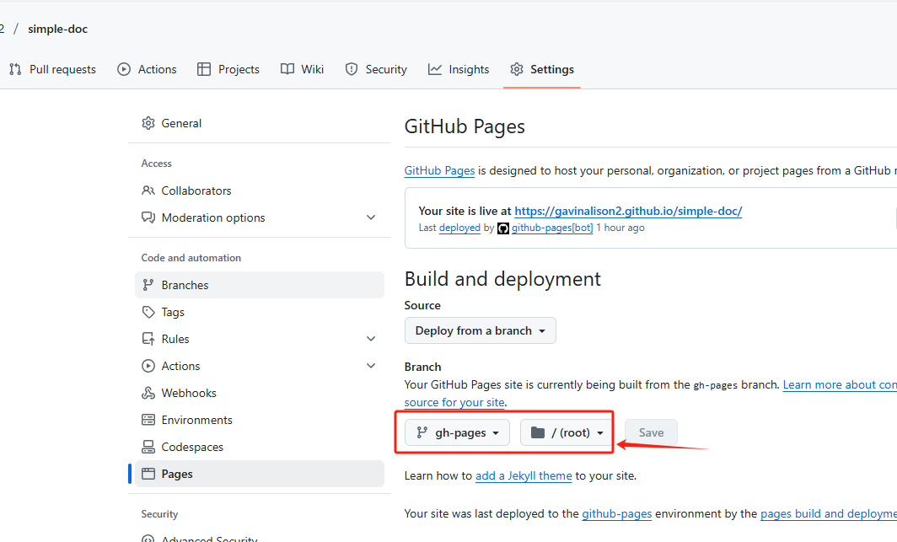
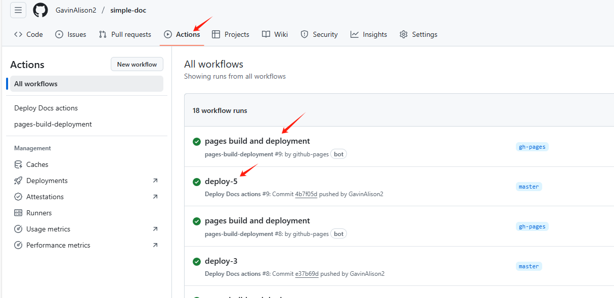

# VuePress 安装

## 注意

该项目需要在 node-v2.18.0 以上版本运行，否则会报错。

`nvm use 20.18.0`

```bash
npm init vuepress vuepress-starter

git  init

cat >.gitignore <<EOF
node_modules
# VuePress 默认临时文件目录
.vuepress/.temp
# VuePress 默认缓存目录
.vuepress/.cache
# VuePress 默认构建生成的静态文件目录
.vuepress/dist
EOF

```

## 使用

查看脚本

```node
{
  "scripts": {
    "docs:dev": "vuepress dev docs",
    "docs:build": "vuepress build docs"
  }
}
```

运行 `docs:dev` 脚本可以启动开发服务器:
VuePress 会在 http://localhost:8080 启动一个热重载的开发服务器。当你修改你的 Markdown 文件时，浏览器中的内容也会自动更新

## 构建你的网站

运行 `npm run docs:build`, 在 docs/.vuepress/dist 目录中可以找到构建生成的静态文件。你可以查看 部署 来了解如何部署你的网站

## 部署 github pages

### 1. 添加源码到 github 仓库

在 `vuepress-starter/docs/config.js` 添加一个 base 路径配置
`base: '/simple-doc',`

```bash
cat > deploy_source.sh << EOF
#!/usr/bin/env sh

set -e

cat > .gitignore <<EOF
node_modules
.DS_Store
docs/.vuepress/dist
EOF

git init .
git add -A
git rm -r --cached node_modules
git rm -r --cached docs/.vuepress/dist
git commit -m 'deploy_source'

git branch -M master
git push -f git@github.com:GavinAlison2/simple-doc.git master

EOF
```

### 2. 部署网站文件到 github 仓库 simple-doc 的 gh-pages 分支

```bash
#!/usr/bin/env sh

set -e
npm run docs:build
cd docs/.vuepress/dist

git init .
git add -A
git commit -m 'deploy'
git branch -M master
git push -f git@github.com:GavinAlison2/simple-doc.git master:gh-pages
```

## 使用 github actions 自动部署

配置好 github actions

1. 新建 `.github/workflows/deploy.yml` 文件
2. 复制以下内容到文件中

```yaml
name: Deploy

on:
  push:
    branches:
      - master

permissions: # 权限
  contents: write

jobs:
  deploy:
    runs-on: ubuntu-latest
    steps:
      - uses: actions/checkout@v2
      - name: Use Node.js 14.x
        uses: actions/setup-node@v1
        with:
          node-version: 20.x
      - run: npm install
      - run: npm run docs:build > docs/.vuepress/dist/.nojekyll
      - name: Deploy
        run: |
          cd docs/.vuepress/dist
          git init
          git config user.name "github-actions[bot]"
          git config user.email "41898282+github-actions[bot]@users.noreply.github.com"
          git add -A
          git commit -m 'deploy'
          git push -f git@github.com/GavinAlison2/simple-doc.git master:gh-pages
```

其中 `${GITHUB_TOKEN}` 是 github 仓库的 `secrets` 设置，用于自动部署。

提交代码到 master 分支，github actions 会自动部署网站到 gh-pages 分支。

在 github pages 设置中，将 `source` 选择 `gh-pages` 分支，然后点击 `save` 保存设置。


github actions 相当于 CI/CD 工具，可以自动化部署网站。

推送成功之后可以看到部署过程，先 工作流指定的名称， 然后系统默认的部署工作流



最后访问： https://gavinalison2.github.io/simple-doc/

## 本地调试

运行 `npm run docs:dev` 启动本地调试服务器，浏览器访问 http://localhost:8080 即可看到本地调试的网站。

参考：

1. https://juejin.cn/column/7041871760995647502
2. https://vuepress.vuejs.org/zh/guide/getting-started.html
